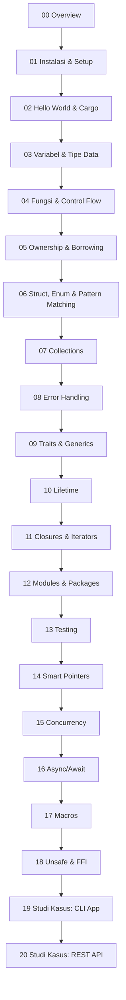

# Belajar Rust — Panduan Lengkap

Selamat datang di kurikulum **Belajar Rust** dari nol sampai mahir. Panduan ini dirancang secara step-by-step untuk membantu kamu menguasai bahasa pemrograman Rust — dari instalasi hingga topik-topik lanjutan seperti async programming, macros, dan FFI.

## Kenapa Belajar Rust?

Rust adalah bahasa pemrograman modern yang menawarkan tiga pilar utama:

| Pilar | Penjelasan |
|-------|-----------|
| **Memory Safety** | Tanpa garbage collector, Rust menjamin keamanan memori pada compile time melalui sistem ownership |
| **Performance** | Performa setara C/C++ — zero-cost abstractions, no runtime overhead |
| **Concurrency** | "Fearless concurrency" — compiler mencegah data races pada compile time |

### Siapa yang Menggunakan Rust?

- **Mozilla** — Servo browser engine, bagian dari Firefox
- **Microsoft** — Menulis ulang komponen Windows dalam Rust
- **Google** — Android, Chromium, Fuchsia OS
- **AWS** — Firecracker (serverless VM), Bottlerocket OS
- **Cloudflare** — Edge computing infrastructure
- **Discord** — Migrasi dari Go ke Rust untuk performa

### Kapan Menggunakan Rust?

- Systems programming (OS, drivers, embedded)
- CLI tools
- Web servers dan API (Axum, Actix)
- WebAssembly (Wasm)
- Game engines
- Blockchain dan cryptocurrency
- Data processing pipelines

## Prerequisites

- [ ] Familiar dengan minimal satu bahasa pemrograman (Python, JS, Java, C, dll.)
- [ ] Terminal/command line basics
- [ ] Pemahaman dasar tentang variabel, fungsi, dan loop
- [ ] Text editor atau IDE (VS Code direkomendasikan)

## Roadmap Pembelajaran

## Daftar Chapter

### Bagian 1 — Fondasi (Chapter 01–04)

| # | Chapter | Topik |
|---|---------|-------|
| 01 | Instalasi & Setup | rustup, cargo, VS Code, rust-analyzer |
| 02 | Hello World & Cargo | Program pertama, project management |
| 03 | Variabel & Tipe Data | let, mut, scalar/compound types, shadowing |
| 04 | Fungsi & Control Flow | Functions, if/else, loops, match |

### Bagian 2 — Core Concepts (Chapter 05–08)

| # | Chapter | Topik |
|---|---------|-------|
| 05 | Ownership & Borrowing | Stack/heap, move, clone, references |
| 06 | Struct, Enum & Pattern Matching | Data modeling, impl blocks, match |
| 07 | Collections | Vec, HashMap, String |
| 08 | Error Handling | Result, Option, ? operator, custom errors |

### Bagian 3 — Intermediate (Chapter 09–13)

| # | Chapter | Topik |
|---|---------|-------|
| 09 | Traits & Generics | Trait bounds, generic functions, std traits |
| 10 | Lifetime | Lifetime annotations, elision rules, 'static |
| 11 | Closures & Iterators | Fn traits, iterator adaptors, lazy evaluation |
| 12 | Modules & Packages | mod, pub, use, crate structure |
| 13 | Testing | Unit tests, integration tests, TDD |

### Bagian 4 — Advanced (Chapter 14–18)

| # | Chapter | Topik |
|---|---------|-------|
| 14 | Smart Pointers | Box, Rc, RefCell, Arc, Weak |
| 15 | Concurrency | Threads, channels, Mutex, Send/Sync |
| 16 | Async/Await | Future trait, tokio runtime, async patterns |
| 17 | Macros | macro_rules!, procedural macros |
| 18 | Unsafe & FFI | Raw pointers, extern, calling C from Rust |

### Bagian 5 — Studi Kasus (Chapter 19–20)

| # | Chapter | Topik |
|---|---------|-------|
| 19 | Studi Kasus: CLI Todo App | clap, serde_json, file I/O, error handling |
| 20 | Studi Kasus: REST API | Axum, serde, Arc/Mutex state, CRUD endpoints |

## Cara Menggunakan Panduan Ini

1. **Baca berurutan** — Setiap chapter membangun di atas chapter sebelumnya
2. **Ketik sendiri** — Jangan copy-paste. Ketik setiap contoh kode untuk membangun muscle memory
3. **Kerjakan Bank Soal** — Setiap chapter memiliki latihan soal dengan tingkat kesulitan bertingkat
4. **Buat Studi Kasus** — Chapter 19-20 adalah proyek lengkap yang mengintegrasikan semua konsep
5. **Gunakan checkbox** — Tandai progress kamu menggunakan checkbox interaktif

## Referensi Tambahan

- [The Rust Programming Language (The Book)](https://doc.rust-lang.org/book/)
- [Rust by Example](https://doc.rust-lang.org/rust-by-example/)
- [Rustlings (Latihan Interaktif)](https://github.com/rust-lang/rustlings)
- [Rust Standard Library Documentation](https://doc.rust-lang.org/std/)
- [Rust Playground](https://play.rust-lang.org/)

---

*Selamat belajar! Rust memiliki learning curve yang cukup steep, tapi setelah kamu "klik" dengan ownership dan borrowing, semuanya akan masuk akal.*
