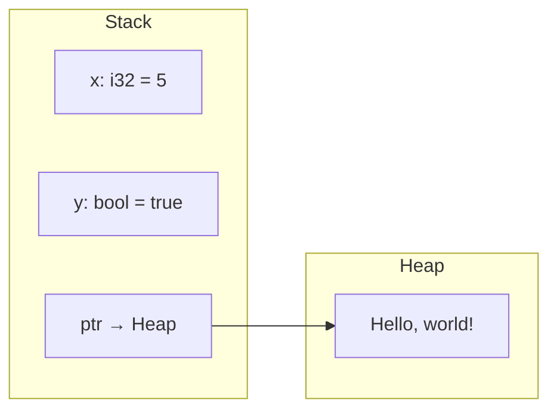
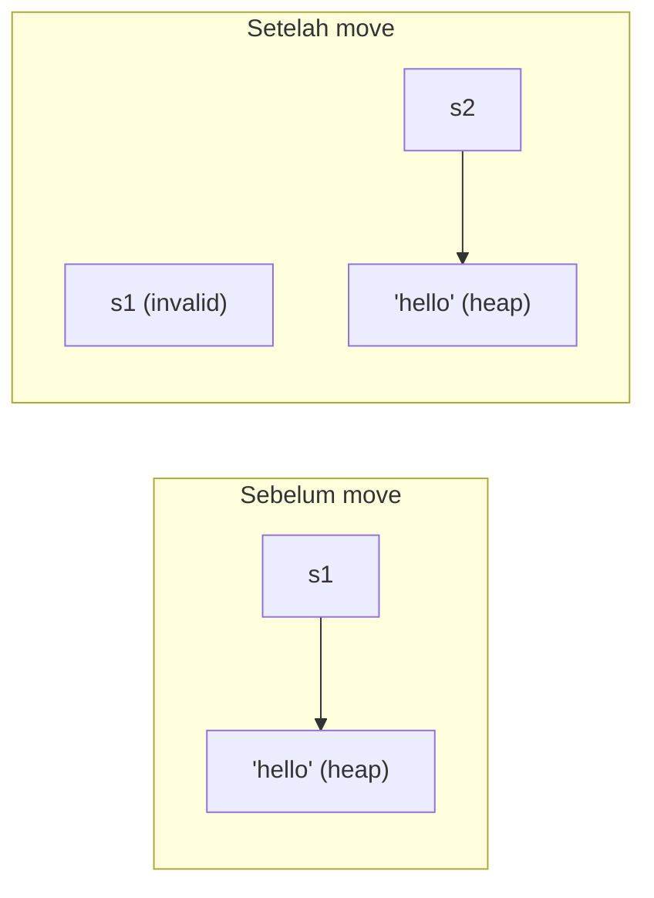

# Ownership & Borrowing

Ini adalah chapter **paling penting** dalam belajar Rust. Ownership adalah konsep yang membedakan Rust dari bahasa lain dan menjadi fondasi dari memory safety tanpa garbage collector.

## Stack vs Heap

Sebelum memahami ownership, kita perlu tahu bagaimana memori bekerja:

| Aspek | Stack | Heap |
|-------|-------|------|
| Ukuran data | Fixed, diketahui saat compile | Dinamis, bisa berubah |
| Kecepatan | Sangat cepat (LIFO) | Lebih lambat (allocation) |
| Contoh tipe | i32, f64, bool, char, array, tuple | String, Vec, Box |
| Management | Otomatis (push/pop) | Perlu tracking |
| Akses | Langsung | Via pointer |



## Tiga Aturan Ownership

Ini adalah tiga aturan fundamental yang HARUS kamu hafal:

1. **Setiap value di Rust memiliki satu owner** (variabel)
2. **Hanya boleh ada satu owner pada satu waktu**
3. **Ketika owner keluar dari scope, value-nya di-drop (deallocated)**

```rust
fn main() {
    {
        let s = String::from("hello"); // s masuk scope, memori dialokasi
        println!("{s}");
    } // s keluar scope, Rust memanggil drop(), memori dibebaskan

    // println!("{s}"); // ❌ Error: s sudah tidak ada
}
```

## Move Semantics

Ketika kamu "assign" satu variabel ke variabel lain untuk tipe heap-allocated, yang terjadi adalah **move** (bukan copy):

```rust
fn main() {
    let s1 = String::from("hello");
    let s2 = s1; // s1 di-MOVE ke s2 — s1 tidak valid lagi!

    // println!("{s1}"); // ❌ Error: value used after move
    println!("{s2}"); // ✅ OK — s2 sekarang owner
}
```



### Kenapa Move?

Jika Rust melakukan shallow copy (seperti C), dua variabel akan menunjuk ke memori yang sama. Ketika keduanya keluar scope, memori akan di-free dua kali (**double free** — undefined behavior). Move mencegah ini.

## Clone vs Copy

### Clone — Deep Copy (Explicit)

```rust
fn main() {
    let s1 = String::from("hello");
    let s2 = s1.clone(); // Deep copy — s1 masih valid

    println!("s1 = {s1}"); // ✅ OK
    println!("s2 = {s2}"); // ✅ OK
}
```

### Copy — Stack Copy (Implicit)

Tipe-tipe yang sepenuhnya di stack bisa **Copy** secara implisit:

```rust
fn main() {
    let x = 5;
    let y = x; // Copy — x masih valid (karena i32 implements Copy)

    println!("x = {x}"); // ✅ OK
    println!("y = {y}"); // ✅ OK
}
```

**Tipe yang implement Copy:** semua scalar types (integer, float, bool, char), tuple yang isinya semua Copy, array yang isinya Copy, dan references.

| Tipe | Copy? | Alasan |
|------|-------|--------|
| `i32`, `f64`, `bool`, `char` | ✅ | Sepenuhnya di stack, cheap to copy |
| `(i32, bool)` | ✅ | Semua field Copy |
| `String` | ❌ | Data di heap, expensive to copy |
| `Vec<T>` | ❌ | Data di heap |
| `&T` | ✅ | Reference adalah pointer (fixed size) |

## Ownership dan Functions

Passing value ke function juga men-trigger **move** atau **copy**:

```rust
fn takes_ownership(s: String) { // s masuk scope
    println!("Got: {s}");
} // s di-drop di sini

fn makes_copy(x: i32) { // x masuk scope
    println!("Got: {x}");
} // x di-drop (tapi i32 = Copy, jadi tidak berpengaruh)

fn main() {
    let s = String::from("hello");
    takes_ownership(s); // s di-move ke function
    // println!("{s}"); // ❌ Error: s sudah di-move

    let x = 5;
    makes_copy(x); // x di-copy ke function
    println!("{x}"); // ✅ OK — x masih valid
}
```

### Return Values dan Ownership

```rust
fn gives_ownership() -> String {
    String::from("hello") // Ownership di-transfer ke caller
}

fn takes_and_gives_back(s: String) -> String {
    println!("Processing: {s}");
    s // Return ownership kembali ke caller
}

fn main() {
    let s1 = gives_ownership();
    let s2 = takes_and_gives_back(s1);
    // s1 sudah di-move, s2 sekarang owner
    println!("{s2}");
}
```

## References & Borrowing

Memindahkan ownership terus-menerus sangat merepotkan. **Borrowing** memungkinkan kita meminjam value tanpa mengambil ownership:

```rust
fn calculate_length(s: &String) -> usize { // s adalah reference ke String
    s.len()
} // s keluar scope, tapi karena tidak punya ownership, nothing is dropped

fn main() {
    let s = String::from("hello");
    let len = calculate_length(&s); // & membuat reference (meminjam)
    println!("Panjang '{s}' adalah {len}"); // ✅ s masih valid!
}
```

### Aturan Borrowing

1. **Boleh punya banyak immutable references** (`&T`) pada satu waktu
2. **ATAU satu mutable reference** (`&mut T`) — tidak keduanya
3. **References harus selalu valid** (no dangling references)

```rust
fn main() {
    let s = String::from("hello");

    // ✅ Multiple immutable references OK
    let r1 = &s;
    let r2 = &s;
    println!("{r1} {r2}");

    // ✅ Mutable reference (setelah immutable selesai dipakai)
    let mut s = String::from("hello");
    let r3 = &mut s;
    r3.push_str(", world!");
    println!("{r3}");
}
```

### Mutable References

```rust
fn add_greeting(s: &mut String) {
    s.push_str(", world!");
}

fn main() {
    let mut s = String::from("hello");
    add_greeting(&mut s);
    println!("{s}"); // "hello, world!"
}
```

### Konflik Reference

```rust
fn main() {
    let mut s = String::from("hello");

    let r1 = &s;     // ✅ immutable borrow
    let r2 = &s;     // ✅ immutable borrow

    // let r3 = &mut s; // ❌ CANNOT borrow as mutable while immutable refs exist!

    println!("{r1} {r2}");
    // r1 dan r2 tidak dipakai lagi setelah titik ini (NLL — Non-Lexical Lifetimes)

    let r3 = &mut s; // ✅ OK sekarang — immutable refs sudah selesai
    r3.push_str("!");
    println!("{r3}");
}
```

## Dangling References

Rust TIDAK mengizinkan dangling references:

```rust
// ❌ TIDAK COMPILE
// fn dangle() -> &String {
//     let s = String::from("hello");
//     &s // s akan di-drop, reference menjadi dangling!
// }

// ✅ Return owned value instead
fn no_dangle() -> String {
    let s = String::from("hello");
    s // Ownership di-transfer ke caller
}

fn main() {
    let s = no_dangle();
    println!("{s}");
}
```

## Slice — Borrowing Sebagian Data

Slice adalah reference ke bagian dari collection:

```rust
fn first_word(s: &str) -> &str {
    let bytes = s.as_bytes();
    for (i, &byte) in bytes.iter().enumerate() {
        if byte == b' ' {
            return &s[..i];
        }
    }
    s
}

fn main() {
    let sentence = String::from("hello world");
    let word = first_word(&sentence);
    println!("First word: {word}");

    // String slices
    let hello = &sentence[0..5];   // "hello"
    let world = &sentence[6..11];  // "world"
    println!("{hello} {world}");

    // Array slices
    let arr = [1, 2, 3, 4, 5];
    let slice = &arr[1..3]; // [2, 3]
    println!("{:?}", slice);
}
```

---

## Studi Kasus: Text Processor

```rust
fn count_words(text: &str) -> usize {
    text.split_whitespace().count()
}

fn capitalize_first(word: &str) -> String {
    let mut chars = word.chars();
    match chars.next() {
        None => String::new(),
        Some(c) => c.to_uppercase().to_string() + chars.as_str(),
    }
}

fn process_text(text: &str) -> String {
    text.split_whitespace()
        .map(|word| capitalize_first(word))
        .collect::<Vec<String>>()
        .join(" ")
}

fn main() {
    let text = String::from("rust adalah bahasa yang aman dan cepat");

    // Borrowing — text masih valid setelah semua operasi
    let word_count = count_words(&text);
    let processed = process_text(&text);

    println!("Original: {text}");
    println!("Words: {word_count}");
    println!("Processed: {processed}");
}
```

---

## Bank Soal

### Soal 1 — Will This Compile? (Mudah)

```rust
fn main() {
    let s = String::from("hello");
    let s2 = s;
    println!("{s}");
}
```

**Jawaban:** ❌ Tidak compile. `s` sudah di-move ke `s2`. Fix: gunakan `s.clone()` atau print `s2`.

### Soal 2 — Will This Compile? (Mudah)

```rust
fn main() {
    let x = 42;
    let y = x;
    println!("{x} {y}");
}
```

**Jawaban:** ✅ Compile. `i32` implement `Copy`, jadi `x` di-copy (bukan di-move).

### Soal 3 — Will This Compile? (Sedang)

```rust
fn main() {
    let mut s = String::from("hello");
    let r1 = &s;
    let r2 = &s;
    let r3 = &mut s;
    println!("{r1} {r2} {r3}");
}
```

**Jawaban:** ❌ Tidak compile. Tidak bisa punya mutable reference saat immutable references masih aktif (dipakai di `println!`).

### Soal 4 — Fix The Code (Sedang)

```rust
fn main() {
    let s = String::from("hello");
    let len = get_length(s);
    println!("{s} has length {len}");
}

fn get_length(s: String) -> usize {
    s.len()
}
```

**Jawaban — gunakan reference:**

```rust
fn main() {
    let s = String::from("hello");
    let len = get_length(&s); // Borrow instead of move
    println!("{s} has length {len}");
}

fn get_length(s: &String) -> usize {
    s.len()
}
```

### Soal 5 — Fix The Code (Sedang)

```rust
fn main() {
    let mut data = vec![1, 2, 3];
    let first = &data[0];
    data.push(4);
    println!("First: {first}");
}
```

**Jawaban:** ❌ Tidak compile. `push` membutuhkan `&mut data`, tapi `first` masih meminjam `data` secara immutable. Fix:

```rust
fn main() {
    let mut data = vec![1, 2, 3];
    let first = data[0]; // Copy the value (i32 is Copy)
    data.push(4);
    println!("First: {first}");
}
```

### Soal 6 — Ownership Chain (Sedang)

Apa output kode berikut?

```rust
fn main() {
    let s1 = String::from("A");
    let s2 = s1;
    let s3 = s2.clone();
    let s4 = s3;

    // Yang mana yang valid?
    // println!("{s1}"); // ?
    // println!("{s2}"); // ?
    // println!("{s3}"); // ?
    // println!("{s4}"); // ?
}
```

**Jawaban:**
- `s1` ❌ moved to s2
- `s2` ✅ valid (cloned to s3, not moved)
- `s3` ❌ moved to s4
- `s4` ✅ valid

### Soal 7 — Implement swap (Sulit)

Implementasikan fungsi yang swap dua String tanpa clone:

**Jawaban:**

```rust
fn swap_strings(a: &mut String, b: &mut String) {
    std::mem::swap(a, b);
}

fn main() {
    let mut s1 = String::from("hello");
    let mut s2 = String::from("world");

    println!("Before: s1={s1}, s2={s2}");
    swap_strings(&mut s1, &mut s2);
    println!("After:  s1={s1}, s2={s2}");
}
```

### Soal 8 — Longest Word (Sulit)

Implementasikan fungsi yang menemukan kata terpanjang dalam sebuah string slice dan mengembalikan reference ke kata tersebut:

**Jawaban:**

```rust
fn longest_word(text: &str) -> &str {
    let mut longest = "";
    for word in text.split_whitespace() {
        if word.len() > longest.len() {
            longest = word;
        }
    }
    longest
}

fn main() {
    let text = "the quick brown fox jumps over the lazy dog";
    let word = longest_word(text);
    println!("Longest word: '{word}'");
}
```

### Soal 9 — Fix Complex Borrowing (Sulit)

```rust
fn remove_duplicates(data: &mut Vec<String>) {
    let mut seen = Vec::new();
    data.retain(|item| {
        if seen.contains(item) {
            false
        } else {
            seen.push(item.clone());
            true
        }
    });
}

fn main() {
    let mut names = vec![
        "alice".to_string(), "bob".to_string(),
        "alice".to_string(), "charlie".to_string(),
        "bob".to_string(),
    ];
    remove_duplicates(&mut names);
    println!("{:?}", names);
}
```

**Jawaban:** ✅ Ini sudah compile! `retain` menggunakan closure yang meminjam `item` secara immutable, dan `seen` milik closure. Output: `["alice", "bob", "charlie"]`

### Soal 10 — Ownership Mental Model (Sulit)

Gambarkan apa yang terjadi di memori untuk setiap baris:

```rust
fn main() {
    let s1 = String::from("hello");  // Line 1
    let s2 = &s1;                     // Line 2
    let s3 = s1;                      // Line 3
    // println!("{s2}");              // Line 4
}
```

**Jawaban:**
- Line 1: `s1` owns "hello" (stack: ptr+len+cap, heap: "hello")
- Line 2: `s2` borrows `s1` (stack: reference to s1)
- Line 3: ❌ COMPILE ERROR. `s1` cannot be moved while it's borrowed by `s2`. Jika Line 4 dihapus, line 2-3 bisa compile karena NLL (s2 tidak dipakai setelah line 2).
