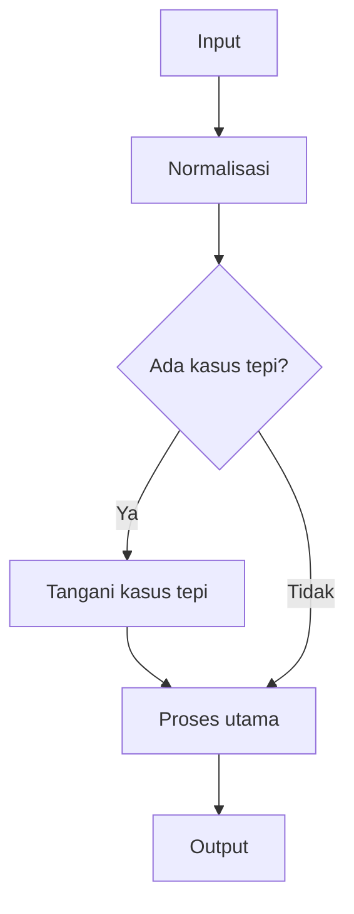

# 01. Dasar JavaScript untuk DSA

## Tujuan
- Mengenal tipe data, struktur data bawaan, dan operasi JavaScript yang paling sering muncul di soal DSA.
- Membiasakan pola pikir *input -> proses -> output*, serta kebiasaan mengecek kasus tepi (edge case).
- Menghindari jebakan umum JavaScript yang bisa bikin jawaban salah walau algoritmanya benar.

## Konsep Inti
Fokus DSA biasanya bukan soal framework, tapi soal:
- representasi data (array, string, object, Map/Set)
- cara iterasi (loop, `map/filter/reduce`)
- perbandingan nilai (strict vs loose)
- mutasi data (apakah kita mengubah input?)

Berikut konsep yang paling relevan.

### Template terkait
- [Queue head-index](/js-dsa/12-code-templates#tpl-queue-head-index)
- [Two pointers palindrome (normalized)](/js-dsa/12-code-templates#tpl-two-pointers-palindrome-normalized)
- [Sliding window fixed (max sum k)](/js-dsa/12-code-templates#tpl-sliding-window-fixed-max-sum-k)

### Visualisasi (Mermaid)


### Array (paling sering)
- Akses O(1) lewat indeks: `arr[i]`.
- Tambah/hapus di akhir biasanya cepat: `push/pop`.
- Hati-hati: `shift/unshift` mahal untuk array besar (geser elemen).
- Metode yang sering dipakai di DSA:
  - `slice` (tidak mutasi), `splice` (mutasi)
  - `sort` (mutasi!)
  - Default `sort()` membandingkan sebagai string; untuk angka gunakan `arr.sort((a, b) => a - b)`.
  - `join/split` (string ke array, dan sebaliknya)

### String (ingat: immutable)
- String tidak bisa diubah per karakter; operasi seperti `s += char` di loop bisa mahal.
- Untuk membangun string, lebih aman kumpulkan di array lalu `join('')`.
- `s.length` menghitung *UTF-16 code units*, bukan jumlah karakter manusia.
  - Contoh: `'😄'.length === 2` (gotcha Unicode). Untuk DSA, jika soal menyebut "karakter" dan input bisa emoji/aksara gabungan, definisi karakter perlu jelas.

### Object vs Map/Set (frekuensi & keanggotaan)
- `Object` cocok untuk key string sederhana, tapi:
  - key bisa bentrok dengan properti bawaan (`__proto__`), jadi gunakan `Object.create(null)` bila perlu.
  - urutan properti punya aturan khusus.
- `Map` lebih aman untuk *hash map* umum:
  - key bisa tipe apa pun (string/number/object).
  - API jelas: `map.get(key)`, `map.set(key, val)`.
- `Set` cocok untuk cek keanggotaan dan deduplikasi.

### Iterasi yang aman
- `for (let i = 0; i < n; i++)` bagus untuk two-pointer dan akses indeks.
- `for (const x of arr)` bagus untuk iterasi nilai.
- Hindari `for...in` untuk array (iterasi *keys* string + bisa ikut properti tambahan).

### Mutasi vs immutability (penting untuk "jangan ubah input")
- Banyak soal mengharuskan input tidak diubah.
- Operasi yang mutasi: `sort`, `reverse`, `splice`, `push/pop`, set properti object.
- Alternatif non-mutasi: `const copy = arr.slice()`, `const copy = [...arr]`.

### Perbandingan dan jebakan nilai
- Pakai `===` dan `!==` (strict) untuk menghindari coercion aneh.
  - `'5' == 5` true, tapi `'5' === 5` false.
- `NaN` tidak sama dengan apa pun (termasuk dirinya sendiri): `NaN === NaN` false.
  - Cek dengan `Number.isNaN(x)`.
- Perbandingan referensi:
  - `[] === []` false, `{}` === `{}` false (beda referensi).
  - Untuk DSA, jika perlu membandingkan isi array/object, bandingkan elemen/field satu per satu.

### Kebiasaan DSA yang mengurangi bug
- Tulis fungsi dengan kontrak jelas: input apa, output apa.
- Sebelum ngoding, sebutkan edge case minimal:
  - input kosong
  - elemen duplikat
  - huruf besar/kecil, spasi
  - nilai negatif / nol
  - data tidak valid (jika memungkinkan)

## Contoh Cepat
```js
// Jalankan: bun run file.js (atau node file.js)

// 1) Frequency count dengan Map
function countWords(words) {
  const freq = new Map();
  for (const w of words) {
    freq.set(w, (freq.get(w) ?? 0) + 1);
  }
  return freq;
}

// 2) Deduplikasi cepat dengan Set (ingat: Set menyimpan nilai unik)
function unique(nums) {
  return [...new Set(nums)];
}

const words = ["teh", "kopi", "teh", "susu", "teh"];
const freq = countWords(words);

console.log(freq.get("teh")); // 3
console.log(unique([3, 1, 3, 2, 2, 1])); // [3, 1, 2]
```

## Studi Kasus (Sehari-hari)
**Pernyataan masalah**
Kamu punya daftar belanja harian. Data datang sebagai array string dengan format:
`"namaBarang|kategori"`.

Tugasnya: hitung total item per kategori (mirip *grouping + counting*), dan abaikan entri yang formatnya tidak valid.

**Contoh input data kecil**
```js
const items = [
  "teh|minuman",
  "kopi|minuman",
  "sabun|kebutuhan",
  "teh|minuman",
  "invalid", // harus diabaikan
  "|kebutuhan", // nama kosong: abaikan
];
```

**Output yang diharapkan**
```js
{ minuman: 3, kebutuhan: 1 }
```

**Pendekatan**
- Pakai `Map` untuk menyimpan counter per kategori.
- Untuk setiap string:
  - `split('|')` menjadi `[nama, kategori]`
  - validasi sederhana: dua bagian harus ada dan tidak kosong
  - `map.set(kategori, (map.get(kategori) ?? 0) + 1)`
- Terakhir, konversi `Map` -> object supaya output mudah dibaca/di-serialize.

**Implementasi JavaScript (final)**
```js
function countByCategory(items) {
  const counts = new Map();

  for (const raw of items) {
    const parts = raw.split("|");
    if (parts.length !== 2) continue;

    const name = parts[0].trim();
    const category = parts[1].trim();
    if (name.length === 0 || category.length === 0) continue;

    counts.set(category, (counts.get(category) ?? 0) + 1);
  }

  return Object.fromEntries(counts);
}

// demo
const items = [
  "teh|minuman",
  "kopi|minuman",
  "sabun|kebutuhan",
  "teh|minuman",
  "invalid",
  "|kebutuhan",
];

console.log(countByCategory(items));
// { minuman: 3, kebutuhan: 1 }
```

Kompleksitas waktu: O(n * L), dengan `L` panjang string rata-rata (karena `split/trim`). Alternatif penulisan yang juga umum: O(totalKarakter).

Kompleksitas ruang: O(m) untuk menyimpan `m` kategori unik (plus output object O(m)).

## Latihan
1. Buat fungsi `max(nums)` yang menerima array angka dan mengembalikan nilai maksimum.

<details>
  <summary>Petunjuk</summary>

  - Mulai dari elemen pertama sebagai kandidat maksimum.
  - Bandingkan satu per satu dan perbarui kandidat.
  - Pikirkan edge case: array kosong (mau return apa?).
</details>

2. Buat fungsi `isAnagram(a, b)` yang mengecek apakah dua string adalah anagram (abaikan spasi, case-insensitive).

<details>
  <summary>Petunjuk</summary>

  - Normalisasi dulu: lowercase, hapus spasi.
  - Cara DSA umum: frequency count (Map/Object) untuk tiap huruf.
  - Cek panjang setelah normalisasi.
</details>

3. Buat fungsi `dedupeStable(nums)` yang menghapus duplikat dari array angka tapi mempertahankan urutan kemunculan pertama.

<details>
  <summary>Petunjuk</summary>

  - Gunakan `Set` untuk melacak angka yang sudah pernah muncul.
  - Iterasi array, jika belum ada di set maka push ke hasil.
</details>

4. Buat fungsi `twoSum(nums, target)` yang mengembalikan indeks dua angka yang jumlahnya `target` (atau `null` jika tidak ada).

<details>
  <summary>Petunjuk</summary>

  - Pakai hash map: simpan nilai -> indeks.
  - Saat di indeks `i`, cari `target - nums[i]`.
  - Waspada: jangan pakai `indexOf` di dalam loop (jadi O(n^2)).
</details>

5. Buat fungsi `sameElements(a, b)` yang mengecek apakah dua array berisi elemen yang sama dengan frekuensi yang sama (urutan boleh beda).

<details>
  <summary>Petunjuk</summary>

  - Ini mirip membandingkan dua multiset.
  - Pakai Map untuk menghitung frekuensi dari array pertama, lalu kurangi saat memproses array kedua.
  - Ingat perbandingan referensi: kalau elemennya object, definisi "sama" perlu jelas.
</details>

## Ringkasan
- DSA di JavaScript sangat bergantung pada `Array`, `String`, `Map`, dan `Set`.
- Biasakan `===`, cek `NaN` dengan `Number.isNaN`, dan pahami bahwa array/object dibandingkan berdasarkan referensi.
- Pahami operasi yang memutasi data (`sort`, `reverse`, `splice`) vs yang tidak (`slice`, spread).
- Untuk performa: gunakan pola loop yang tepat (two-pointer, frequency map) dan hindari operasi O(n) tersembunyi di dalam loop.
- Selalu tulis kontrak input-output dan pikirkan edge case sejak awal.
