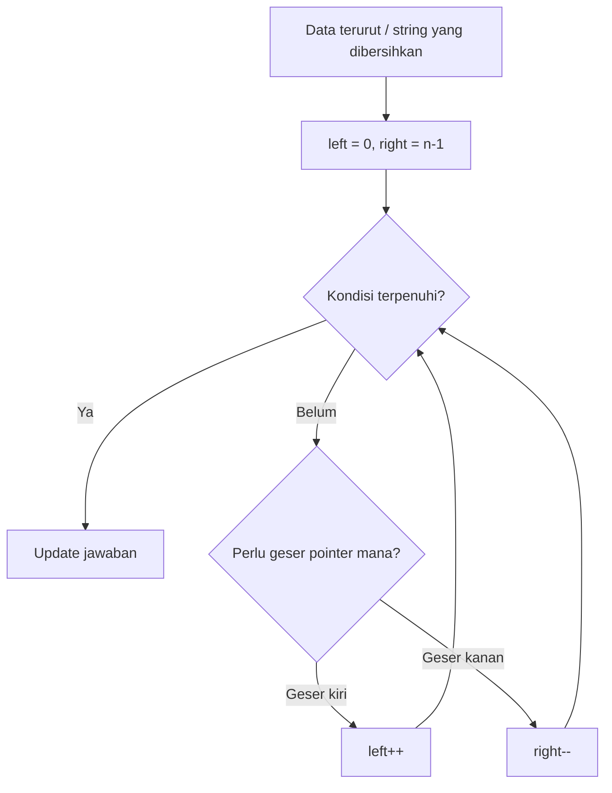

# 03. Array dan string

## Tujuan
- Menguasai operasi dasar array/string yang sering muncul di problem DSA.
- Paham kapan sebuah operasi itu cepat atau mahal (gambaran Big-O) di JavaScript.
- Kenal pola umum: dedupe stabil, sorting angka yang benar, two pointers, prefix/suffix, dan persiapan frequency counting.

## Konsep Inti

Array dan string adalah bentuk input paling umum di soal DSA. Banyak solusi yang benar secara logika bisa gagal karena salah paham operasi bawaan JavaScript (mis. `sort()` default, atau biaya `shift()`), atau karena lupa bahwa string itu immutable.

### Template terkait
- Dedupe stabil: `/js-dsa/12-code-templates#tpl-set-dedupe-stable`
- Two pointers (pair sum pada sorted array): `/js-dsa/12-code-templates#tpl-two-pointers-pair-sum-sorted`
- Two pointers (palindrome ternormalisasi): `/js-dsa/12-code-templates#tpl-two-pointers-palindrome-normalized`
- Sliding window (ukuran tetap): `/js-dsa/12-code-templates#tpl-sliding-window-fixed-max-sum-k`

### Visualisasi (Mermaid)



### Array: operasi yang paling sering dipakai

**1) Indexing (akses via indeks)**
- `arr[i]` untuk baca/tulis elemen pada indeks `i`.
- Umumnya akses ini `O(1)`.

**2) Tambah/hapus di belakang: `push` dan `pop`**
- `push(x)` menambah ke akhir, `pop()` menghapus dari akhir.
- Umumnya cepat (rata-rata `O(1)`), sehingga banyak algoritma memakai array sebagai stack.

**3) Tambah/hapus di depan: `unshift` dan `shift`**
- `unshift(x)` menambah di depan, `shift()` menghapus dari depan.
- Biasanya mahal untuk array besar karena elemen lain perlu bergeser indeksnya (sering diperkirakan `O(n)`).
- Jika kamu butuh queue besar, pertimbangkan struktur queue (dibahas di bab stack/queue) atau pakai pointer indeks.

Berikut contoh queue sederhana yang menghindari `shift()` dengan menyimpan indeks `head`:

```js
// Queue berbasis array + head index (tanpa shift)
const q = [];
let head = 0;

function enqueue(x) {
  q.push(x);
}

function dequeue() {
  if (head >= q.length) return undefined;
  const value = q[head];
  head += 1;

  // Opsional: rapikan sesekali supaya array tidak tumbuh terus
  if (head > 50 && head * 2 > q.length) {
    q.splice(0, head);
    head = 0;
  }

  return value;
}

enqueue("A");
enqueue("B");
console.log(dequeue()); // A
console.log(dequeue()); // B
```

**4) `slice` vs `splice` (ini sering tertukar)**
- `slice(start, end)`:
  - Membuat salinan bagian array.
  - Tidak memutasi array asal.
  - Biaya mengikuti panjang potongan (sekitar `O(k)`).
- `splice(start, deleteCount, ...items)`:
  - Memutasi array asal (menghapus/menyisipkan).
  - Bisa mahal karena menggeser elemen (sering `O(n)`).

Coba jalankan snippet ini untuk melihat bedanya (mutasi vs tidak):

```js
const a = [1, 2, 3, 4];

const potongan = a.slice(1, 3);
console.log(potongan); // [2, 3]
console.log(a); // [1, 2, 3, 4] (tidak berubah)

const a2 = [1, 2, 3, 4];
const terhapus = a2.splice(1, 2, 99);
console.log(terhapus); // [2, 3]
console.log(a2); // [1, 99, 4] (berubah)
```

**5) Sorting: gotcha comparator**
- `arr.sort()` tanpa comparator membandingkan elemen sebagai string.
  - Contoh: `[2, 10, 3].sort()` menghasilkan `[10, 2, 3]`.
- Untuk angka, gunakan comparator:
  - `arr.sort((a, b) => a - b)` untuk urut naik.
  - `arr.sort((a, b) => b - a)` untuk urut turun.
- `sort()` memutasi array. Kalau input tidak boleh diubah, salin dulu: `const copy = [...arr]`.
- Kompleksitas sorting berbasis perbandingan umumnya `O(n log n)`.

### Dua pointers: kesiapan dari array
Pola **two pointers** sering muncul pada array terurut atau saat memproses dari dua ujung.
- Contoh ide: pointer `l` dari kiri dan `r` dari kanan, lalu bergerak berdasarkan kondisi.
- Keuntungan: sering bisa menurunkan `O(n^2)` jadi `O(n)` karena tidak perlu dua loop penuh.
- Bab pola algoritma akan membahas lebih dalam; di sini cukup siap dengan akses indeks dan loop `while (l < r)`.

### String: ingat bahwa string itu immutable

**1) String tidak bisa diubah per karakter**
- Di JavaScript, string immutable: operasi seperti `s[0] = 'x'` tidak mengubah string.
- Kalau kamu perlu mengubah banyak karakter, biasanya kamu:
  - membangun string baru, atau
  - konversi ke array karakter, modifikasi, lalu gabung lagi.

**2) Operasi string yang paling sering dipakai**
- `slice(start, end)` mengambil potongan.
- `substring(start, end)` mirip, tapi perlakuan indeks negatif berbeda (untuk pemula, cukup pilih salah satu dan konsisten).
- `split(sep)` memecah jadi array.
- `arr.join(sep)` menggabungkan array menjadi string.
- `toLowerCase()` dan `toUpperCase()` untuk normalisasi case.
- `trim()` untuk menghapus spasi di ujung.

**3) Membangun string dengan aman (hindari concatenation di loop)**
- Karena immutable, `s += part` di dalam loop *bisa* membuat banyak salinan (worst-case). Di beberapa engine JS, ada optimasi tertentu, tapi biayanya tetap bisa bergantung pada pola pemakaian dan ukuran data.
- Pola yang aman untuk performa: kumpulkan ke array, lalu `join('')`.

**4) Catatan singkat Unicode**
- `str.length` menghitung unit UTF-16, bukan selalu jumlah karakter yang terlihat manusia.
- Contoh: `'😄'.length === 2`. Untuk banyak soal DSA pemula (ASCII/latin), ini aman; kalau input bisa emoji/aksara gabungan, definisi "karakter" harus jelas.

### Pola yang sering muncul (persiapan untuk bab lain)

**Frequency counting (hitung frekuensi)**
- Banyak soal: anagram, duplikasi, substring, dll.
- Biasanya kamu membuat struktur `Map` atau object untuk menghitung kemunculan.
- Intinya: sekali pass, update counter.

**Prefix/suffix (akumulasi dari kiri/kanan)**
- Berguna untuk: jumlah prefix, produk prefix, running total, atau cek kondisi tanpa nested loop.
- Ide utama: precompute array `prefix[i]` (hasil sampai indeks `i`) atau `suffix[i]` (hasil dari `i` sampai akhir).

**Kapan konversi string menjadi array?**
- Jika perlu:
  - sorting karakter,
  - reverse,
  - modifikasi per posisi.
- Cara umum: `const chars = s.split('')`, proses, lalu `chars.join('')`.

### Catatan kompleksitas (tingkat tinggi)
- Akses `arr[i]`: umumnya `O(1)`.
- `push/pop`: umumnya `O(1)` rata-rata.
- `shift/unshift`: sering diperkirakan `O(n)`.
- `slice` array atau string: `O(k)` untuk panjang hasil.
- `split/join`: `O(totalKarakter)`.
- `sort`: umumnya `O(n log n)`.

## Contoh Cepat
```js
// Jalankan di console browser, Node.js, atau Bun.

// 1) Dedupe stabil (urutan kemunculan pertama tetap)
function dedupeStable(arr) {
  const seen = new Set();
  const out = [];
  for (const x of arr) {
    if (!seen.has(x)) {
      seen.add(x);
      out.push(x);
    }
  }
  return out;
}

console.log(dedupeStable(["a", "b", "a", "c", "b"]));
// [ 'a', 'b', 'c' ]

// 2) Sorting angka: wajib comparator
const nums = [2, 10, 3, 1];
console.log([...nums].sort((a, b) => a - b));
// [ 1, 2, 3, 10 ]

// 3) Bangun string aman: kumpulkan lalu join
const parts = ["ID", "-", "2026", "-", "0007"];
console.log(parts.join(""));
// ID-2026-0007
```

## Studi Kasus (Sehari-hari)

### Normalisasi kode produk dari scanner gudang

**Pernyataan masalah**
Scanner gudang mengirim daftar kode produk sebagai array string. Masalahnya:
- Kadang ada spasi dan tanda minus yang tidak konsisten.
- Kadang huruf kecil/besar campur.
- Kamu butuh daftar kode produk **unik** yang sudah dinormalisasi, dengan **urutan kemunculan pertama tetap**.

Aturan normalisasi:
- Hapus spasi di ujung dan di tengah.
- Hapus tanda minus `-`.
- Ubah menjadi huruf besar.
- Kode valid hanya berisi huruf A sampai Z dan angka 0 sampai 9, dan panjangnya minimal 4.

**Contoh input**
```js
const rawCodes = [
  "  ab-12  ",
  "AB12",
  "xy 99",
  "XY-99",
  "!!!",
  "p-0007",
  "P0007",
];
```

**Output yang diharapkan**
```js
["AB12", "XY99", "P0007"]
```

### Pendekatan
1) Untuk tiap string, lakukan normalisasi (trim, hapus spasi dan minus, uppercase).
2) Validasi hasil normalisasi (hanya alfanumerik, panjang minimal 4).
3) Dedupe stabil menggunakan `Set` untuk melacak kode yang sudah pernah muncul.

### Implementasi JavaScript (final)
```js
function normalizeCode(raw) {
  // 1) trim ujung
  let s = raw.trim();

  // 2) hapus spasi di tengah dan tanda minus
  // (pakai regex sederhana: g = global)
  s = s.replace(/\s+/g, "");
  s = s.replace(/-/g, "");

  // 3) uppercase
  s = s.toUpperCase();
  return s;
}

function isValidCode(code) {
  if (code.length < 4) return false;
  return /^[A-Z0-9]+$/.test(code);
}

function uniqueNormalizedCodes(rawCodes) {
  const seen = new Set();
  const result = [];

  for (const raw of rawCodes) {
    const code = normalizeCode(raw);
    if (!isValidCode(code)) continue;

    if (!seen.has(code)) {
      seen.add(code);
      result.push(code);
    }
  }

  return result;
}

// demo
const rawCodes = [
  "  ab-12  ",
  "AB12",
  "xy 99",
  "XY-99",
  "!!!",
  "p-0007",
  "P0007",
];

console.log(uniqueNormalizedCodes(rawCodes));
// [ 'AB12', 'XY99', 'P0007' ]
```

Kompleksitas waktu: O(n * L), dengan `L` panjang string rata-rata untuk proses normalisasi/validasi.

Kompleksitas ruang: O(m) untuk `m` kode unik yang valid (set dan output).

## Latihan
1. Diberi array angka, hapus duplikat tapi pertahankan urutan kemunculan pertama (stable dedupe).
   <details>
     <summary>Petunjuk</summary>
     - Gunakan `Set` untuk melacak angka yang sudah pernah muncul.
     - Setiap angka yang belum pernah muncul, masukkan ke array hasil.
   </details>

1. Diberi array angka, kembalikan array baru yang berisi angka terurut naik. Pastikan hasil benar untuk input seperti `[2, 10, 3]`.
   <details>
     <summary>Petunjuk</summary>
     - Ingat: `sort()` default membandingkan sebagai string.
     - Pakai comparator `(a, b) => a - b`.
     - Jika input tidak boleh berubah, salin dulu array-nya.
   </details>

1. Diberi string, tentukan apakah semua karakter unik (tanpa duplikat).
   <details>
     <summary>Petunjuk</summary>
     - Gunakan struktur untuk mencatat karakter yang sudah pernah muncul.
     - Pikirkan apakah input bisa berisi spasi atau huruf besar/kecil.
   </details>

1. Diberi string kalimat, buat fungsi `reverseWords(s)` yang membalik urutan katanya (bukan membalik huruf), rapikan spasi berlebih.
   <details>
     <summary>Petunjuk</summary>
     - Fokus ke dua tahap: (1) normalisasi whitespace dulu, (2) proses daftar kata.
     - Setelah jadi daftar kata yang bersih, balik urutan katanya, lalu gabungkan kembali dengan satu spasi.
   </details>

1. Diberi array terurut dan target, buat fungsi yang mengecek apakah ada dua angka yang jumlahnya sama dengan target.
   <details>
     <summary>Petunjuk</summary>
     - Coba pola two pointers: satu pointer dari kiri, satu dari kanan.
     - Jika jumlah terlalu kecil, geser pointer kiri; kalau terlalu besar, geser pointer kanan.
   </details>

## Ringkasan
- Array dan string adalah input paling umum di soal DSA; pahami operasi mutasi vs non-mutasi.
- `push/pop` biasanya cepat, `shift/unshift` sering mahal untuk array besar.
- `slice` tidak memutasi, `splice` memutasi; `sort()` memutasi dan butuh comparator untuk angka.
- String immutable; untuk membangun string besar, lebih aman kumpulkan ke array lalu `join('')`.
- Pola dasar yang perlu siap: stable dedupe, frequency counting, two pointers, dan prefix/suffix.
