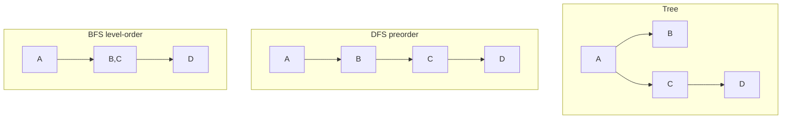

# 09. Dasar tree

## Tujuan
- Memahami apa itu tree dan istilah pentingnya (root, parent/child, leaf, depth/height).
- Mengenal cara merepresentasikan tree di JavaScript (nested object + `children`).
- Bisa melakukan traversal dasar: DFS (preorder) dan BFS (level order).

## Konsep Inti

### Template terkait
- Queue head-index: `/js-dsa/12-code-templates#tpl-queue-head-index`
- BFS shortest path (unweighted): `/js-dsa/12-code-templates#tpl-bfs-shortest-path`
- DFS reachable (iteratif): `/js-dsa/12-code-templates#tpl-dfs-reachable-iterative`

### Visualisasi (Mermaid)



### Apa itu tree
**Tree (pohon)** adalah struktur data yang menyimpan elemen (disebut **node**) dalam bentuk **hierarki**.

Istilah penting:
- **Node**: satu elemen di tree (mis. folder "docs").
- **Edge**: hubungan/garis penghubung antar node (umumnya parent -> child).
- **Root**: node paling atas.
- **Parent / Child**: node A adalah parent dari node B jika B berada langsung di bawah A.
- **Leaf**: node yang tidak punya child.
- **Depth (kedalaman)**: jumlah node dari root sampai node tersebut (root depth = 1).
- **Height (tinggi)**: depth maksimum pada tree (node paling dalam).

Catatan: tree yang paling sering kamu lihat adalah **binary tree** (punya child kiri/kanan). Tapi konsep tree lebih umum: satu node bisa punya banyak child.

### Representasi tree di JavaScript
Ada beberapa cara umum:

**1) Nested object + `children` (paling praktis untuk tree)**
```js
const tree = {
  value: "A",
  children: [
    { value: "B", children: [] },
    { value: "C", children: [{ value: "D", children: [] }] },
  ],
};
```
Ini enak karena struktur data sudah mirip dengan bentuk tree-nya.

**2) (Opsional) Adjacency map/list**
Untuk graph umum, kamu sering pakai adjacency list, misalnya:
```js
const adj = {
  A: ["B", "C"],
  B: [],
  C: ["D"],
  D: [],
};
```
Ini juga bisa dipakai untuk tree, tapi biasanya perlu info tambahan (siapa root, dan memastikan tidak ada siklus). Jadi untuk bab tree, fokuslah ke nested object.

### Traversal (cara “mengunjungi” node)
Traversal adalah proses mengunjungi node-node tree dengan urutan tertentu.

#### DFS (Depth-First Search)
DFS “menyelam” sedalam mungkin, baru kembali (backtrack).

Variasi urutan DFS:
- **Preorder**: proses node sekarang dulu, lalu child.
- **Inorder**: (khusus binary tree) kiri -> node -> kanan.
- **Postorder**: proses semua child dulu, baru node sekarang.

Di bab ini kita implement **preorder** karena paling mudah untuk tree umum.

#### BFS (Breadth-First Search) / Level order
BFS mengunjungi node per level: level root, lalu semua anak root, lalu cucu-cucu, dst.

Biasanya BFS memakai **queue (antrian)**.

Kapan pilih DFS vs BFS (aturan praktis):
- **DFS**: cocok untuk eksplorasi semua path, enumerasi semua node, atau operasi yang butuh “masuk dulu sedalam mungkin” (mis. hitung total, cari semua file path). Hati-hati jika tree sangat dalam (rekursi bisa overflow).
- **BFS**: cocok untuk proses per level, atau mencari node “terdekat” dalam jumlah langkah level (mis. level/jarak minimum pada struktur level-order). Biaya memori bisa lebih besar karena queue bisa menampung satu level.

### Kapan tree dipakai
Tree cocok untuk data hierarki, misalnya:
- Struktur folder/file
- Struktur organisasi (CEO -> manager -> staff)
- Menu navigasi (kategori -> subkategori)
- Komponen UI yang bersarang (walau di implementasi nyata bisa ada detail tambahan)

### Intuisi kompleksitas
Untuk traversal yang mengunjungi semua node:
- **Time**: umumnya `O(n)` karena setiap node diproses sekali.
- **Space**:
  - DFS rekursif memakai call stack sampai kedalaman `h` (height), jadi `O(h)`.
  - BFS memakai queue yang ukurannya bisa sebesar jumlah node dalam satu level (worst-case bisa mendekati `O(n)`).

Kalau kamu khawatir dengan kedalaman rekursi (stack overflow), DFS bisa dibuat **iteratif** dengan stack manual.

### Pitfall yang sering terjadi
- **Rekursi terlalu dalam**: data sangat “rantai” (tinggi besar) bisa memicu `Maximum call stack size exceeded`.
- **`children` null/undefined**: pastikan selalu array, atau beri default `[]`.
- **Data mengandung siklus**: tree seharusnya tidak punya siklus, tapi data “kotor” bisa membuat node menunjuk balik ke parent. Jika ada risiko ini, gunakan `visited` (mis. `Set`) saat traversal.

## Contoh Cepat
```js
// Tree kecil (representasi nested object + children)
const tree = {
  value: "A",
  children: [
    {
      value: "B",
      children: [
        { value: "D", children: [] },
        { value: "E", children: [] },
      ],
    },
    {
      value: "C",
      children: [{ value: "F", children: [] }],
    },
  ],
};

// DFS preorder: node -> semua child (kiri ke kanan)
function dfsPreorder(root) {
  const result = [];

  function visit(node) {
    if (!node) return;

    result.push(node.value);
    const children = Array.isArray(node.children) ? node.children : [];
    for (const child of children) visit(child);
  }

  visit(root);
  return result;
}

// BFS level order: per level memakai queue
function bfsLevelOrder(root) {
  const result = [];
  if (!root) return result;

  const queue = [root];
  let head = 0;

  while (head < queue.length) {
    const node = queue[head++];
    if (!node) continue;
    result.push(node.value);

    const children = Array.isArray(node.children) ? node.children : [];
    for (const child of children) {
      if (child) queue.push(child);
    }
  }

  return result;
}

console.log("DFS preorder =", dfsPreorder(tree));
// Expected: ["A", "B", "D", "E", "C", "F"]

console.log("BFS level order =", bfsLevelOrder(tree));
// Expected: ["A", "B", "C", "D", "E", "F"]
```

## Studi Kasus (Sehari-hari)

### Cari semua path file di struktur folder

**Pernyataan masalah**
Kamu punya struktur folder seperti di File Explorer. Tiap folder bisa berisi folder lain atau file.

Tugas: buat fungsi yang mengembalikan **semua path file** (mis. `root/docs/readme.md`) dari root.

**Contoh input**
```js
const fsTree = {
  type: "folder",
  name: "root",
  children: [
    {
      type: "folder",
      name: "docs",
      children: [
        { type: "file", name: "readme.md", size: 1200 },
        { type: "file", name: "api.md", size: 800 },
      ],
    },
    {
      type: "folder",
      name: "src",
      children: [{ type: "file", name: "index.js", size: 3000 }],
    },
    { type: "file", name: "package.json", size: 900 },
  ],
};
```

**Output yang diharapkan**
```js
[
  "root/docs/readme.md",
  "root/docs/api.md",
  "root/src/index.js",
  "root/package.json",
]
```

### Pendekatan
Masalah ini cocok untuk traversal **DFS**.

Ide sederhana:
- Kita berjalan dari root.
- Kita bawa `currentPath` (path sampai node sekarang).
- Kalau node adalah **file**, kita masukkan path-nya ke hasil.
- Kalau node adalah **folder**, kita lanjutkan ke semua child.

Kita juga harus aman terhadap data yang tidak rapi (mis. `children` kosong atau tidak ada).

### Implementasi (JavaScript)
Asumsi node:
- Folder: `{ type: "folder", name: string, children?: Node[] }`
- File: `{ type: "file", name: string, ... }`
Node tanpa `children` dianggap `children: []`.

```js
function listAllFilePaths(root) {
  const result = [];

  function walk(node, currentPath) {
    if (!node) return;

    const pathHere = currentPath ? `${currentPath}/${node.name}` : node.name;

    if (node.type === "file") {
      result.push(pathHere);
      return;
    }

    const children = Array.isArray(node.children) ? node.children : [];
    for (const child of children) {
      walk(child, pathHere);
    }
  }

  walk(root, "");
  return result;
}

const fsTree = {
  type: "folder",
  name: "root",
  children: [
    {
      type: "folder",
      name: "docs",
      children: [
        { type: "file", name: "readme.md", size: 1200 },
        { type: "file", name: "api.md", size: 800 },
      ],
    },
    {
      type: "folder",
      name: "src",
      children: [{ type: "file", name: "index.js", size: 3000 }],
    },
    { type: "file", name: "package.json", size: 900 },
  ],
};

console.log(listAllFilePaths(fsTree));
```

Kompleksitas waktu: O(n) (setiap node dikunjungi sekali)

Kompleksitas ruang: O(h) untuk call stack DFS + O(f) untuk hasil (f = jumlah file)

## Latihan
1. Buat fungsi `dfsPreorderValues(root)` yang mengembalikan array nilai preorder dari tree umum (`children` array).

    <details>
      <summary>Petunjuk</summary>
      - Preorder: push nilai node sekarang dulu.
      - Lalu loop semua `children` dan panggil fungsi ke tiap child.
    </details>

2. Buat fungsi `bfsValues(root)` yang mengembalikan array nilai BFS (level order).

    <details>
      <summary>Petunjuk</summary>
      - Pakai queue (array) + index `head` agar dequeue O(1).
      - Enqueue semua child setelah memproses node.
    </details>

3. Buat fungsi `countLeaves(root)` untuk menghitung jumlah leaf.

    <details>
      <summary>Petunjuk</summary>
      - Leaf = node yang `children`-nya kosong.
      - Kamu bisa DFS dan tambah counter ketika ketemu leaf.
    </details>

4. Buat fungsi `maxDepth(root)` untuk mengembalikan depth maksimum (height) dari tree.

    <details>
      <summary>Petunjuk</summary>
      - Base: jika node null, depth 0.

      - Dengan definisi depth root = 1, base: jika node null, depth 0.
      - Jawaban = 1 + maksimum dari depth semua child.
    </details>

5. (Opsional) Data tree kamu bisa mengandung siklus (kotor). Buat fungsi `safeDfs(root)` yang tidak infinite loop.

    <details>
      <summary>Petunjuk</summary>
      - Simpan `visited` sebagai `Set`.
      - Untuk bisa menandai visited, kamu perlu identitas node (mis. object reference) atau `id` unik.
    </details>

## Ringkasan
- Tree adalah struktur data hierarki: node terhubung lewat edge dengan root di atas.
- Istilah penting: parent/child, leaf, depth (jarak dari root), height (kedalaman maksimum).
- Representasi yang praktis di JS: nested object dengan `children` array.
- Traversal dasar: DFS (mis. preorder) dan BFS (level order).
- Traversal mengunjungi semua node biasanya O(n) waktu; DFS rekursif butuh O(h) stack.
