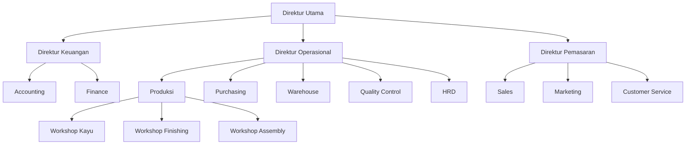
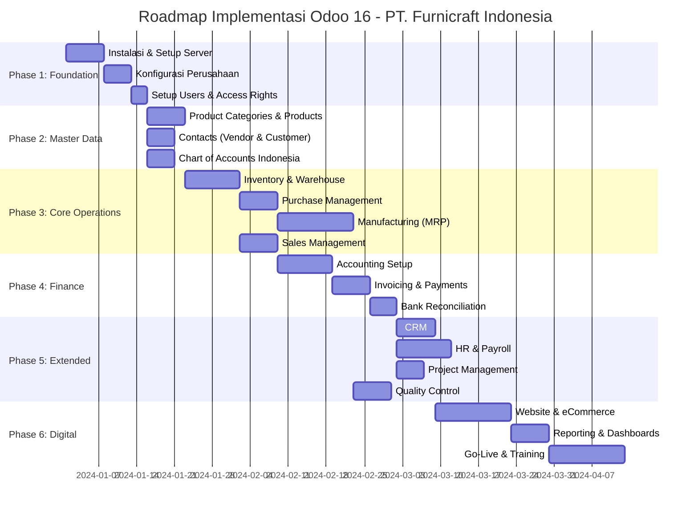
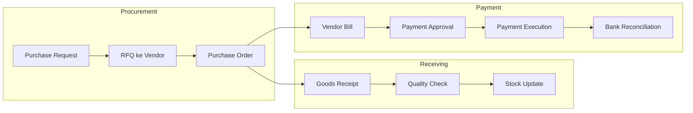
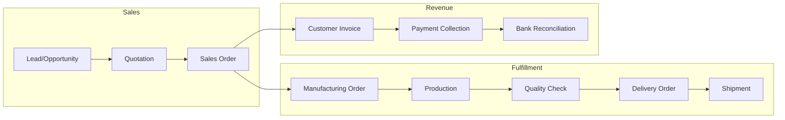
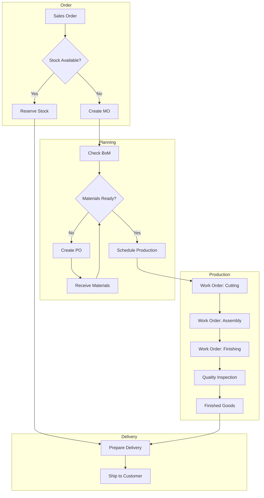

# PT. Furnicraft Indonesia - Implementasi Odoo 16

## Profil Perusahaan

**PT. Furnicraft Indonesia** adalah perusahaan manufaktur furnitur berbasis di Jawa Tengah, Indonesia. Perusahaan memproduksi berbagai jenis furnitur kayu berkualitas tinggi untuk pasar domestik dan ekspor.

### Informasi Perusahaan

| Aspek | Detail |
|-------|--------|
| **Nama** | PT. Furnicraft Indonesia |
| **Industri** | Manufaktur Furnitur |
| **Lokasi** | Jepara, Jawa Tengah |
| **Tahun Berdiri** | 2018 |
| **Jumlah Karyawan** | 150 orang |
| **Omzet Tahunan** | Rp 25-35 Miliar |

### Produk Utama

1. **Living Room** - Sofa, meja tamu, rak TV, coffee table
2. **Bedroom** - Tempat tidur, lemari, nakas, meja rias
3. **Dining** - Meja makan, kursi makan, buffet
4. **Office** - Meja kerja, kursi kantor, rak dokumen
5. **Outdoor** - Garden set, bench, gazebo

### Struktur Organisasi

---

## Tujuan Implementasi

### Business Goals

1. **Integrasi Proses** - Menghubungkan seluruh departemen dalam satu sistem
2. **Real-time Visibility** - Monitoring stok, produksi, dan keuangan secara real-time
3. **Efisiensi Operasional** - Mengurangi waktu proses dan human error
4. **Traceability** - Pelacakan material dari pembelian hingga pengiriman
5. **Kepatuhan** - Memenuhi standar akuntansi dan perpajakan Indonesia

### Key Performance Indicators (KPI)

| Area | KPI | Target |
|------|-----|--------|
| Sales | Order-to-Delivery Time | < 14 hari |
| Inventory | Stock Accuracy | > 98% |
| Production | On-Time Delivery | > 95% |
| Quality | Defect Rate | < 2% |
| Finance | Invoice Cycle Time | < 3 hari |

---

## Roadmap Implementasi

---

## Modul yang Diimplementasikan

### Core Modules

| No | Modul | Fungsi | Prioritas |
|----|-------|--------|-----------|
| 1 | **Settings** | Konfigurasi sistem dan perusahaan | Critical |
| 2 | **Contacts** | Master data vendor dan customer | Critical |
| 3 | **Inventory** | Manajemen gudang dan stok | Critical |
| 4 | **Purchase** | Pengadaan dan pembelian | Critical |
| 5 | **Manufacturing** | Produksi dan MRP | Critical |
| 6 | **Sales** | Penjualan dan quotation | Critical |
| 7 | **Accounting** | Keuangan dan perpajakan | Critical |

### Extended Modules

| No | Modul | Fungsi | Prioritas |
|----|-------|--------|-----------|
| 8 | **CRM** | Pipeline penjualan dan leads | High |
| 9 | **HR** | Manajemen karyawan | High |
| 10 | **Project** | Manajemen proyek custom order | Medium |
| 11 | **Quality** | Quality control produksi | Medium |
| 12 | **Website** | Company profile online | Low |
| 13 | **eCommerce** | Penjualan online | Low |

---

## Alur Bisnis Utama

### 1. Procure-to-Pay (P2P)

### 2. Order-to-Cash (O2C)

### 3. Make-to-Order (MTO) Flow

---

## Daftar Dokumen Implementasi

| No | Dokumen | Deskripsi |
|----|---------|-----------|
| 00 | `00-overview.md` | Dokumen ini - gambaran umum |
| 01 | `01-persiapan-instalasi.md` | Instalasi Odoo 16 |
| 02 | `02-pengaturan-perusahaan.md` | Setup company & users |
| 03 | `03-master-data.md` | Products & contacts |
| 04 | `04-inventory.md` | Warehouse management |
| 05 | `05-purchase.md` | Procurement |
| 06 | `06-manufacturing.md` | Production & MRP |
| 07 | `07-sales.md` | Sales management |
| 08 | `08-accounting.md` | Finance & tax |
| 09 | `09-crm.md` | Customer relationship |
| 10 | `10-hr.md` | Human resources |
| 11 | `11-project.md` | Project management |
| 12 | `12-quality.md` | Quality control |
| 13 | `13-website-ecommerce.md` | Digital presence |
| 14 | `14-reporting.md` | Analytics & dashboards |

---

## Tim Implementasi

### Internal Team (PT. Furnicraft)

| Role | Nama | Departemen |
|------|------|------------|
| Project Sponsor | Budi Santoso | Direktur Utama |
| Project Manager | Dewi Lestari | IT Manager |
| Finance Lead | Ahmad Fauzi | Accounting Manager |
| Operations Lead | Siti Rahayu | Production Manager |
| Sales Lead | Rudi Hartono | Sales Manager |

### Key Users per Module

| Modul | Key User | Backup |
|-------|----------|--------|
| Inventory | Andi Wijaya | Bambang K. |
| Purchase | Rina Susanti | Dian P. |
| Manufacturing | Hendra Kusuma | Agus S. |
| Sales | Maya Putri | Tono W. |
| Accounting | Sri Wahyuni | Eko P. |
| HR | Linda Permata | Yuni A. |

---

## Catatan Implementasi

> **Versi Odoo**: 16.0 Community Edition (CE)
>
> **Bahasa**: Bahasa Indonesia (id_ID)
>
> **Timezone**: Asia/Jakarta (WIB)
>
> **Currency**: Indonesian Rupiah (IDR)
>
> **Fiscal Year**: Januari - Desember

---

*Dokumen ini adalah bagian dari Panduan Implementasi Odoo 16 untuk PT. Furnicraft Indonesia*
