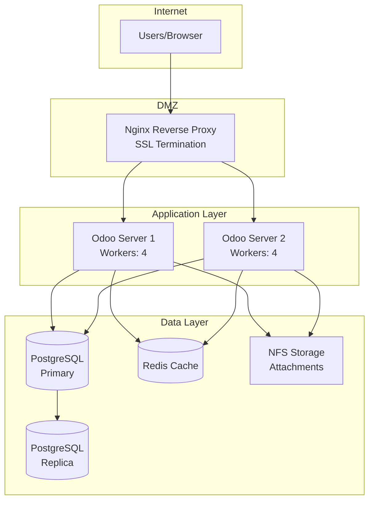
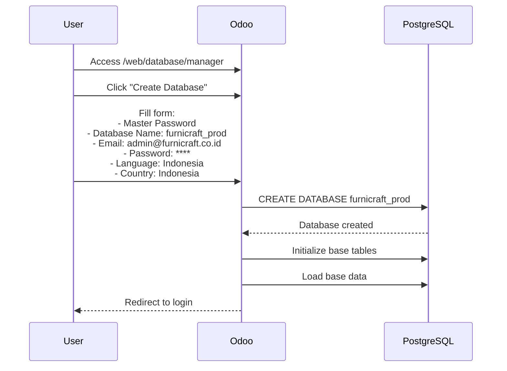
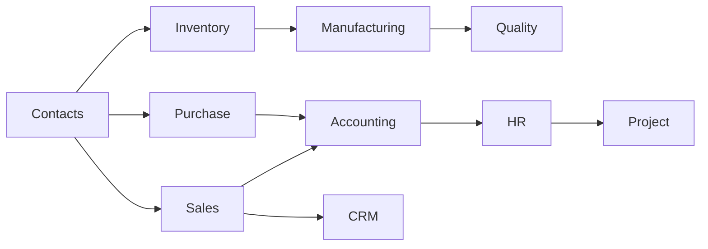

# 01 - Persiapan & Instalasi Odoo 16

## Prasyarat Sistem

### Kebutuhan Server

| Komponen | Minimum | Recommended |
|----------|---------|-------------|
| **CPU** | 2 Core | 4+ Core |
| **RAM** | 4 GB | 8+ GB |
| **Storage** | 50 GB SSD | 100+ GB SSD |
| **OS** | Ubuntu 20.04/22.04 LTS | Ubuntu 22.04 LTS |
| **Database** | PostgreSQL 12+ | PostgreSQL 14+ |
| **Python** | 3.8+ | 3.10+ |

### Arsitektur Deployment



---

## Step 1: Persiapan Server

### 1.1 Update Sistem

```bash
# Update package list
sudo apt update && sudo apt upgrade -y

# Install required packages
sudo apt install -y git python3-pip python3-dev python3-venv \
    build-essential libxml2-dev libxslt1-dev libevent-dev \
    libsasl2-dev libldap2-dev libpq-dev libjpeg-dev zlib1g-dev \
    libfreetype6-dev liblcms2-dev libblas-dev libatlas-base-dev \
    npm node-less xfonts-75dpi xfonts-base fontconfig
```

### 1.2 Install PostgreSQL

```bash
# Install PostgreSQL 14
sudo apt install -y postgresql postgresql-contrib

# Start and enable service
sudo systemctl start postgresql
sudo systemctl enable postgresql

# Create Odoo database user
sudo -u postgres createuser -s odoo16

# Set password for odoo user
sudo -u postgres psql -c "ALTER USER odoo16 WITH PASSWORD 'StrongPassword123!';"
```

### 1.3 Install wkhtmltopdf

```bash
# Download wkhtmltopdf untuk report PDF
wget https://github.com/wkhtmltopdf/packaging/releases/download/0.12.6.1-2/wkhtmltox_0.12.6.1-2.jammy_amd64.deb

# Install
sudo dpkg -i wkhtmltox_0.12.6.1-2.jammy_amd64.deb
sudo apt-get install -f

# Verify installation
wkhtmltopdf --version
```

---

## Step 2: Instalasi Odoo 16

### 2.1 Buat User Odoo

```bash
# Create system user for Odoo
sudo useradd -m -d /opt/odoo16 -U -r -s /bin/bash odoo16

# Switch to odoo user
sudo su - odoo16
```

### 2.2 Download Odoo 16

```bash
# Clone Odoo 16 dari GitHub
git clone https://www.github.com/odoo/odoo --depth 1 --branch 16.0 /opt/odoo16/odoo

# Create virtual environment
python3 -m venv /opt/odoo16/odoo-venv

# Activate virtual environment
source /opt/odoo16/odoo-venv/bin/activate

# Install Python dependencies
pip install wheel
pip install -r /opt/odoo16/odoo/requirements.txt

# Deactivate
deactivate
```

### 2.3 Buat Direktori Custom Addons

```bash
# Create custom addons directory
mkdir -p /opt/odoo16/custom-addons

# Create directory for Furnicraft modules
mkdir -p /opt/odoo16/custom-addons/furnicraft

# Set permissions
sudo chown -R odoo16:odoo16 /opt/odoo16
```

---

## Step 3: Konfigurasi Odoo

### 3.1 Buat File Konfigurasi

```bash
# Exit from odoo user
exit

# Create config file
sudo nano /etc/odoo16.conf
```

### 3.2 Isi Konfigurasi

```ini
[options]
; Database settings
admin_passwd = FurnicraftAdmin2024!
db_host = localhost
db_port = 5432
db_user = odoo16
db_password = StrongPassword123!
db_name = False

; Paths
addons_path = /opt/odoo16/odoo/addons,/opt/odoo16/custom-addons
data_dir = /opt/odoo16/.local/share/Odoo

; Server settings
http_port = 8069
longpolling_port = 8072
proxy_mode = True

; Workers (production)
workers = 4
max_cron_threads = 2

; Limits
limit_memory_hard = 2684354560
limit_memory_soft = 2147483648
limit_request = 8192
limit_time_cpu = 600
limit_time_real = 1200
limit_time_real_cron = -1

; Logging
logfile = /var/log/odoo16/odoo.log
log_level = info
log_handler = :INFO

; Security
list_db = False
```

### 3.3 Buat Direktori Log

```bash
# Create log directory
sudo mkdir -p /var/log/odoo16
sudo chown odoo16:odoo16 /var/log/odoo16
```

---

## Step 4: Setup Systemd Service

### 4.1 Buat Service File

```bash
sudo nano /etc/systemd/system/odoo16.service
```

### 4.2 Isi Service Configuration

```ini
[Unit]
Description=Odoo 16
Documentation=https://www.odoo.com
After=network.target postgresql.service

[Service]
Type=simple
SyslogIdentifier=odoo16
PermissionsStartOnly=true
User=odoo16
Group=odoo16
ExecStart=/opt/odoo16/odoo-venv/bin/python3 /opt/odoo16/odoo/odoo-bin -c /etc/odoo16.conf
StandardOutput=journal+console
Restart=on-failure
RestartSec=5

[Install]
WantedBy=multi-user.target
```

### 4.3 Start Service

```bash
# Reload systemd
sudo systemctl daemon-reload

# Start Odoo service
sudo systemctl start odoo16

# Enable auto-start on boot
sudo systemctl enable odoo16

# Check status
sudo systemctl status odoo16
```

---

## Step 5: Setup Nginx Reverse Proxy

### 5.1 Install Nginx

```bash
sudo apt install -y nginx
```

### 5.2 Konfigurasi Nginx

```bash
sudo nano /etc/nginx/sites-available/odoo16
```

```nginx
upstream odoo16 {
    server 127.0.0.1:8069;
}

upstream odoo16-chat {
    server 127.0.0.1:8072;
}

server {
    listen 80;
    server_name erp.furnicraft.co.id;
    
    # Redirect to HTTPS
    return 301 https://$server_name$request_uri;
}

server {
    listen 443 ssl http2;
    server_name erp.furnicraft.co.id;
    
    # SSL Configuration
    ssl_certificate /etc/ssl/certs/furnicraft.crt;
    ssl_certificate_key /etc/ssl/private/furnicraft.key;
    ssl_protocols TLSv1.2 TLSv1.3;
    ssl_ciphers ECDHE-ECDSA-AES128-GCM-SHA256:ECDHE-RSA-AES128-GCM-SHA256;
    ssl_prefer_server_ciphers off;
    
    # Proxy settings
    proxy_read_timeout 720s;
    proxy_connect_timeout 720s;
    proxy_send_timeout 720s;
    
    # Proxy headers
    proxy_set_header X-Forwarded-Host $host;
    proxy_set_header X-Forwarded-For $proxy_add_x_forwarded_for;
    proxy_set_header X-Forwarded-Proto $scheme;
    proxy_set_header X-Real-IP $remote_addr;
    
    # Gzip
    gzip on;
    gzip_types text/css text/less text/plain text/xml application/xml application/json application/javascript;
    
    # Log files
    access_log /var/log/nginx/odoo16_access.log;
    error_log /var/log/nginx/odoo16_error.log;
    
    # Longpolling
    location /longpolling {
        proxy_pass http://odoo16-chat;
    }
    
    # Main application
    location / {
        proxy_pass http://odoo16;
        proxy_redirect off;
    }
    
    # Static files caching
    location ~* /web/static/ {
        proxy_cache_valid 200 90m;
        proxy_buffering on;
        expires 864000;
        proxy_pass http://odoo16;
    }
}
```

### 5.3 Enable Site

```bash
# Enable site
sudo ln -s /etc/nginx/sites-available/odoo16 /etc/nginx/sites-enabled/

# Test configuration
sudo nginx -t

# Restart Nginx
sudo systemctl restart nginx
```

---

## Step 6: Inisialisasi Database

### 6.1 Akses Web Interface

1. Buka browser: `https://erp.furnicraft.co.id`
2. Atau untuk development: `http://localhost:8069`

### 6.2 Buat Database Baru



### 6.3 Form Database Creation

| Field | Value |
|-------|-------|
| Master Password | FurnicraftAdmin2024! |
| Database Name | furnicraft_prod |
| Email | admin@furnicraft.co.id |
| Password | Admin@Furnicraft2024 |
| Phone Number | +62 291 123456 |
| Language | Indonesian / Bahasa Indonesia |
| Country | Indonesia |
| Demo Data | ❌ Unchecked |

---

## Step 7: Install Modul-Modul yang Diperlukan

### 7.1 Login sebagai Admin

Setelah database dibuat, login dengan kredensial admin.

### 7.2 Aktivasi Developer Mode

```
Settings → Activate Developer Mode
```

### 7.3 Update Apps List

```
Apps → Update Apps List
```

### 7.4 Install Core Modules

Install modul-modul berikut secara berurutan:



| Urutan | Technical Name | Display Name | Deskripsi |
|--------|---------------|--------------|-----------|
| 1 | `contacts` | Contacts | Master data kontak |
| 2 | `sale_management` | Sales | Manajemen penjualan |
| 3 | `purchase` | Purchase | Manajemen pembelian |
| 4 | `stock` | Inventory | Manajemen gudang |
| 5 | `mrp` | Manufacturing | Produksi & MRP |
| 6 | `om_account_accountant` | Accounting | Akuntansi (Odoo Mates - CE) |
| 7 | `l10n_id` | Indonesian - Accounting | Chart of Account Indonesia |
| 8 | `quality_control` | Quality | Kontrol kualitas |
| 9 | `crm` | CRM | Pipeline penjualan |
| 10 | `hr` | Employees | Data karyawan |
| 11 | `hr_attendance` | Attendances | Absensi |
| 12 | `hr_payroll` | Payroll | Penggajian |
| 13 | `project` | Project | Manajemen proyek |
| 14 | `website` | Website Builder | Website perusahaan |
| 15 | `website_sale` | eCommerce | Toko online |

---

## Step 8: Backup Strategy

### 8.1 Automated Backup Script

```bash
#!/bin/bash
# /opt/odoo16/scripts/backup.sh

# Configuration
BACKUP_DIR="/opt/odoo16/backups"
DB_NAME="furnicraft_prod"
DB_USER="odoo16"
FILESTORE="/opt/odoo16/.local/share/Odoo/filestore/${DB_NAME}"
RETENTION_DAYS=30
DATE=$(date +%Y%m%d_%H%M%S)

# Create backup directory
mkdir -p ${BACKUP_DIR}/${DATE}

# Backup database
pg_dump -U ${DB_USER} -F c ${DB_NAME} > ${BACKUP_DIR}/${DATE}/${DB_NAME}.dump

# Backup filestore
tar -czf ${BACKUP_DIR}/${DATE}/filestore.tar.gz ${FILESTORE}

# Create combined archive
cd ${BACKUP_DIR}
tar -czf ${DB_NAME}_${DATE}.tar.gz ${DATE}
rm -rf ${DATE}

# Remove old backups
find ${BACKUP_DIR} -name "*.tar.gz" -mtime +${RETENTION_DAYS} -delete

echo "Backup completed: ${BACKUP_DIR}/${DB_NAME}_${DATE}.tar.gz"
```

### 8.2 Cron Job untuk Backup

```bash
# Edit crontab
sudo crontab -u odoo16 -e

# Add daily backup at 2 AM
0 2 * * * /opt/odoo16/scripts/backup.sh >> /var/log/odoo16/backup.log 2>&1
```

---

## Step 9: Monitoring & Maintenance

### 9.1 Log Monitoring

```bash
# View real-time logs
sudo tail -f /var/log/odoo16/odoo.log

# Check error logs
sudo grep -i error /var/log/odoo16/odoo.log | tail -50
```

### 9.2 Database Maintenance

```sql
-- Check database size
SELECT pg_database.datname,
       pg_size_pretty(pg_database_size(pg_database.datname)) AS size
FROM pg_database
WHERE datname = 'furnicraft_prod';

-- Vacuum and analyze
VACUUM ANALYZE;
```

### 9.3 Service Health Check

```bash
# Check Odoo service
systemctl status odoo16

# Check PostgreSQL
systemctl status postgresql

# Check Nginx
systemctl status nginx

# Check port listening
netstat -tlnp | grep -E '8069|8072|5432|80|443'
```

---

## Checklist Instalasi

- [ ] Server memenuhi spesifikasi minimum
- [ ] PostgreSQL terinstall dan running
- [ ] wkhtmltopdf terinstall
- [ ] Odoo 16 ter-clone dan virtual env aktif
- [ ] File konfigurasi `/etc/odoo16.conf` dibuat
- [ ] Systemd service aktif dan running
- [ ] Nginx reverse proxy terkonfigurasi
- [ ] SSL certificate terinstall
- [ ] Database `furnicraft_prod` dibuat
- [ ] Modul-modul dasar terinstall
- [ ] Backup script terkonfigurasi
- [ ] Monitoring aktif

---

## Troubleshooting

### Error: Permission Denied

```bash
# Fix ownership
sudo chown -R odoo16:odoo16 /opt/odoo16
sudo chown -R odoo16:odoo16 /var/log/odoo16
```

### Error: Port Already in Use

```bash
# Find process using port
sudo lsof -i :8069
# Kill if necessary
sudo kill -9 <PID>
```

### Error: Database Connection Failed

```bash
# Check PostgreSQL is running
sudo systemctl status postgresql

# Check pg_hba.conf
sudo nano /etc/postgresql/14/main/pg_hba.conf
# Ensure local connection is allowed
```

---

*Lanjut ke: [02-pengaturan-perusahaan.md](02-pengaturan-perusahaan.md)*
