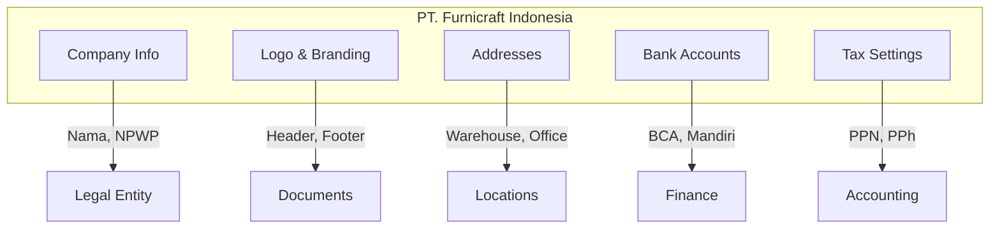
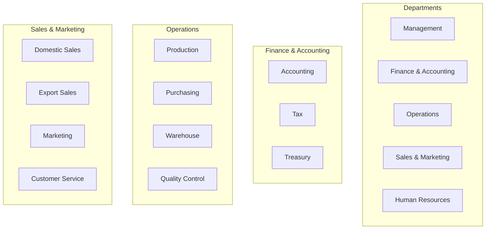
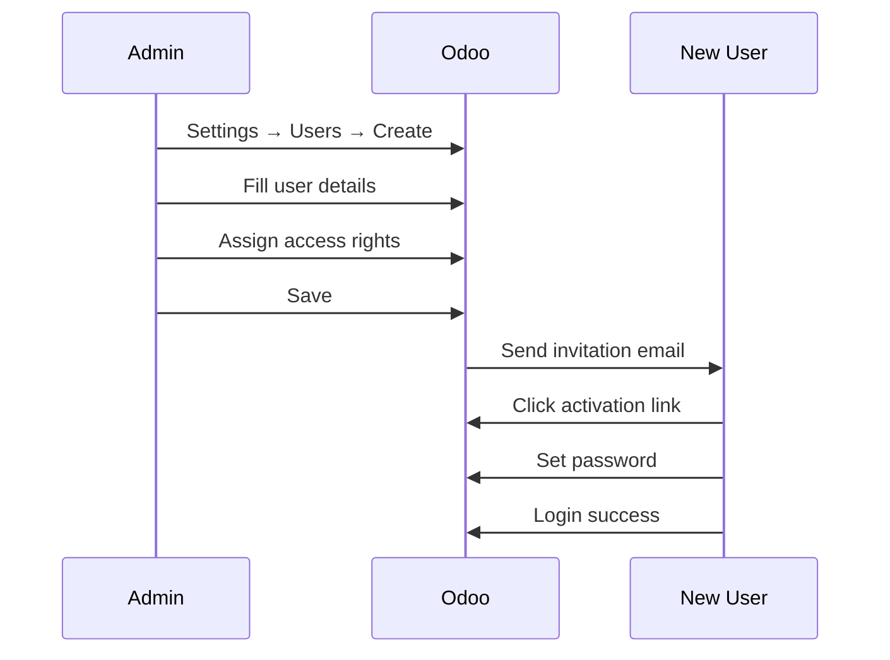
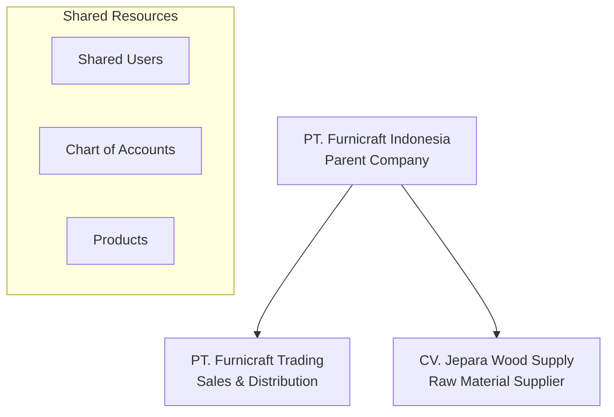

# 02 - Pengaturan Perusahaan

## Konfigurasi Awal Perusahaan

### Langkah 1: Akses Pengaturan

```
Settings → General Settings
```

### Data Perusahaan PT. Furnicraft Indonesia



---

## Step 1: Data Perusahaan

### 1.1 General Information

Navigasi: `Settings → Companies → PT. Furnicraft Indonesia`

| Field | Value |
|-------|-------|
| **Company Name** | PT. Furnicraft Indonesia |
| **Tax ID (NPWP)** | 01.234.567.8-521.000 |
| **Company Registry** | AHU-0012345.AH.01.01.2018 |
| **Email** | info@furnicraft.co.id |
| **Phone** | +62 291 123456 |
| **Mobile** | +62 812 3456 7890 |
| **Website** | https://www.furnicraft.co.id |

### 1.2 Alamat Perusahaan

**Head Office & Factory:**
```
PT. Furnicraft Indonesia
Jl. Raya Jepara - Kudus Km. 12
Desa Tahunan, Kecamatan Tahunan
Kabupaten Jepara 59451
Jawa Tengah, Indonesia
```

**Jakarta Sales Office:**
```
PT. Furnicraft Indonesia - Jakarta Office
Gedung Menara Karya Lt. 15
Jl. HR. Rasuna Said Blok X-5 Kav. 1-2
Jakarta Selatan 12950
Indonesia
```

### 1.3 Logo Perusahaan

Upload logo perusahaan untuk tampil di:
- Header dokumen (Quotation, Invoice, PO)
- Website
- Email template
- Report PDF

**Spesifikasi Logo:**
- Format: PNG (dengan transparansi)
- Ukuran minimum: 300x100 pixels
- Max file size: 1 MB

---

## Step 2: Pengaturan Lokalisasi

### 2.1 Language & Time Zone

Navigasi: `Settings → General Settings → Languages`

| Setting | Value |
|---------|-------|
| **Language** | Indonesian / Bahasa Indonesia |
| **Timezone** | Asia/Jakarta (UTC+7) |
| **Date Format** | DD/MM/YYYY |
| **Time Format** | 24 Hour |
| **First Day of Week** | Monday |

### 2.2 Mata Uang

Navigasi: `Settings → Currencies`

**Primary Currency:**

| Field | Value |
|-------|-------|
| Currency | IDR - Indonesian Rupiah |
| Symbol | Rp |
| Position | Before Amount |
| Decimal Places | 0 |

**Secondary Currencies (untuk transaksi ekspor):**

| Currency | Rate (per IDR) | Auto Update |
|----------|----------------|-------------|
| USD | 15,500 | ✅ Yes |
| EUR | 17,000 | ✅ Yes |
| SGD | 11,500 | ✅ Yes |
| AUD | 10,500 | ✅ Yes |

---

## Step 3: Struktur Organisasi & Users

### 3.1 Department Structure



### 3.2 Membuat Users

Navigasi: `Settings → Users & Companies → Users`

#### User Role Matrix

| User | Email | Groups | Departments |
|------|-------|--------|-------------|
| Budi Santoso | budi.santoso@furnicraft.co.id | Administrator | Management |
| Dewi Lestari | dewi.lestari@furnicraft.co.id | Settings, All Apps | IT |
| Ahmad Fauzi | ahmad.fauzi@furnicraft.co.id | Accounting: Advisor | Finance |
| Sri Wahyuni | sri.wahyuni@furnicraft.co.id | Accounting: Accountant | Accounting |
| Siti Rahayu | siti.rahayu@furnicraft.co.id | Manufacturing: Admin | Production |
| Hendra Kusuma | hendra.kusuma@furnicraft.co.id | Manufacturing: User | Production |
| Rina Susanti | rina.susanti@furnicraft.co.id | Purchase: Admin | Purchasing |
| Andi Wijaya | andi.wijaya@furnicraft.co.id | Inventory: Admin | Warehouse |
| Rudi Hartono | rudi.hartono@furnicraft.co.id | Sales: Admin | Sales |
| Maya Putri | maya.putri@furnicraft.co.id | Sales: User | Sales |
| Linda Permata | linda.permata@furnicraft.co.id | HR: Admin | HR |

### 3.3 Membuat User Baru



**Langkah-langkah:**

1. Klik **Create**
2. Isi informasi:
   - Name: Nama lengkap
   - Email: Email kerja (akan menjadi login)
   - Photo: Upload foto karyawan
3. Pilih **Access Rights** sesuai role
4. Klik **Save**
5. Klik **Send Invitation Email**

---

## Step 4: Access Rights & Security Groups

### 4.1 Odoo Built-in Groups

```mermaid
graph TB
    subgraph "Sales Module"
        S1[Sales: User]
        S2[Sales: Administrator]
        S1 --> S2
    end
    
    subgraph "Purchase Module"
        P1[Purchase: User]
        P2[Purchase: Administrator]
        P1 --> P2
    end
    
    subgraph "Inventory Module"
        I1[Inventory: User]
        I2[Inventory: Administrator]
        I1 --> I2
    end
    
    subgraph "Manufacturing Module"
        M1[Manufacturing: User]
        M2[Manufacturing: Administrator]
        M1 --> M2
    end
    
    subgraph "Accounting Module"
        A1[Accounting: Billing]
        A2[Accounting: Accountant]
        A3[Accounting: Advisor]
        A1 --> A2 --> A3
    end
```



### 4.2 Custom Security Groups

Untuk kontrol lebih granular, buat custom groups:

**Navigasi:** `Settings → Technical → Security → Groups`

| Group Name | Implied Groups | Description |
|------------|----------------|-------------|
| Furnicraft / Manager | Sales Admin, Purchase Admin | Department Manager |
| Furnicraft / Approver | - | Can approve PO/SO |
| Furnicraft / Price Editor | - | Can modify prices |
| Furnicraft / Report Viewer | - | View all reports |

### 4.3 Record Rules (Contoh)

**Sales: User hanya melihat data sendiri:**

```xml
<record id="sale_order_personal_rule" model="ir.rule">
    <field name="name">Personal Orders</field>
    <field name="model_id" ref="sale.model_sale_order"/>
    <field name="domain_force">[('user_id','=',user.id)]</field>
    <field name="groups" eval="[(4, ref('sales_team.group_sale_salesman'))]"/>
</record>
```

---

## Step 5: Email Configuration

### 5.1 Outgoing Mail Server (SMTP)

Navigasi: `Settings → Technical → Email → Outgoing Mail Servers`

**Google Workspace / Gmail:**

| Field | Value |
|-------|-------|
| Description | Furnicraft Gmail |
| SMTP Server | smtp.gmail.com |
| SMTP Port | 587 |
| Connection Security | TLS (STARTTLS) |
| Username | noreply@furnicraft.co.id |
| Password | [App Password] |

**Office 365:**

| Field | Value |
|-------|-------|
| Description | Furnicraft O365 |
| SMTP Server | smtp.office365.com |
| SMTP Port | 587 |
| Connection Security | TLS (STARTTLS) |
| Username | noreply@furnicraft.co.id |
| Password | [Password] |

### 5.2 Incoming Mail Server (Optional)

Untuk auto-create leads dari email:

Navigasi: `Settings → Technical → Email → Incoming Mail Servers`

| Field | Value |
|-------|-------|
| Name | Sales Inquiries |
| Server Type | IMAP Server |
| Server | imap.gmail.com |
| Port | 993 |
| SSL/TLS | ✅ Yes |
| Username | sales@furnicraft.co.id |
| Create Model | Lead/Opportunity |

### 5.3 Email Templates

Setup email templates untuk dokumen standar:

| Template | Used For |
|----------|----------|
| Sales Order Confirmation | Konfirmasi order ke customer |
| Purchase Order | Kirim PO ke vendor |
| Invoice | Kirim invoice ke customer |
| Payment Reminder | Reminder hutang jatuh tempo |
| Delivery Note | Notifikasi pengiriman |

---

## Step 6: Document Sequences

### 6.1 Konfigurasi Nomor Dokumen

Navigasi: `Settings → Technical → Sequences`

**Format Penomoran PT. Furnicraft:**

| Document | Prefix | Next Number | Format Example |
|----------|--------|-------------|----------------|
| Quotation | SQ | 00001 | SQ/2024/00001 |
| Sales Order | SO | 00001 | SO/2024/00001 |
| Purchase Order | PO | 00001 | PO/2024/00001 |
| Delivery Order | DO | 00001 | DO/2024/00001 |
| Receipt | GRN | 00001 | GRN/2024/00001 |
| Invoice | INV | 00001 | INV/2024/00001 |
| Bill | BILL | 00001 | BILL/2024/00001 |
| Manufacturing Order | MO | 00001 | MO/2024/00001 |

### 6.2 Contoh Konfigurasi Sequence

```xml
<!-- Sales Order Sequence -->
<record id="seq_sale_order" model="ir.sequence">
    <field name="name">Sales Order</field>
    <field name="code">sale.order</field>
    <field name="prefix">SO/%(year)s/</field>
    <field name="padding">5</field>
    <field name="number_next">1</field>
    <field name="number_increment">1</field>
</record>
```

---

## Step 7: Multi-Company Setup (Optional)

Jika PT. Furnicraft memiliki anak perusahaan:



### 7.1 Menambah Company

Navigasi: `Settings → Companies → Create`

### 7.2 Inter-Company Rules

Enable untuk transaksi antar perusahaan:

```
Settings → General Settings → Multi-Company
✅ Inter-Company Transactions
```

---

## Step 8: Pengaturan Tambahan

### 8.1 Aktivasi Fitur

Navigasi: `Settings → General Settings`

**Sales:**
- ✅ Quotations Templates
- ✅ Customer Addresses
- ✅ Quotation Expiration
- ✅ Sale Warnings
- ✅ Lock Confirmed Sales

**Purchase:**
- ✅ Purchase Agreements
- ✅ Purchase Order Approval
- ✅ Purchase Warnings

**Inventory:**
- ✅ Storage Locations
- ✅ Multi-Step Routes
- ✅ Packages
- ✅ Batch Transfers
- ✅ Consignment

**Manufacturing:**
- ✅ Work Orders
- ✅ MRP Workload
- ✅ Quality Control
- ✅ By-Products

### 8.2 Default Values

Set default values untuk mempercepat input:

| Field | Default Value |
|-------|---------------|
| Default Payment Term | 30 Days |
| Default Incoterm | FOB |
| Default Warehouse | WH/Stock |
| Default Sales Team | Domestic Sales |

---

## Step 9: Backup Configuration

Setelah konfigurasi selesai, buat backup:

```bash
# Backup database
pg_dump -U odoo16 -F c furnicraft_prod > /backup/furnicraft_config_$(date +%Y%m%d).dump

# Document configuration
odoo-bin --config=/etc/odoo16.conf --database=furnicraft_prod --export-translation=/backup/translations.pot
```

---

## Checklist Pengaturan Perusahaan

- [ ] Data perusahaan lengkap (Nama, NPWP, Alamat)
- [ ] Logo perusahaan ter-upload
- [ ] Timezone dan bahasa terkonfigurasi
- [ ] Mata uang IDR sebagai default
- [ ] Semua user dibuat dan memiliki akses yang sesuai
- [ ] Email server (SMTP) terkonfigurasi dan tested
- [ ] Format nomor dokumen sesuai standar perusahaan
- [ ] Fitur-fitur modul yang diperlukan aktif
- [ ] Backup configuration tersimpan

---

## Troubleshooting

### User tidak bisa login

```sql
-- Reset user password via database
UPDATE res_users 
SET password = '' 
WHERE login = 'user@furnicraft.co.id';
-- User will need to reset via "Reset Password" link
```

### Email tidak terkirim

1. Periksa log: `Settings → Technical → Email → Emails`
2. Check SMTP credentials
3. Untuk Gmail, pastikan menggunakan App Password
4. Periksa firewall port 587

### Sequence tidak berurutan

```sql
-- Check current sequence value
SELECT * FROM ir_sequence WHERE code = 'sale.order';

-- Reset sequence if needed
UPDATE ir_sequence SET number_next = 1 WHERE code = 'sale.order';
```

---

*Sebelumnya: [01-persiapan-instalasi.md](01-persiapan-instalasi.md)*

*Lanjut ke: [03-master-data.md](03-master-data.md)*
