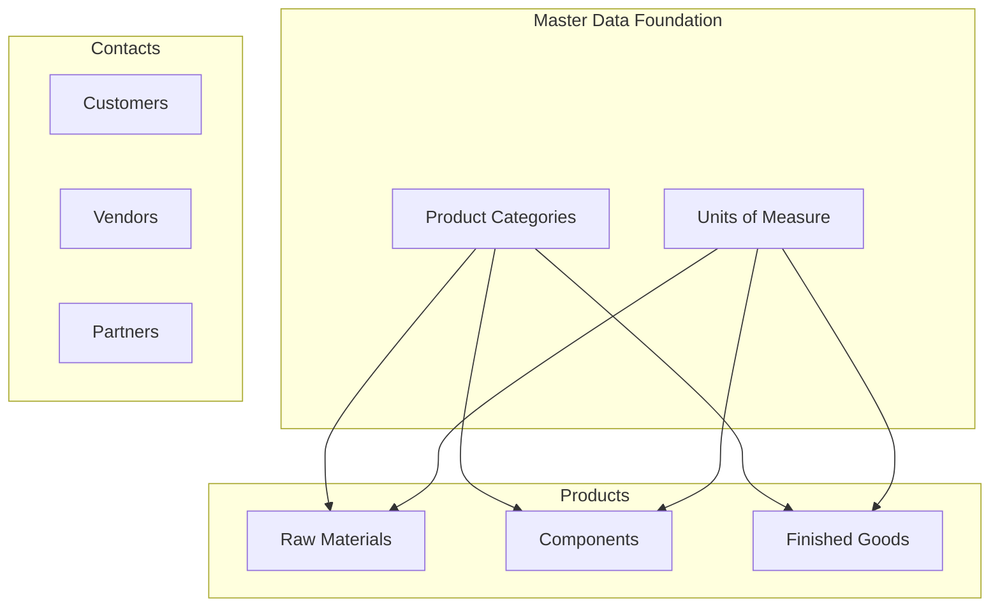
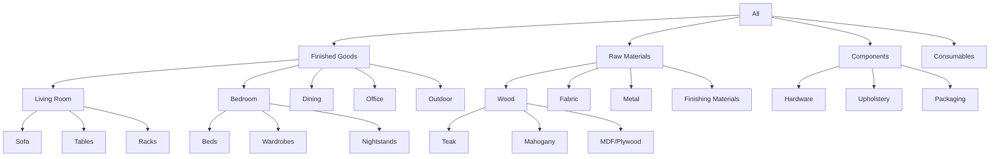
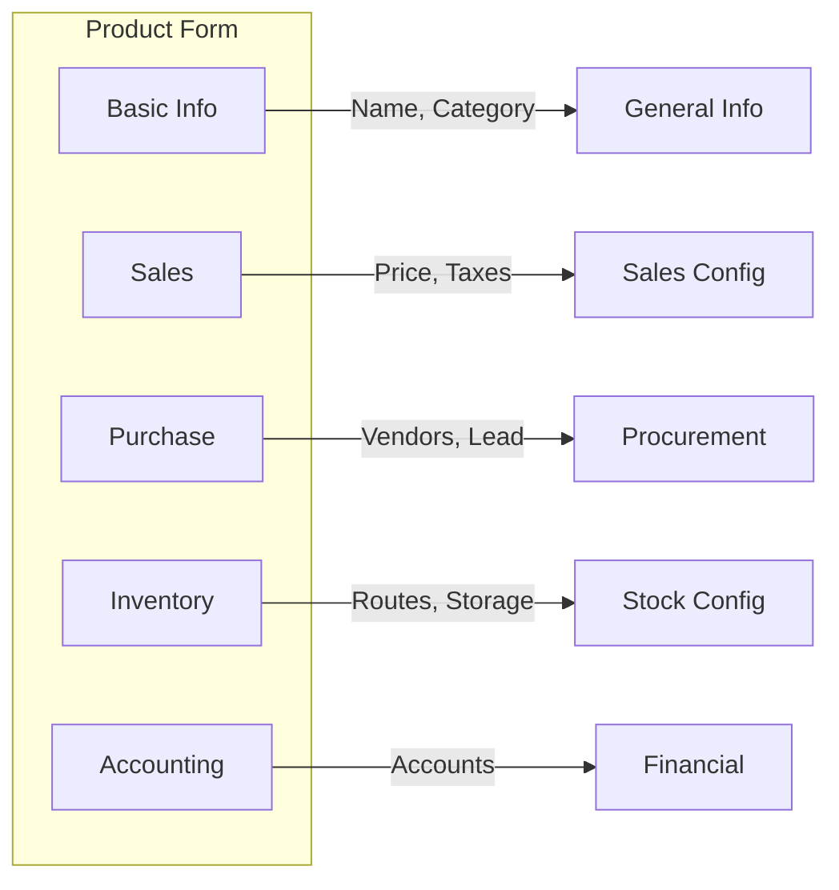
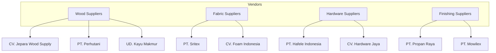
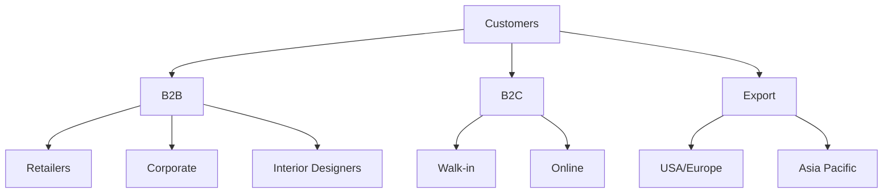
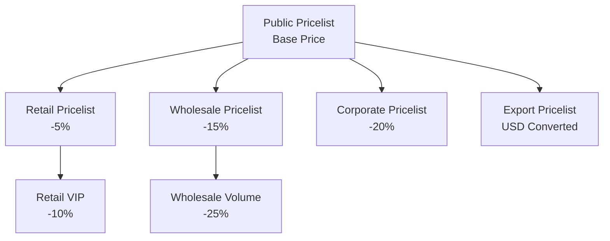

# 03 - Master Data

## Overview

Master data adalah fondasi dari seluruh operasi ERP. Untuk PT. Furnicraft Indonesia, master data meliputi:

1. **Product Categories** - Hierarki kategori produk
2. **Products** - Produk jadi, bahan baku, komponen
3. **Contacts** - Customer, Vendor, dan Partner lainnya
4. **Units of Measure** - Satuan pengukuran



---

## Part 1: Product Categories

### 1.1 Struktur Kategori PT. Furnicraft

Navigasi: `Inventory → Configuration → Product Categories`



### 1.2 Data Kategori

| Category | Parent | Costing Method | Valuation | Income Account | Expense Account |
|----------|--------|----------------|-----------|----------------|-----------------|
| All | - | Standard | Manual | - | - |
| **Finished Goods** | All | Standard | Automated | 4100 Sales | 5100 COGS |
| Living Room | Finished Goods | Standard | Automated | 4100 Sales | 5100 COGS |
| Bedroom | Finished Goods | Standard | Automated | 4100 Sales | 5100 COGS |
| Dining | Finished Goods | Standard | Automated | 4100 Sales | 5100 COGS |
| Office | Finished Goods | Standard | Automated | 4100 Sales | 5100 COGS |
| Outdoor | Finished Goods | Standard | Automated | 4100 Sales | 5100 COGS |
| **Raw Materials** | All | Average | Automated | - | 5200 RM Consumed |
| Wood | Raw Materials | Average | Automated | - | 5200 RM Consumed |
| Fabric | Raw Materials | Average | Automated | - | 5200 RM Consumed |
| Metal | Raw Materials | Average | Automated | - | 5200 RM Consumed |
| Finishing | Raw Materials | Average | Automated | - | 5200 RM Consumed |
| **Components** | All | Average | Automated | - | 5300 Components |
| Hardware | Components | Average | Automated | - | 5300 Components |
| Upholstery | Components | Average | Automated | - | 5300 Components |
| Packaging | Components | Average | Automated | - | 5300 Components |
| **Consumables** | All | Standard | Manual | - | 5400 Consumables |

### 1.3 Membuat Kategori

```python
# Via Python (development)
category = self.env['product.category'].create({
    'name': 'Living Room',
    'parent_id': self.env.ref('product.product_category_all').id,
    'property_cost_method': 'standard',
    'property_valuation': 'real_time',
    'property_account_income_categ_id': income_account.id,
    'property_account_expense_categ_id': expense_account.id,
})
```

---

## Part 2: Units of Measure

### 2.1 UoM Categories

Navigasi: `Inventory → Configuration → UoM Categories`

| Category | Description |
|----------|-------------|
| Unit | Satuan per pieces |
| Weight | Satuan berat (kg, gram, ton) |
| Length | Satuan panjang (m, cm, inch) |
| Volume | Satuan volume (m³, liter) |
| Area | Satuan luas (m²) |
| Working Time | Satuan waktu kerja (jam, menit) |

### 2.2 Units of Measure Detail

| UoM | Category | Type | Ratio | Rounding |
|-----|----------|------|-------|----------|
| **Unit** | Unit | Reference | 1 | 1 |
| Dozen | Unit | Bigger | 12 | 1 |
| Set | Unit | Reference | 1 | 1 |
| **kg** | Weight | Reference | 1 | 0.001 |
| gram | Weight | Smaller | 0.001 | 1 |
| ton | Weight | Bigger | 1000 | 0.001 |
| **m** | Length | Reference | 1 | 0.01 |
| cm | Length | Smaller | 0.01 | 1 |
| inch | Length | Smaller | 0.0254 | 0.01 |
| feet | Length | Smaller | 0.3048 | 0.01 |
| **m²** | Area | Reference | 1 | 0.01 |
| **m³** | Volume | Reference | 1 | 0.001 |
| liter | Volume | Smaller | 0.001 | 0.01 |
| **Hours** | Working Time | Reference | 1 | 0.01 |
| Minutes | Working Time | Smaller | 0.0167 | 1 |

---

## Part 3: Products - Raw Materials

### 3.1 Daftar Bahan Baku Kayu

Navigasi: `Inventory → Products → Products → Create`

| Internal Ref | Product Name | Category | UoM | Purchase UoM | Cost |
|--------------|--------------|----------|-----|--------------|------|
| RM-TK-001 | Kayu Jati Grade A | Wood/Teak | m³ | m³ | Rp 12,000,000 |
| RM-TK-002 | Kayu Jati Grade B | Wood/Teak | m³ | m³ | Rp 8,500,000 |
| RM-TK-003 | Kayu Jati Solid Board | Wood/Teak | m² | m² | Rp 450,000 |
| RM-MH-001 | Kayu Mahoni | Wood/Mahogany | m³ | m³ | Rp 6,000,000 |
| RM-MH-002 | Kayu Mahoni Solid Board | Wood/Mahogany | m² | m² | Rp 280,000 |
| RM-MDF-001 | MDF 18mm | Wood/MDF | lembar | lembar | Rp 185,000 |
| RM-MDF-002 | MDF 12mm | Wood/MDF | lembar | lembar | Rp 145,000 |
| RM-PLY-001 | Plywood 18mm | Wood/MDF | lembar | lembar | Rp 165,000 |
| RM-PLY-002 | Plywood 12mm | Wood/MDF | lembar | lembar | Rp 125,000 |

### 3.2 Daftar Bahan Finishing

| Internal Ref | Product Name | Category | UoM | Cost |
|--------------|--------------|----------|-----|------|
| RM-FIN-001 | Wood Stain - Natural | Finishing | liter | Rp 85,000 |
| RM-FIN-002 | Wood Stain - Walnut | Finishing | liter | Rp 95,000 |
| RM-FIN-003 | NC Lacquer Clear | Finishing | liter | Rp 120,000 |
| RM-FIN-004 | PU Clear Gloss | Finishing | liter | Rp 180,000 |
| RM-FIN-005 | Sanding Sealer | Finishing | liter | Rp 75,000 |
| RM-FIN-006 | Thinner A | Finishing | liter | Rp 35,000 |
| RM-FIN-007 | Amplas 120 | Finishing | lembar | Rp 3,500 |
| RM-FIN-008 | Amplas 240 | Finishing | lembar | Rp 4,000 |
| RM-FIN-009 | Amplas 400 | Finishing | lembar | Rp 4,500 |

### 3.3 Daftar Hardware & Components

| Internal Ref | Product Name | Category | UoM | Cost |
|--------------|--------------|----------|-----|------|
| HW-HNG-001 | Engsel Pintu Kuningan | Hardware | pcs | Rp 45,000 |
| HW-HNG-002 | Engsel Laci Soft-Close | Hardware | pcs | Rp 28,000 |
| HW-HDL-001 | Handle Pintu Stainless | Hardware | pcs | Rp 65,000 |
| HW-HDL-002 | Tarikan Laci Kuningan | Hardware | pcs | Rp 35,000 |
| HW-SCR-001 | Sekrup 3cm | Hardware | box | Rp 25,000 |
| HW-SCR-002 | Sekrup 5cm | Hardware | box | Rp 35,000 |
| HW-SLD-001 | Rel Laci Full Extension | Hardware | set | Rp 85,000 |
| HW-LCK-001 | Kunci Lemari | Hardware | pcs | Rp 55,000 |

### 3.4 Daftar Fabric & Upholstery

| Internal Ref | Product Name | Category | UoM | Cost |
|--------------|--------------|----------|-----|------|
| FAB-VEL-001 | Velvet Premium Grey | Fabric | m | Rp 185,000 |
| FAB-VEL-002 | Velvet Premium Brown | Fabric | m | Rp 185,000 |
| FAB-LIN-001 | Linen Natural | Fabric | m | Rp 145,000 |
| FAB-LTR-001 | Oscar Leather Black | Fabric | m | Rp 95,000 |
| FAB-LTR-002 | Oscar Leather Brown | Fabric | m | Rp 95,000 |
| UP-FOAM-001 | Foam Density 32 | Upholstery | m² | Rp 125,000 |
| UP-FOAM-002 | Foam Density 28 | Upholstery | m² | Rp 95,000 |
| UP-FIL-001 | Dacron Silikon | Upholstery | kg | Rp 45,000 |

---

## Part 4: Products - Finished Goods

### 4.1 Living Room Products

| Internal Ref | Product Name | Category | Sale Price | Cost |
|--------------|--------------|----------|------------|------|
| FG-SF-001 | Sofa 3 Seater - Milano | Living/Sofa | Rp 12,500,000 | Rp 7,800,000 |
| FG-SF-002 | Sofa 2 Seater - Milano | Living/Sofa | Rp 8,500,000 | Rp 5,200,000 |
| FG-SF-003 | Sofa L-Shape - Verona | Living/Sofa | Rp 18,500,000 | Rp 11,500,000 |
| FG-SF-004 | Armchair - Comfort | Living/Sofa | Rp 4,500,000 | Rp 2,800,000 |
| FG-CT-001 | Coffee Table - Minimalis | Living/Tables | Rp 2,850,000 | Rp 1,650,000 |
| FG-CT-002 | Coffee Table - Classic | Living/Tables | Rp 3,950,000 | Rp 2,350,000 |
| FG-ST-001 | Side Table - Scandinavia | Living/Tables | Rp 1,450,000 | Rp 850,000 |
| FG-TV-001 | TV Cabinet 180cm | Living/Racks | Rp 4,250,000 | Rp 2,500,000 |
| FG-TV-002 | TV Cabinet 200cm | Living/Racks | Rp 5,250,000 | Rp 3,100,000 |
| FG-BS-001 | Bookshelf 5-Tier | Living/Racks | Rp 2,850,000 | Rp 1,650,000 |

### 4.2 Bedroom Products

| Internal Ref | Product Name | Category | Sale Price | Cost |
|--------------|--------------|----------|------------|------|
| FG-BD-001 | Bed Frame King 180x200 | Bedroom/Beds | Rp 8,500,000 | Rp 5,100,000 |
| FG-BD-002 | Bed Frame Queen 160x200 | Bedroom/Beds | Rp 6,800,000 | Rp 4,100,000 |
| FG-BD-003 | Bed Frame Single 120x200 | Bedroom/Beds | Rp 4,250,000 | Rp 2,550,000 |
| FG-WD-001 | Wardrobe 3 Doors | Bedroom/Wardrobes | Rp 9,500,000 | Rp 5,700,000 |
| FG-WD-002 | Wardrobe 2 Doors Sliding | Bedroom/Wardrobes | Rp 11,500,000 | Rp 6,900,000 |
| FG-WD-003 | Wardrobe 4 Doors | Bedroom/Wardrobes | Rp 13,500,000 | Rp 8,100,000 |
| FG-NS-001 | Nightstand 2 Drawers | Bedroom/Nightstands | Rp 1,850,000 | Rp 1,100,000 |
| FG-DR-001 | Dresser with Mirror | Bedroom/Nightstands | Rp 5,250,000 | Rp 3,150,000 |

### 4.3 Dining Products

| Internal Ref | Product Name | Category | Sale Price | Cost |
|--------------|--------------|----------|------------|------|
| FG-DT-001 | Dining Table 6 Seater | Dining | Rp 7,500,000 | Rp 4,500,000 |
| FG-DT-002 | Dining Table 8 Seater | Dining | Rp 9,500,000 | Rp 5,700,000 |
| FG-DT-003 | Dining Table 4 Seater | Dining | Rp 5,250,000 | Rp 3,150,000 |
| FG-DC-001 | Dining Chair - Classic | Dining | Rp 1,250,000 | Rp 750,000 |
| FG-DC-002 | Dining Chair - Modern | Dining | Rp 1,450,000 | Rp 870,000 |
| FG-DC-003 | Dining Chair - Upholstered | Dining | Rp 1,850,000 | Rp 1,100,000 |
| FG-BF-001 | Buffet Cabinet | Dining | Rp 6,500,000 | Rp 3,900,000 |

### 4.4 Product Configuration



### 4.5 Product Template Fields

**Tab General:**

| Field | Example Value |
|-------|---------------|
| Product Name | Sofa 3 Seater - Milano |
| Internal Reference | FG-SF-001 |
| Barcode | 8990001001001 |
| Product Category | Finished Goods / Living Room / Sofa |
| Product Type | Storable Product |
| Can be Sold | ✅ Yes |
| Can be Purchased | ❌ No (for Finished Goods) |

**Tab Sales:**

| Field | Example Value |
|-------|---------------|
| Sales Price | Rp 12,500,000 |
| Customer Taxes | PPN 11% |
| Optional Products | Armchair - Comfort, Coffee Table |
| Sales Description | Premium 3-seater sofa with teak frame... |

**Tab Purchase (untuk Raw Materials):**

| Field | Example Value |
|-------|---------------|
| Can be Purchased | ✅ Yes |
| Vendors | CV. Jepara Wood (Lead time: 7 days) |
| Purchase Description | Kayu Jati Grade A, diameter min 40cm |
| Purchase Taxes | PPN 11% |

**Tab Inventory:**

| Field | Example Value |
|-------|---------------|
| Routes | Manufacture + MTO |
| Responsible | Hendra Kusuma |
| Weight | 45.00 kg |
| Volume | 1.2 m³ |
| HS Code | 9403.60.10 |

---

## Part 5: Contacts - Vendors

### 5.1 Daftar Vendor Utama



### 5.2 Data Vendor Detail

| Vendor Name | Category | Address | Contact | Payment Terms |
|-------------|----------|---------|---------|---------------|
| CV. Jepara Wood Supply | Wood | Jl. Raya Jepara 45, Jepara | Pak Hadi (0291-591234) | 30 Days |
| PT. Perhutani Unit I | Wood | Jl. Soekarno-Hatta 66, Semarang | Pak Budi (024-7612345) | 45 Days |
| UD. Kayu Makmur | Wood | Jl. Industri 12, Jepara | Pak Karno (0291-593456) | 14 Days |
| PT. Sritex | Fabric | Jl. Raya Solo 201, Sukoharjo | Ibu Rina (0271-654321) | 30 Days |
| CV. Foam Indonesia | Upholstery | Jl. Rungkut 88, Surabaya | Pak Agus (031-8765432) | 30 Days |
| PT. Hafele Indonesia | Hardware | Jl. Letjen S. Parman 28, Jakarta | Ibu Dewi (021-5678901) | 30 Days |
| CV. Hardware Jaya | Hardware | Jl. Suryakencana 45, Bogor | Pak Andi (0251-345678) | 14 Days |
| PT. Propan Raya | Finishing | Jl. Raya Bekasi 76, Bekasi | Pak Joko (021-8901234) | 30 Days |
| PT. Mowilex | Finishing | Jl. Raya Bogor 121, Jakarta | Ibu Sri (021-2345678) | 30 Days |

### 5.3 Vendor Form Configuration

**Tab Contact & Addresses:**

| Field | Example Value |
|-------|---------------|
| Company Name | CV. Jepara Wood Supply |
| Is a Company | ✅ Yes |
| Address | Jl. Raya Jepara No. 45, Jepara 59451 |
| Phone | +62 291 591234 |
| Mobile | +62 812 3456 7890 |
| Email | sales@jeparawood.co.id |
| Website | www.jeparawood.co.id |
| Tags | Vendor, Wood Supplier, Jepara |

**Tab Sales & Purchase:**

| Field | Example Value |
|-------|---------------|
| Is a Vendor | ✅ Yes |
| Payment Terms | 30 Days |
| Supplier Currency | IDR |
| Scheduled Delivery Days | 7 |
| Receipt Reminder | ✅ Yes |

**Tab Accounting:**

| Field | Example Value |
|-------|---------------|
| Bank Account | BCA 1234567890 |
| NPWP | 01.234.567.8-521.000 |
| Payable Account | 211000 - Account Payable |

---

## Part 6: Contacts - Customers

### 6.1 Segmentasi Customer



### 6.2 Daftar Customer Utama

| Customer Name | Type | City | Sales Person | Credit Limit |
|---------------|------|------|--------------|--------------|
| PT. Informa Furnishings | Retailer | Jakarta | Rudi Hartono | Rp 500,000,000 |
| IKEA Indonesia | Retailer | Jakarta | Rudi Hartono | Rp 1,000,000,000 |
| ACE Hardware Indonesia | Retailer | Jakarta | Maya Putri | Rp 300,000,000 |
| Hotel Santika Group | Corporate | Jakarta | Rudi Hartono | Rp 250,000,000 |
| The Ritz Carlton | Corporate | Jakarta | Rudi Hartono | Rp 500,000,000 |
| Studio ABCD Interior | Interior | Surabaya | Maya Putri | Rp 100,000,000 |
| Johnson Furniture USA | Export | Los Angeles | Rudi Hartono | USD 100,000 |
| Singapore Lifestyle Pte Ltd | Export | Singapore | Maya Putri | SGD 80,000 |

### 6.3 Customer Form Configuration

**Tab Contact:**

| Field | Example Value |
|-------|---------------|
| Company Name | PT. Informa Furnishings |
| Address | Jl. Hayam Wuruk 108, Jakarta Barat 11180 |
| Phone | +62 21 6295555 |
| Email | purchasing@informa.co.id |
| Tags | Customer, Retailer, Jakarta, Premium |

**Tab Sales & Purchase:**

| Field | Example Value |
|-------|---------------|
| Is a Customer | ✅ Yes |
| Salesperson | Rudi Hartono |
| Sales Team | Domestic Sales |
| Payment Terms | 30 Days |
| Delivery Method | Pickup atau Ekspedisi |
| Pricelist | Retail Pricelist |

**Tab Accounting:**

| Field | Example Value |
|-------|---------------|
| Receivable Account | 112000 - Account Receivable |
| Credit Limit | Rp 500,000,000 |
| NPWP | 02.345.678.9-123.000 |
| Tax Address | Same as main address |

---

## Part 7: Pricelist Configuration

### 7.1 Struktur Pricelist



### 7.2 Pricelist Detail

| Pricelist Name | Currency | Discount | Rules |
|----------------|----------|----------|-------|
| **Public Pricelist** | IDR | 0% | Base price for all products |
| **Retail Pricelist** | IDR | -5% | For furniture stores |
| **Retail VIP** | IDR | -10% | For VIP retailers (> Rp 1B/year) |
| **Wholesale** | IDR | -15% | Minimum order Rp 50M |
| **Wholesale Volume** | IDR | -25% | Minimum order Rp 200M |
| **Corporate** | IDR | -20% | Hotel, Office, Project |
| **Export USD** | USD | - | Converted to USD + 5% margin |
| **Export EUR** | EUR | - | Converted to EUR + 5% margin |

### 7.3 Pricelist Rules Example

```xml
<!-- Pricelist: Wholesale Volume -->
<record id="pricelist_wholesale_volume" model="product.pricelist">
    <field name="name">Wholesale Volume</field>
    <field name="currency_id" ref="base.IDR"/>
</record>

<record id="pricelist_item_wholesale_volume" model="product.pricelist.item">
    <field name="pricelist_id" ref="pricelist_wholesale_volume"/>
    <field name="applied_on">3_global</field>
    <field name="compute_price">percentage</field>
    <field name="percent_price">-25</field>
    <field name="min_quantity">100</field>
</record>
```

---

## Part 8: Import Data Massal

### 8.1 Template Import Products

```csv
"Internal Reference","Name","Product Type","Category","Sales Price","Cost","Can be Sold","Can be Purchased","Barcode"
"FG-SF-001","Sofa 3 Seater - Milano","Storable Product","Finished Goods / Living Room / Sofa",12500000,7800000,TRUE,FALSE,"8990001001001"
"FG-SF-002","Sofa 2 Seater - Milano","Storable Product","Finished Goods / Living Room / Sofa",8500000,5200000,TRUE,FALSE,"8990001001002"
"RM-TK-001","Kayu Jati Grade A","Storable Product","Raw Materials / Wood / Teak",0,12000000,FALSE,TRUE,"8990002001001"
```

### 8.2 Template Import Contacts

```csv
"Name","Is Company","Street","City","State","Country","Phone","Email","Customer","Vendor","Salesperson"
"PT. Informa Furnishings",TRUE,"Jl. Hayam Wuruk 108","Jakarta","DKI Jakarta","Indonesia","+62 21 6295555","purchasing@informa.co.id",TRUE,FALSE,"Rudi Hartono"
"CV. Jepara Wood Supply",TRUE,"Jl. Raya Jepara 45","Jepara","Jawa Tengah","Indonesia","+62 291 591234","sales@jeparawood.co.id",FALSE,TRUE,""
```

### 8.3 Import via Odoo UI

1. Navigasi ke modul (Products / Contacts)
2. Klik **Favorites → Import Records**
3. Upload file CSV/Excel
4. Map kolom ke field Odoo
5. **Test Import** untuk validasi
6. **Import** untuk eksekusi

---

## Checklist Master Data

### Products
- [ ] Kategori produk tersusun hierarkis
- [ ] Satuan ukuran (UoM) terkonfigurasi
- [ ] Raw Materials dengan cost dan vendor
- [ ] Finished Goods dengan price dan BoM link
- [ ] Components dan Hardware
- [ ] Barcode untuk tracking (optional)

### Contacts
- [ ] Semua vendor utama terdata
- [ ] Vendor memiliki payment terms
- [ ] Customer tersegmentasi (B2B/B2C/Export)
- [ ] Customer memiliki credit limit
- [ ] Salesperson ter-assign

### Pricing
- [ ] Public pricelist sebagai base
- [ ] Pricelist per segment
- [ ] Export pricelist dalam foreign currency

---

*Sebelumnya: [02-pengaturan-perusahaan.md](02-pengaturan-perusahaan.md)*

*Lanjut ke: [04-inventory.md](04-inventory.md)*
