# 04 - Inventory Management

## Overview

Modul Inventory adalah jantung operasional PT. Furnicraft Indonesia. Mengatur aliran barang dari penerimaan bahan baku hingga pengiriman produk jadi.

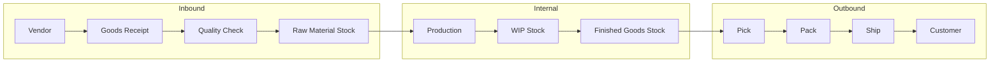

---

## Step 1: Warehouse Configuration

### 1.1 Struktur Warehouse PT. Furnicraft

Navigasi: `Inventory → Configuration → Warehouses`

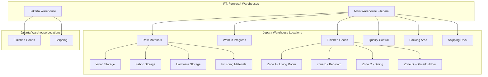

### 1.2 Konfigurasi Main Warehouse

| Field | Value |
|-------|-------|
| **Warehouse Name** | Main Warehouse - Jepara |
| **Short Name** | JPR |
| **Company** | PT. Furnicraft Indonesia |
| **Address** | Jl. Raya Jepara - Kudus Km. 12, Jepara |

**Routes Configuration:**

| Route | Enabled | Description |
|-------|---------|-------------|
| Receipts | ✅ 3 Steps | Receive → QC → Stock |
| Deliveries | ✅ 3 Steps | Pick → Pack → Ship |
| Internal Transfers | ✅ Yes | Between locations |
| Resupply from | - | - |

### 1.3 Membuat Locations

Navigasi: `Inventory → Configuration → Locations`

| Location | Parent | Location Type | Usage |
|----------|--------|---------------|-------|
| **JPR/Stock** | JPR | Internal | Default stock |
| JPR/Stock/Raw Materials | JPR/Stock | Internal | Bahan baku |
| JPR/Stock/Raw Materials/Wood | JPR/Stock/RM | Internal | Kayu |
| JPR/Stock/Raw Materials/Fabric | JPR/Stock/RM | Internal | Kain |
| JPR/Stock/Raw Materials/Hardware | JPR/Stock/RM | Internal | Hardware |
| JPR/Stock/Raw Materials/Finishing | JPR/Stock/RM | Internal | Cat, Amplas |
| JPR/Stock/WIP | JPR/Stock | Internal | Work in Progress |
| JPR/Stock/Finished Goods | JPR/Stock | Internal | Produk jadi |
| JPR/Stock/FG/Zone A | JPR/Stock/FG | Internal | Living Room |
| JPR/Stock/FG/Zone B | JPR/Stock/FG | Internal | Bedroom |
| JPR/Stock/FG/Zone C | JPR/Stock/FG | Internal | Dining |
| JPR/Stock/FG/Zone D | JPR/Stock/FG | Internal | Office/Outdoor |
| **JPR/Input** | JPR | Internal | Receiving Area |
| **JPR/Quality Control** | JPR | Internal | QC Inspection |
| **JPR/Packing** | JPR | Internal | Packing Area |
| **JPR/Output** | JPR | Internal | Shipping Dock |

### 1.4 Alur 3-Step Receipts

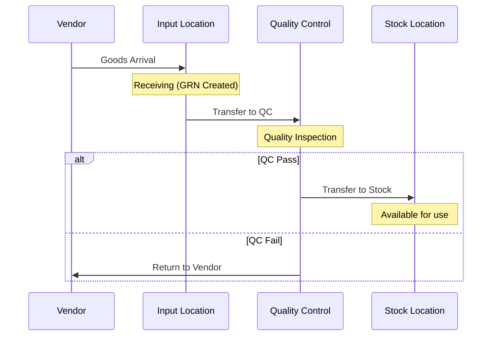

### 1.5 Alur 3-Step Delivery

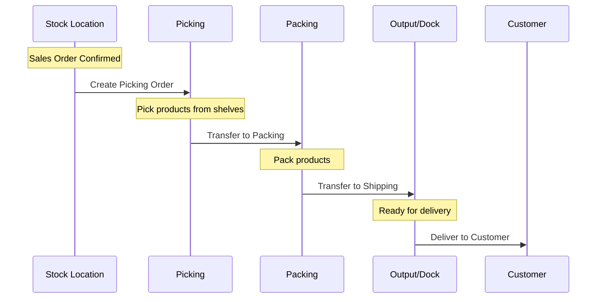

---

## Step 2: Operation Types

Navigasi: `Inventory → Configuration → Operation Types`

### 2.1 Operation Types untuk 3-Step Receipt

| Operation Type | Code | Reservation | Source | Destination |
|----------------|------|-------------|--------|-------------|
| Receipts | JPR/IN | At Confirmation | Vendors | JPR/Input |
| Quality Control | JPR/QC | At Confirmation | JPR/Input | JPR/Quality |
| Store | JPR/STR | At Confirmation | JPR/Quality | JPR/Stock |

### 2.2 Operation Types untuk 3-Step Delivery

| Operation Type | Code | Reservation | Source | Destination |
|----------------|------|-------------|--------|-------------|
| Pick | JPR/PICK | Manually | JPR/Stock | JPR/Packing |
| Pack | JPR/PACK | At Confirmation | JPR/Packing | JPR/Output |
| Delivery Orders | JPR/OUT | At Confirmation | JPR/Output | Customers |

### 2.3 Internal Operations

| Operation Type | Code | Usage |
|----------------|------|-------|
| Internal Transfers | JPR/INT | Transfer antar lokasi |
| Manufacturing | JPR/MO | Konsumsi & produksi |
| Returns | JPR/RET | Customer returns |
| Scrap | JPR/SCRAP | Barang rusak |

---

## Step 3: Routes & Rules

### 3.1 Standard Routes

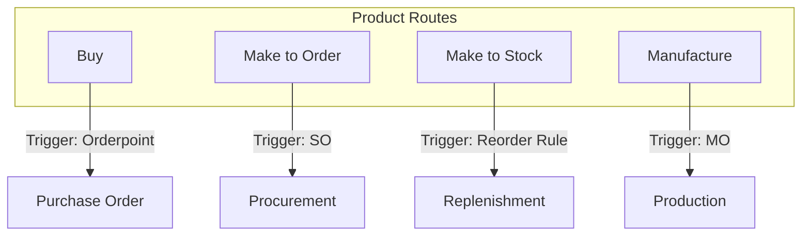

### 3.2 Routes Configuration

| Route | Description | Products |
|-------|-------------|----------|
| **Buy** | Purchase from vendor | Raw Materials, Components |
| **Manufacture** | Produce in-house | Finished Goods |
| **Make to Order (MTO)** | Produce on demand | Custom orders |
| **Resupply from JPR to JKT** | Inter-warehouse transfer | Finished Goods |

### 3.3 Push & Pull Rules

**Pull Rule untuk Raw Materials:**

```python
# Ketika stock menipis, trigger Purchase
{
    'name': 'Buy',
    'action': 'buy',
    'picking_type_id': stock.picking_type_in.id,
    'location_src_id': supplier_location.id,
    'location_id': stock_location.id,
}
```

**Push Rule untuk Finished Goods (ke Jakarta):**

```python
# Setelah produksi, auto-transfer ke Jakarta
{
    'name': 'Push to Jakarta',
    'action': 'push',
    'picking_type_id': internal_transfer.id,
    'location_src_id': jepara_fg.id,
    'location_id': jakarta_fg.id,
    'auto': 'manual',  # atau 'transparent'
}
```

---

## Step 4: Reordering Rules (Orderpoints)

### 4.1 Konsep Reordering

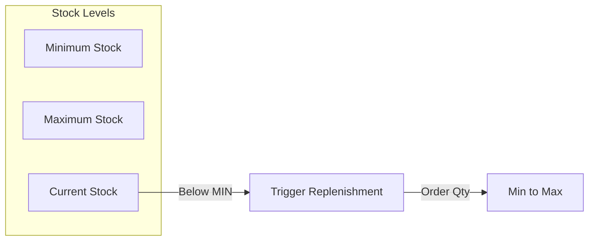

### 4.2 Reordering Rules untuk Raw Materials

Navigasi: `Inventory → Configuration → Reordering Rules`

| Product | Location | Min Qty | Max Qty | To Order | Route |
|---------|----------|---------|---------|----------|-------|
| Kayu Jati Grade A | JPR/Stock/RM/Wood | 5 m³ | 20 m³ | Multiple of 1 | Buy |
| Kayu Jati Grade B | JPR/Stock/RM/Wood | 3 m³ | 15 m³ | Multiple of 1 | Buy |
| MDF 18mm | JPR/Stock/RM/Wood | 50 lembar | 200 lembar | Multiple of 10 | Buy |
| Velvet Premium Grey | JPR/Stock/RM/Fabric | 100 m | 500 m | Multiple of 50 | Buy |
| Foam Density 32 | JPR/Stock/RM/Fabric | 200 m² | 800 m² | Multiple of 100 | Buy |
| Engsel Pintu Kuningan | JPR/Stock/RM/HW | 500 pcs | 2000 pcs | Multiple of 100 | Buy |
| NC Lacquer Clear | JPR/Stock/RM/Fin | 50 liter | 200 liter | Multiple of 20 | Buy |

### 4.3 Scheduler Configuration

```
Settings → Inventory → Run Scheduler Automatically
✅ Run scheduler every: 1 Day
```

### 4.4 Manual Scheduler Run

Navigasi: `Inventory → Operations → Run Scheduler`

---

## Step 5: Inventory Operations

### 5.1 Goods Receipt (Penerimaan Barang)

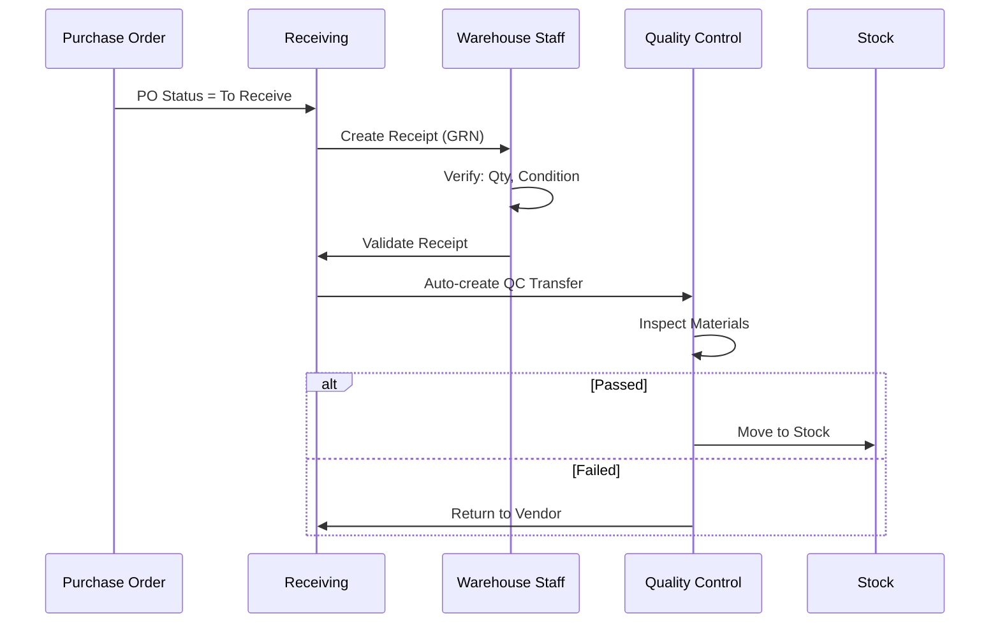

**Langkah-langkah:**

1. **Buka Receipt:** `Inventory → Operations → Receipts`
2. **Verify items:** Cek quantity dan kondisi
3. **Edit jika perlu:** Qty received berbeda dari ordered
4. **Validate:** Confirm receipt
5. **QC Transfer:** Auto-created, inspect materials
6. **Store:** Move to final location

### 5.2 Delivery Order (Pengiriman)

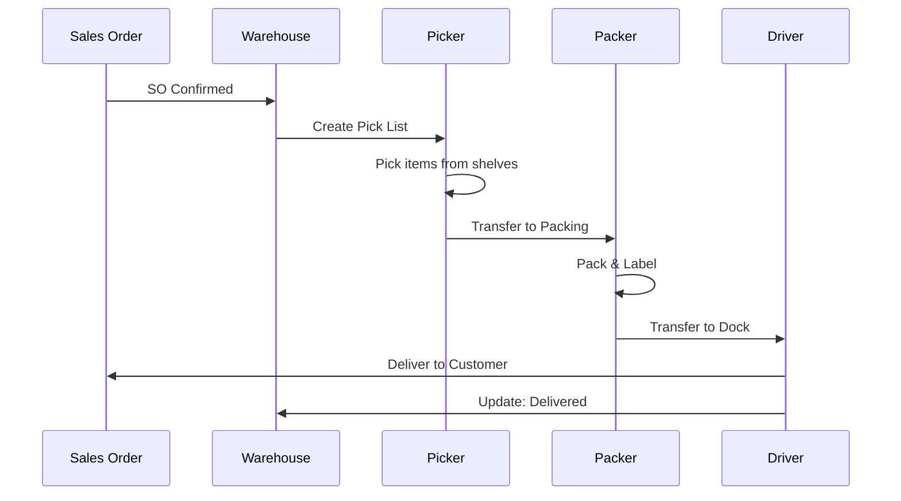

**Langkah-langkah:**

1. **Check Pickings:** `Inventory → Operations → Delivery Orders`
2. **Pick products:** Scan/select products from locations
3. **Validate pick:** Move to packing area
4. **Pack products:** Add packaging, labels
5. **Validate pack:** Move to output dock
6. **Deliver:** Mark as delivered

### 5.3 Internal Transfer

**Use Cases:**
- Move between zones (Zone A → Zone B)
- Move to QC for inspection
- Replenish from warehouse to production

**Langkah-langkah:**

1. Navigasi: `Inventory → Operations → Internal Transfers`
2. Create new transfer
3. Select source & destination locations
4. Add products & quantities
5. Validate

### 5.4 Inventory Adjustment

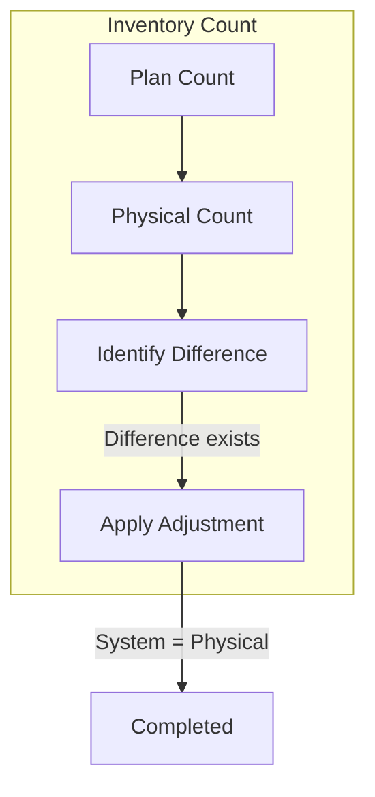

**Langkah-langkah:**

1. Navigasi: `Inventory → Operations → Inventory Adjustments`
2. Create adjustment for location/category
3. Start inventory
4. Input actual quantities
5. Apply adjustments

---

## Step 6: Lot & Serial Number Tracking

### 6.1 Traceability Configuration

| Product Type | Tracking | Why |
|--------------|----------|-----|
| Raw Materials - Wood | By Lot | Track supplier, quality per batch |
| Raw Materials - Fabric | By Lot | Track dye lot, supplier |
| Finished Goods | By Serial | Track individual unit for warranty |
| Components | No Tracking | High volume, low value |

### 6.2 Enable Lot/Serial Tracking

1. Product form → Inventory tab
2. **Tracking:** 
   - No Tracking
   - By Unique Serial Number
   - By Lots

### 6.3 Lot Number Format

| Product Type | Format | Example |
|--------------|--------|---------|
| Wood | WOOD-YYYYMM-XXX | WOOD-202401-001 |
| Fabric | FAB-YYYYMM-XXX | FAB-202401-015 |
| Finished Goods | SN-PRODUCT-XXXXXX | SN-FGSF001-000123 |

---

## Step 7: Barcode Operations

### 7.1 Barcode Configuration

Navigasi: `Inventory → Configuration → Settings`

```
✅ Barcodes
```

### 7.2 Barcode Types

| Usage | Barcode Type | Length |
|-------|--------------|--------|
| Products | EAN-13 | 13 digits |
| Locations | Internal | Custom |
| Lot/Serial | Internal | Custom |
| Packages | Internal | Custom |

### 7.3 Scanning Workflow

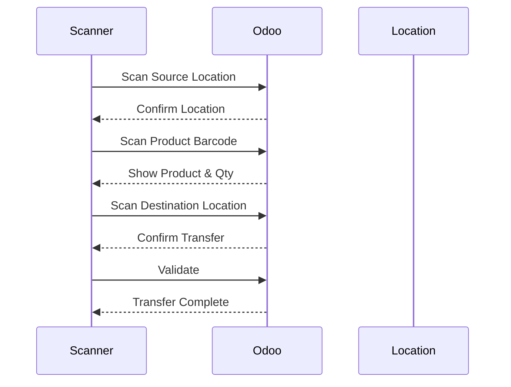

### 7.4 Mobile Barcode App

Install module: `stock_barcode`

**Features:**
- Scan to receive
- Scan to pick
- Scan for inventory count
- Scan for transfers

---

## Step 8: Reporting & Analytics

### 8.1 Stock Reports

| Report | Navigation | Purpose |
|--------|------------|---------|
| Stock Valuation | Inventory → Reporting → Valuation | Total inventory value |
| Stock Moves | Inventory → Reporting → Moves History | All stock movements |
| Stock Forecast | Inventory → Reporting → Forecast | Expected stock levels |
| Inventory Report | Inventory → Reporting → Inventory | Current on-hand |

### 8.2 Stock Valuation Report

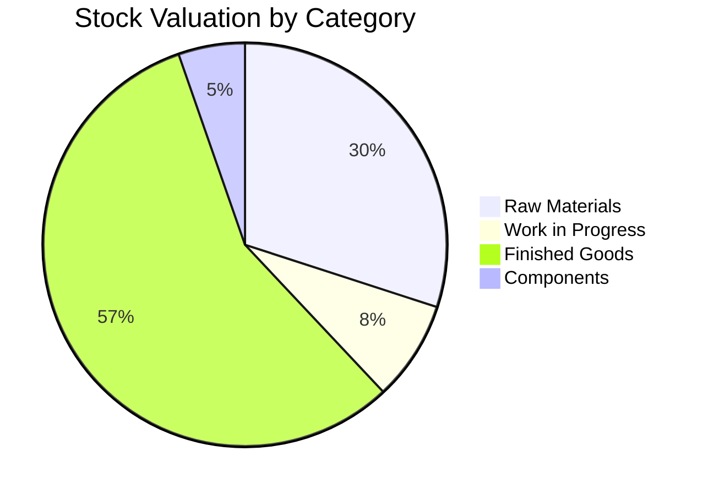

### 8.3 Key Metrics Dashboard

| KPI | Formula | Target |
|-----|---------|--------|
| Stock Accuracy | (Correct Items / Total Items) × 100 | > 98% |
| Inventory Turnover | COGS / Average Inventory | > 6x/year |
| Days of Inventory | 365 / Inventory Turnover | < 60 days |
| Fill Rate | Orders Fulfilled Complete / Total Orders | > 95% |
| Stockout Rate | Stockout Events / Total SKUs | < 2% |

---

## Step 9: Integration dengan Modul Lain

### 9.1 Purchase Integration

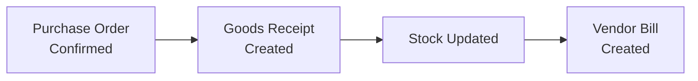

### 9.2 Sales Integration

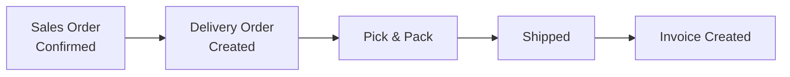

### 9.3 Manufacturing Integration

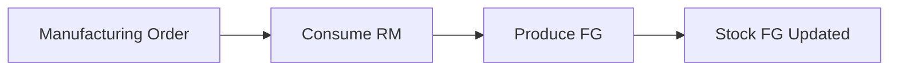

---

## Checklist Inventory Setup

### Warehouse Configuration
- [ ] Main warehouse created dengan lokasi lengkap
- [ ] 3-step receipt configured
- [ ] 3-step delivery configured
- [ ] Operation types sesuai kebutuhan

### Products
- [ ] Routes assigned ke setiap product
- [ ] Lot/Serial tracking enabled untuk product yang perlu
- [ ] Barcodes assigned

### Automation
- [ ] Reordering rules untuk raw materials
- [ ] Scheduler dikonfigurasi
- [ ] Push/Pull rules sesuai alur

### Operations
- [ ] Receiving SOP documented
- [ ] Delivery SOP documented
- [ ] Inventory count schedule defined

---

## Troubleshooting

### Transfer tidak bisa di-validate

1. Check stock availability di source location
2. Check product tracking (lot/serial required?)
3. Check user access rights

### Reordering rule tidak trigger

1. Check min/max quantities
2. Check product routes
3. Run scheduler manual: `Inventory → Run Scheduler`

### Stock mismatch

1. Lakukan inventory adjustment
2. Check pending transfers
3. Review stock moves history

---

*Sebelumnya: [03-master-data.md](03-master-data.md)*

*Lanjut ke: [05-purchase.md](05-purchase.md)*
