# 05 - Purchase Management

## Overview

Modul Purchase mengelola seluruh proses pengadaan bahan baku dan komponen untuk produksi PT. Furnicraft Indonesia. Integrasi erat dengan Inventory dan Accounting.

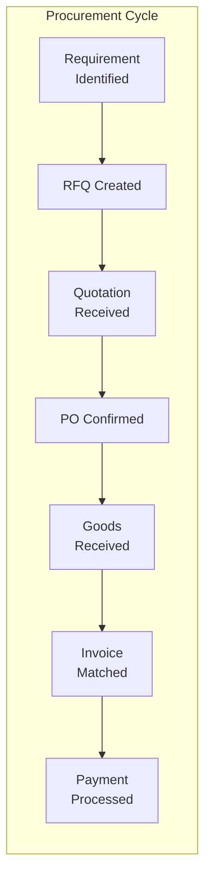

---

## Step 1: Module Installation & Configuration

### 1.1 Install Modules

Navigasi: `Apps`

| Module | Technical Name | Purpose |
|--------|----------------|---------|
| Purchase | `purchase` | Core purchasing |
| Purchase Agreements | `purchase_requisition` | Blanket orders, call for tenders |
| Purchase - MRP | `purchase_mrp` | Link to manufacturing |
| Purchase Stock | `purchase_stock` | Stock integration |

### 1.2 Settings Configuration

Navigasi: `Purchase → Configuration → Settings`

```
✅ Purchase Agreements (Blanket Orders)
✅ 3-Way Matching (Bills, PO, Receipts)
✅ Lock Confirmed Orders
✅ Product Variants
```

---

## Step 2: Vendor Management

### 2.1 Vendor Categories

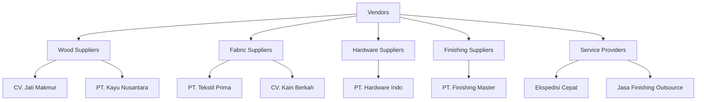

### 2.2 Sample Vendors PT. Furnicraft

Navigasi: `Purchase → Orders → Vendors` atau `Contacts`

| Vendor | Category | Payment Terms | Lead Time | Products |
|--------|----------|---------------|-----------|----------|
| CV. Jati Makmur | Wood | 30 Days | 7 days | Kayu Jati Grade A/B |
| PT. Kayu Nusantara | Wood | 45 Days | 10 days | MDF, Plywood |
| PT. Tekstil Prima | Fabric | 30 Days | 14 days | Velvet, Canvas |
| CV. Kain Berkah | Fabric | 14 Days | 7 days | Foam, Busa |
| PT. Hardware Indo | Hardware | 30 Days | 5 days | Engsel, Handle, Sekrup |
| PT. Finishing Master | Finishing | 30 Days | 3 days | NC Lacquer, Stain, Cat |

### 2.3 Vendor Form Configuration

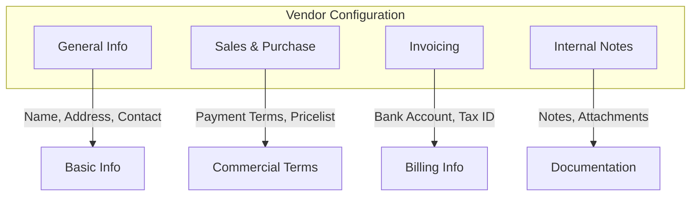

**Important Fields:**

| Tab | Field | PT. Furnicraft Value |
|-----|-------|----------------------|
| General | Is Vendor | ✅ Yes |
| Sales & Purchase | Payment Terms | 30 Days |
| Sales & Purchase | Purchase Currency | IDR |
| Invoicing | Tax ID | NPWP |
| Invoicing | Bank Account | For payments |

### 2.4 Vendor Pricelist (Supplierinfo)

Navigasi: `Product Form → Purchase Tab`

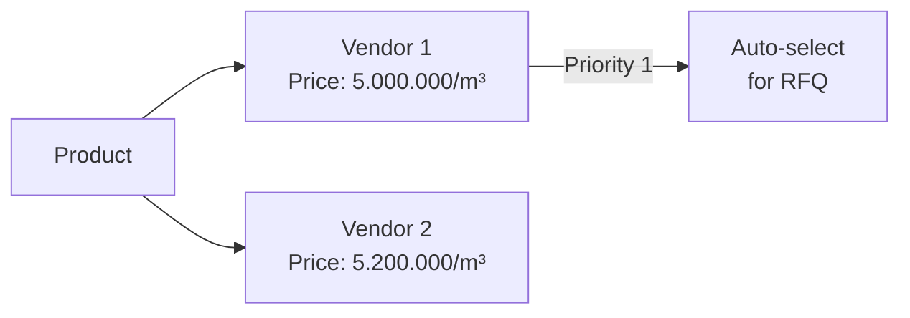

| Product | Vendor | Min Qty | Price | Lead Time |
|---------|--------|---------|-------|-----------|
| Kayu Jati Grade A | CV. Jati Makmur | 1 m³ | Rp 5.000.000 | 7 days |
| Kayu Jati Grade A | PT. Kayu Nusantara | 5 m³ | Rp 4.800.000 | 10 days |
| Velvet Premium Grey | PT. Tekstil Prima | 50 m | Rp 85.000/m | 14 days |
| Foam Density 32 | CV. Kain Berkah | 100 m² | Rp 45.000/m² | 7 days |

---

## Step 3: Request for Quotation (RFQ)

### 3.1 RFQ Workflow

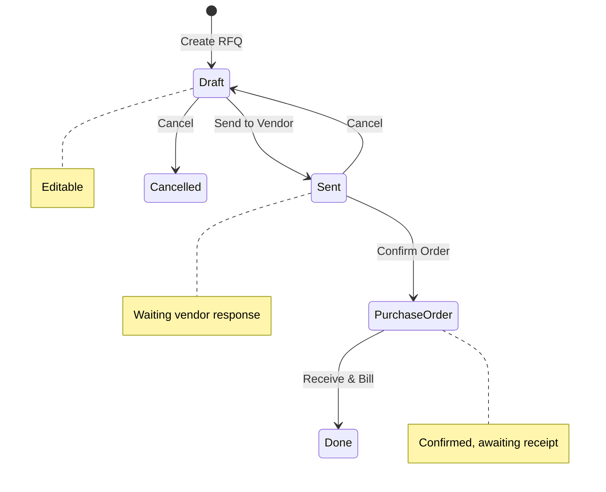

### 3.2 Creating RFQ

Navigasi: `Purchase → Orders → Requests for Quotation`

**Header:**

| Field | Example |
|-------|---------|
| Vendor | CV. Jati Makmur |
| Vendor Reference | QT-JM-2024-001 |
| Order Deadline | 15/02/2024 |
| Receipt Date | 22/02/2024 |
| Currency | IDR |

**Lines:**

| Product | Description | Qty | UoM | Unit Price | Subtotal |
|---------|-------------|-----|-----|------------|----------|
| Kayu Jati Grade A | Kayu jati kering | 10 | m³ | 5.000.000 | 50.000.000 |
| Kayu Jati Grade B | Kayu jati kering | 5 | m³ | 3.500.000 | 17.500.000 |

### 3.3 RFQ to Multiple Vendors

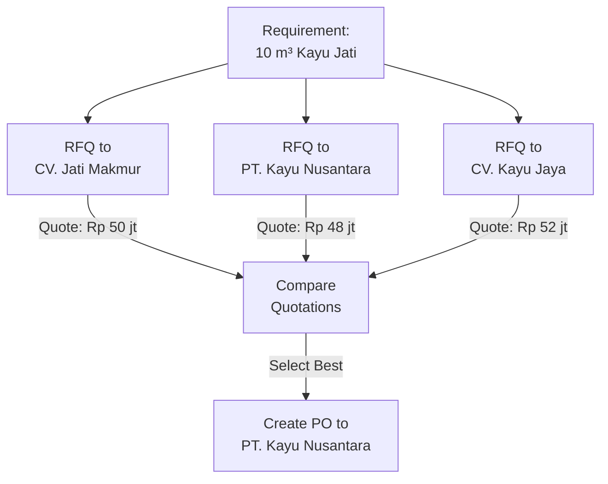

**Steps:**
1. Create RFQ untuk vendor pertama
2. Duplicate untuk vendor lain
3. Send all RFQs
4. Receive quotations
5. Compare (Purchase → Reporting → Compare)
6. Confirm best option

---

## Step 4: Purchase Agreement (Blanket Orders)

### 4.1 Agreement Types

| Type | Usage | Example |
|------|-------|---------|
| **Blanket Order** | Fixed price contract | Kayu Jati @ Rp 4.8M/m³ for 1 year |
| **Call for Tenders** | Compare vendors | RFQ ke 5 vendor untuk kontrak kain |

### 4.2 Create Blanket Order

Navigasi: `Purchase → Orders → Purchase Agreements`

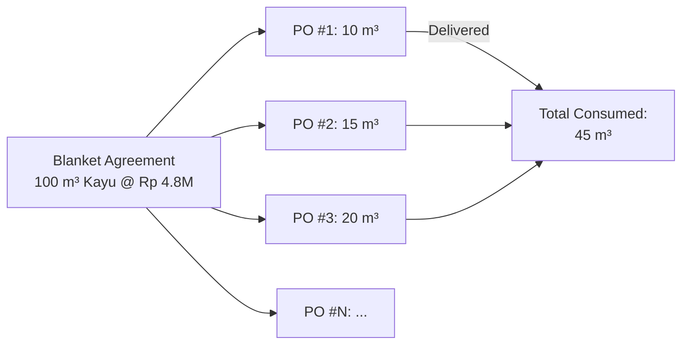

**Blanket Order Form:**

| Field | Value |
|-------|-------|
| Agreement Type | Blanket Order |
| Vendor | CV. Jati Makmur |
| Ordering Date | 01/01/2024 |
| Agreement Deadline | 31/12/2024 |
| Delivery Date | As per PO |

**Lines:**

| Product | Qty | Unit Price | Agreement |
|---------|-----|------------|-----------|
| Kayu Jati Grade A | 100 m³ | 4.800.000 | Min: 5 m³/order |
| Kayu Jati Grade B | 50 m³ | 3.300.000 | Min: 3 m³/order |

### 4.3 Creating PO from Blanket Order

1. Open Blanket Order
2. Click "New Quotation"
3. Select quantities needed
4. Confirm PO

---

## Step 5: Purchase Order Management

### 5.1 PO Lifecycle

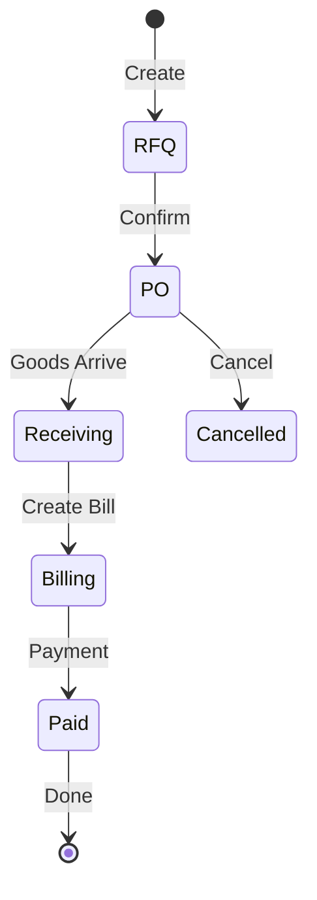

### 5.2 PO Confirmation Actions

When PO is confirmed:

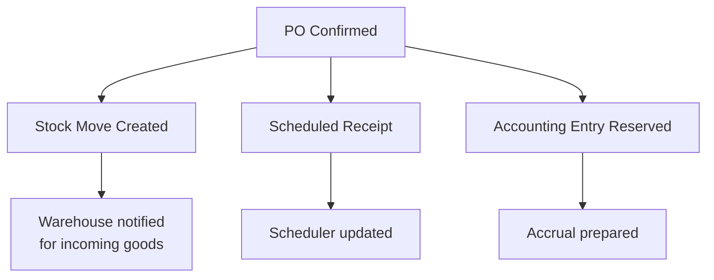

### 5.3 PO States & Actions

| State | Actions Available | Next Step |
|-------|-------------------|-----------|
| Draft/RFQ | Edit, Send, Confirm, Cancel | Send or Confirm |
| Sent | Edit, Confirm, Cancel | Wait vendor response |
| Purchase Order | Receive, Cancel, Create Bill | Receive goods |
| Done | View Bill, Reports | - |
| Cancelled | Set to Draft | Restart |

---

## Step 6: Goods Receipt

### 6.1 3-Step Receipt Process (dari Inventory)

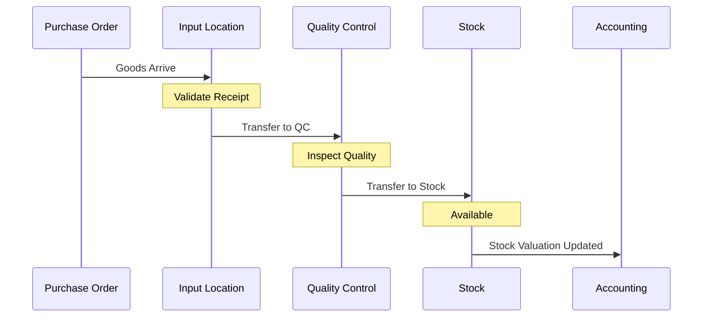

### 6.2 Partial & Over Receipt

| Scenario | Handling |
|----------|----------|
| **Partial Receipt** | PO status = "Partially Received", backorder created |
| **Over Receipt** | Warning shown, can accept or adjust |
| **Under Receipt** | Adjust PO or wait for backorder |

### 6.3 Receipt Validation

Navigasi: `Inventory → Operations → Receipts`

1. Find receipt linked to PO
2. Verify quantities
3. Assign lots/serials if required
4. Validate receipt
5. Process QC transfer
6. Move to stock

---

## Step 7: Vendor Bills

### 7.1 Bill Creation Flow

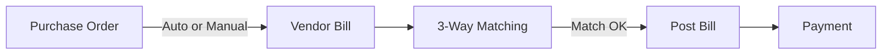

### 7.2 Bill Creation Methods

| Method | When to Use |
|--------|-------------|
| **From PO** | Click "Create Bill" on PO after receipt |
| **From Receipt** | Create from validated receipt |
| **Manual** | Upload vendor invoice, match to PO |

### 7.3 3-Way Matching

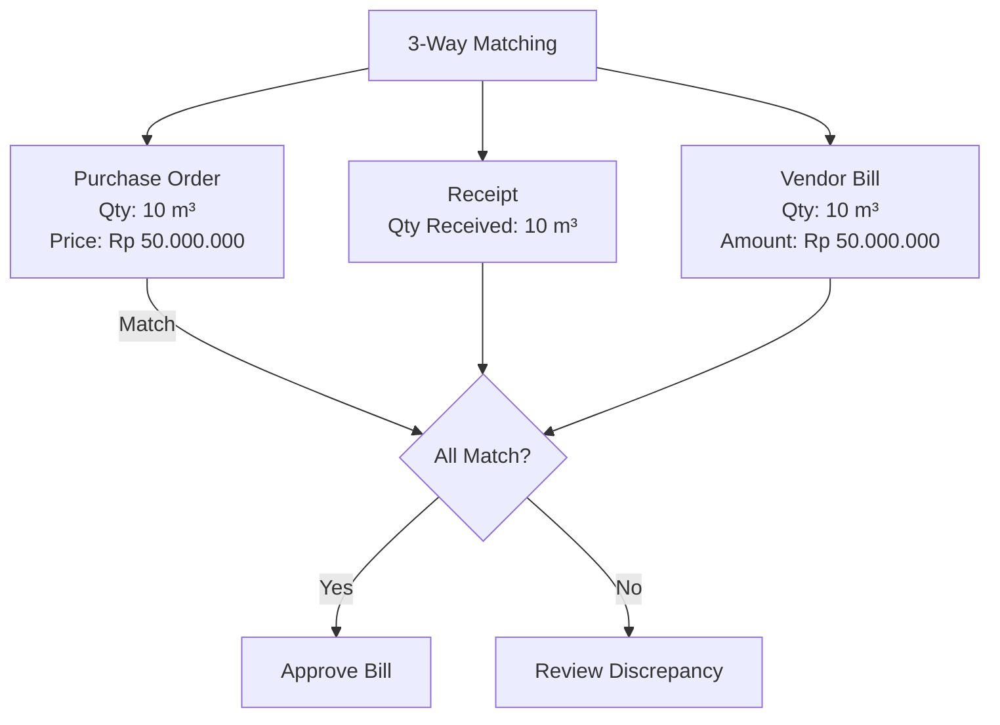

### 7.4 Bill States

| State | Description | Actions |
|-------|-------------|---------|
| Draft | Bill created, not posted | Edit, Post, Cancel |
| Posted | Recorded in accounting | Pay, Reverse |
| Paid | Payment registered | - |
| Cancelled | Voided | Reset to Draft |

---

## Step 8: Replenishment & Automation

### 8.1 Automatic Replenishment

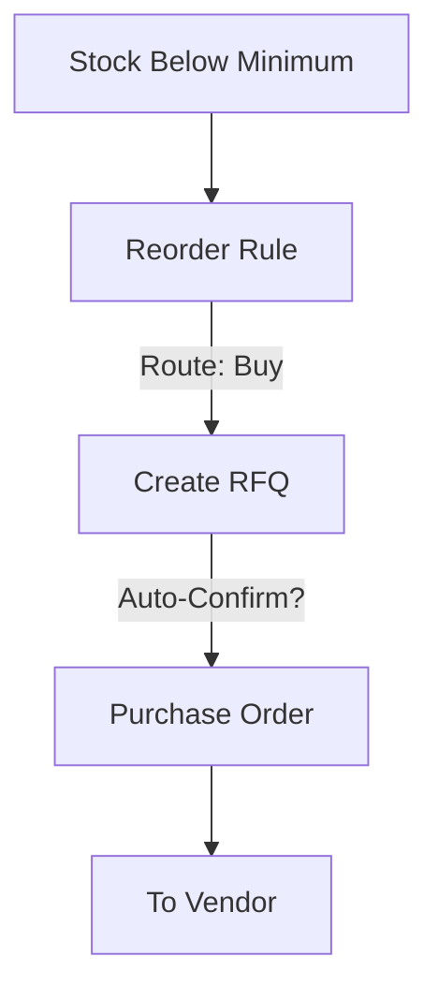

### 8.2 Reorder Rules Setup (Link to Inventory)

Navigasi: `Inventory → Configuration → Reordering Rules`

| Product | Min | Max | Vendor | Auto-Confirm |
|---------|-----|-----|--------|--------------|
| Kayu Jati Grade A | 5 m³ | 20 m³ | CV. Jati Makmur | ❌ Review |
| Velvet Premium Grey | 100 m | 500 m | PT. Tekstil Prima | ❌ Review |
| Engsel Pintu Kuningan | 500 pcs | 2000 pcs | PT. Hardware Indo | ✅ Yes |

### 8.3 Scheduled Actions

| Action | Frequency | Purpose |
|--------|-----------|---------|
| Run Scheduler | Daily | Check reorder rules |
| Send RFQ Reminders | Weekly | Follow up pending RFQs |
| PO Report | Weekly | Management review |

---

## Step 9: Purchase Reports

### 9.1 Available Reports

| Report | Navigation | Purpose |
|--------|------------|---------|
| Purchase Analysis | Purchase → Reporting → Purchase | Volume, value, trends |
| Vendor Performance | Purchase → Reporting → Vendor | Lead time, quality |
| Order Status | Purchase → Reporting → Orders | Pending, late orders |

### 9.2 Key Metrics

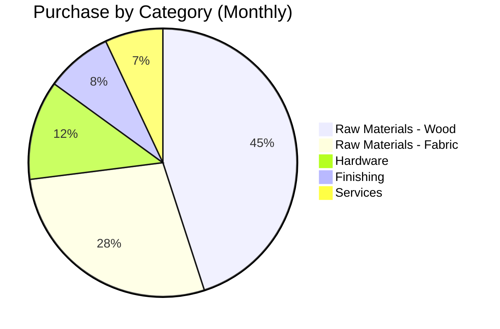

| KPI | Formula | Target |
|-----|---------|--------|
| Vendor On-Time Delivery | Orders On-Time / Total Orders | > 95% |
| Cost Variance | (Actual - Budget) / Budget | < 5% |
| Lead Time Accuracy | Actual Lead Time / Promised | > 90% |
| Quality Rate | Passed QC / Total Received | > 98% |

### 9.3 Purchase Dashboard

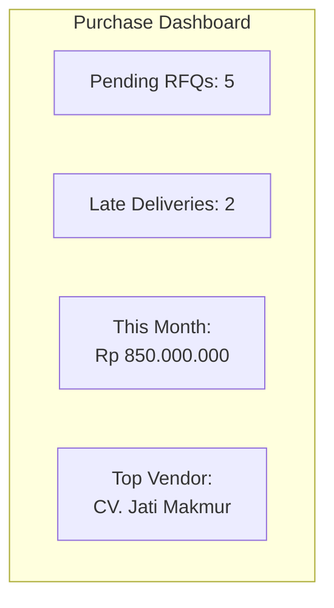

---

## Step 10: Integration

### 10.1 Purchase → Inventory

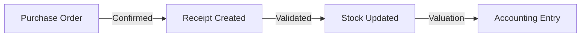

### 10.2 Purchase → Manufacturing

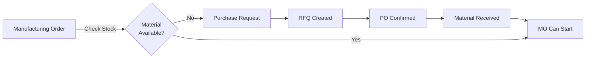

### 10.3 Purchase → Accounting

| Event | Accounting Entry |
|-------|------------------|
| PO Confirmed | No entry (commitment only) |
| Goods Received | Dr: Inventory, Cr: Goods Received Not Invoiced |
| Bill Posted | Dr: Expense/Inventory, Cr: Accounts Payable |
| Payment Made | Dr: Accounts Payable, Cr: Bank |

---

## Workflow Examples

### Example 1: Regular Purchase

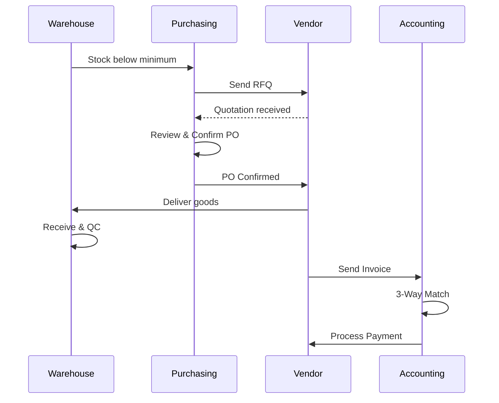

### Example 2: Urgent Purchase

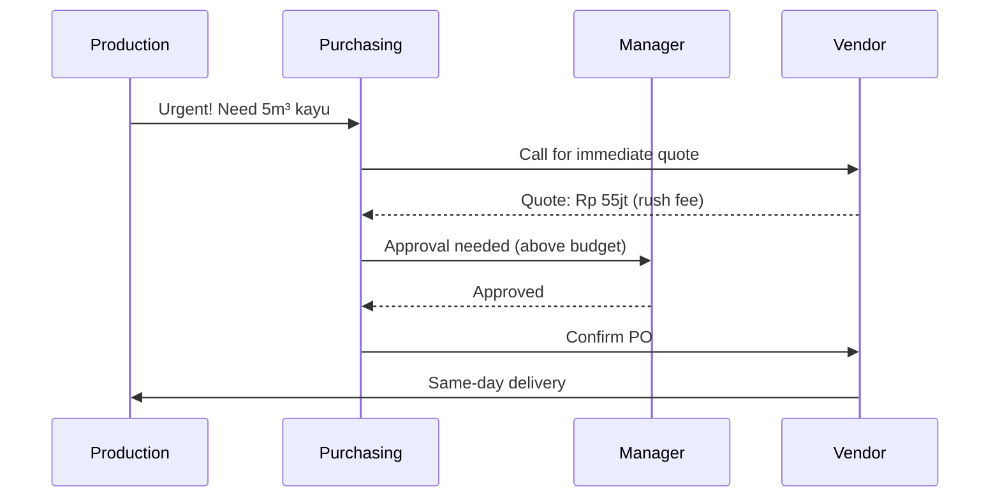

---

## Checklist Purchase Setup

### Configuration
- [ ] Module Purchase installed
- [ ] 3-Way Matching enabled
- [ ] Purchase Agreements enabled

### Master Data
- [ ] Vendors created dengan payment terms
- [ ] Product supplierinfo (vendor pricelist)
- [ ] Lead times configured

### Workflow
- [ ] Approval matrix defined (jika perlu)
- [ ] Blanket orders untuk vendor tetap
- [ ] Integration dengan Inventory verified

### Reporting
- [ ] Dashboard configured
- [ ] Scheduled reports setup

---

## Troubleshooting

### RFQ tidak bisa di-confirm

1. Check vendor payment terms
2. Verify product exists dan purchasable
3. Check user access rights

### Receipt tidak muncul

1. Verify PO status = Purchase Order
2. Check scheduled date
3. Run scheduler manual

### Bill tidak match dengan PO

1. Check quantities (ordered vs received vs billed)
2. Check prices (currency, discounts)
3. Review 3-way matching settings

---

*Sebelumnya: [04-inventory.md](04-inventory.md)*

*Lanjut ke: [06-manufacturing.md](06-manufacturing.md)*
