# 06 - Manufacturing

## Overview

Modul Manufacturing adalah inti operasional PT. Furnicraft Indonesia. Mengelola Bill of Materials (BoM), Work Orders, Work Centers, dan seluruh proses produksi furnitur.

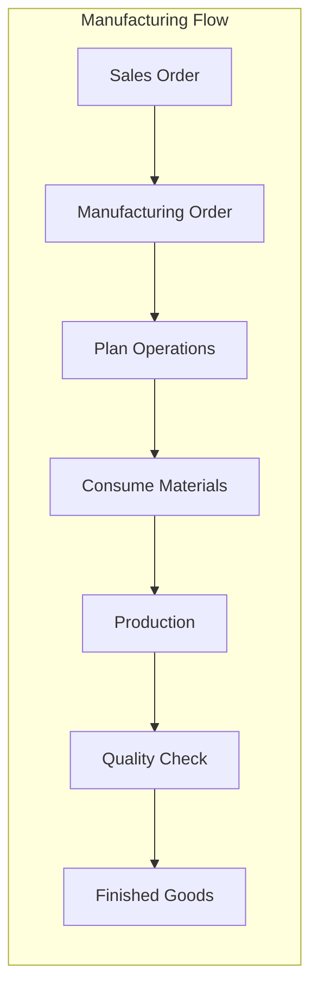

---

## Step 1: Module Installation & Configuration

### 1.1 Install Modules

Navigasi: `Apps`

| Module | Technical Name | Purpose |
|--------|----------------|---------|
| Manufacturing | `mrp` | Core MRP |
| MRP II | `mrp_workorder` | Work orders & operations |
| Quality | `quality_control` | QC integration |
| MRP Subcontracting | `mrp_subcontracting` | Outsourced operations |

> **Catatan**: PLM (Product Lifecycle Management - `mrp_plm`) adalah modul **Enterprise only**. Untuk Odoo CE, gunakan OCA module `product_lifecycle` atau kelola product versions secara manual.

### 1.2 Settings Configuration

Navigasi: `Manufacturing → Configuration → Settings`

```
✅ Work Orders
✅ By-Products
✅ Work Order Dependencies
✅ Quality Control
✅ Subcontracting
□  MPS (Manufacturing Planning) - Optional
```

---

## Step 2: Work Centers

### 2.1 Konsep Work Center

Work Center = Tempat kerja/mesin dimana operasi produksi dilakukan.

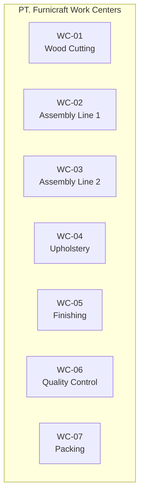

### 2.2 Work Center Configuration

Navigasi: `Manufacturing → Configuration → Work Centers`

| Work Center | Code | Capacity | Cost/Hour | Working Hours |
|-------------|------|----------|-----------|---------------|
| Wood Cutting | WC-01 | 2 | Rp 150.000 | 8 hr/day |
| Assembly Line 1 | WC-02 | 4 | Rp 200.000 | 8 hr/day |
| Assembly Line 2 | WC-03 | 4 | Rp 200.000 | 8 hr/day |
| Upholstery | WC-04 | 3 | Rp 180.000 | 8 hr/day |
| Finishing | WC-05 | 2 | Rp 220.000 | 8 hr/day |
| Quality Control | WC-06 | 2 | Rp 100.000 | 8 hr/day |
| Packing | WC-07 | 3 | Rp 80.000 | 8 hr/day |

### 2.3 Work Center Form

| Field | Description | Example |
|-------|-------------|---------|
| Work Center Name | Nama deskriptif | Wood Cutting Station |
| Code | Kode pendek | WC-01 |
| Working Hours | Jadwal kerja | Monday-Friday, 08:00-17:00 |
| Time Efficiency | Efisiensi aktual | 90% |
| Capacity | Operasi paralel | 2 |
| Cost per Hour | Biaya operasional | Rp 150.000 |
| Analytic Account | Untuk cost tracking | MFG - Wood Cutting |

### 2.4 Work Center Productivity

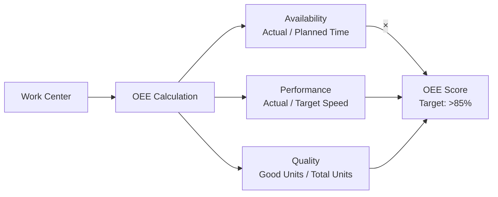

---

## Step 3: Bill of Materials (BoM)

### 3.1 BoM Types

| Type | Usage | Example |
|------|-------|---------|
| **Manufacture** | Standard production | Sofa 3-Seater |
| **Kit** | Bundle tanpa produksi | Furniture Set (Sofa + Table) |
| **Subcontracting** | Outsourced | Finishing outsource |

### 3.2 BoM Structure

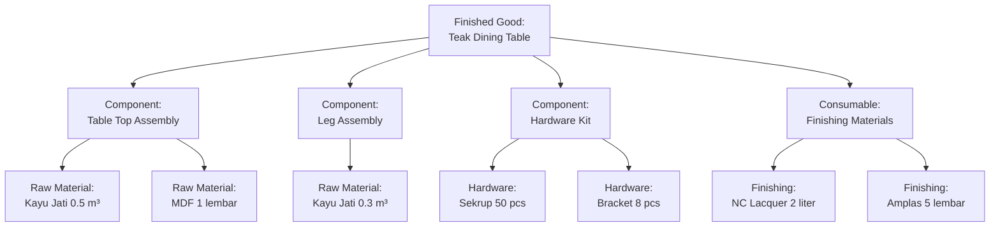

### 3.3 Sample BoM: Sofa 3-Seater Premium

Navigasi: `Manufacturing → Products → Bills of Materials`

**Header:**

| Field | Value |
|-------|-------|
| Product | FGSF001 - Sofa 3-Seater Premium Grey |
| Product Variant | Grey, Teak Frame |
| BoM Type | Manufacture this product |
| Quantity | 1 Unit |

**Components:**

| Component | Qty | UoM | Cost | Notes |
|-----------|-----|-----|------|-------|
| **Frame & Structure** |
| Kayu Jati Grade A | 0.15 | m³ | 750.000 | Main frame |
| Kayu Jati Grade B | 0.05 | m³ | 175.000 | Support |
| Plywood 12mm | 2 | lembar | 180.000 | Base panel |
| **Upholstery** |
| Velvet Premium Grey | 8 | meter | 680.000 | Fabric |
| Foam Density 32 | 3 | m² | 135.000 | Cushion |
| Dacron | 2 | kg | 60.000 | Filling |
| Webbing | 10 | meter | 50.000 | Support |
| **Hardware** |
| Sekrup 3cm | 50 | pcs | 25.000 | Assembly |
| Kaki Sofa Stainless | 4 | pcs | 120.000 | Legs |
| Spring Zigzag | 8 | pcs | 80.000 | Comfort |
| **Finishing** |
| NC Lacquer Clear | 0.5 | liter | 35.000 | Coating |
| Amplas 240 | 3 | lembar | 6.000 | Sanding |

**Total Material Cost:** Rp 2.296.000

### 3.4 Operations (Routing)

| Operation | Work Center | Duration | Description |
|-----------|-------------|----------|-------------|
| 10 - Frame Cutting | WC-01 Wood Cutting | 2 hours | Cut wood to dimensions |
| 20 - Frame Assembly | WC-02 Assembly Line | 3 hours | Assemble frame structure |
| 30 - Foam Cutting | WC-04 Upholstery | 1 hour | Cut foam to shape |
| 40 - Upholstery | WC-04 Upholstery | 4 hours | Apply fabric |
| 50 - Finishing | WC-05 Finishing | 2 hours | Apply lacquer, dry |
| 60 - QC Inspection | WC-06 QC | 0.5 hour | Quality check |
| 70 - Packing | WC-07 Packing | 0.5 hour | Pack for delivery |

**Total Operation Time:** 13 hours

### 3.5 Multi-level BoM

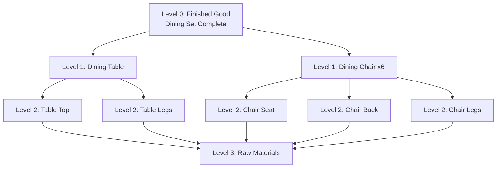

**Konfigurasi Multi-level:**

1. Create BoM untuk sub-assemblies (Semi-finished)
2. Reference sub-assembly dalam parent BoM
3. Set "Type: Manufacture" untuk semua level

---

## Step 4: Manufacturing Orders

### 4.1 MO Lifecycle

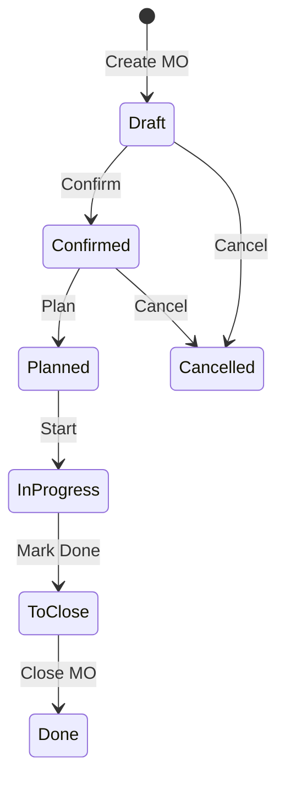

### 4.2 Creating Manufacturing Order

Navigasi: `Manufacturing → Operations → Manufacturing Orders`

**Automatic Creation (dari SO):**
```
Sales Order Confirmed → Check Routes → 
If Route = "Manufacture" → MO Auto-Created
```

**Manual Creation:**

| Field | Value |
|-------|-------|
| Product | FGSF001 - Sofa 3-Seater Premium Grey |
| Quantity | 10 units |
| Bill of Materials | FGSF001 BoM |
| Scheduled Date | 15/02/2024 |
| Deadline | 28/02/2024 |
| Responsible | Production Manager |

### 4.3 MO States & Actions

| State | Available Actions | Material Status |
|-------|-------------------|-----------------|
| Draft | Confirm, Cancel | Not reserved |
| Confirmed | Check Availability, Plan, Cancel | Can reserve |
| Planned | Start Production | Reserved |
| In Progress | Work Orders, Record Production | Consuming |
| To Close | Close MO | All consumed |
| Done | View, Report | Finished goods produced |

### 4.4 Material Availability

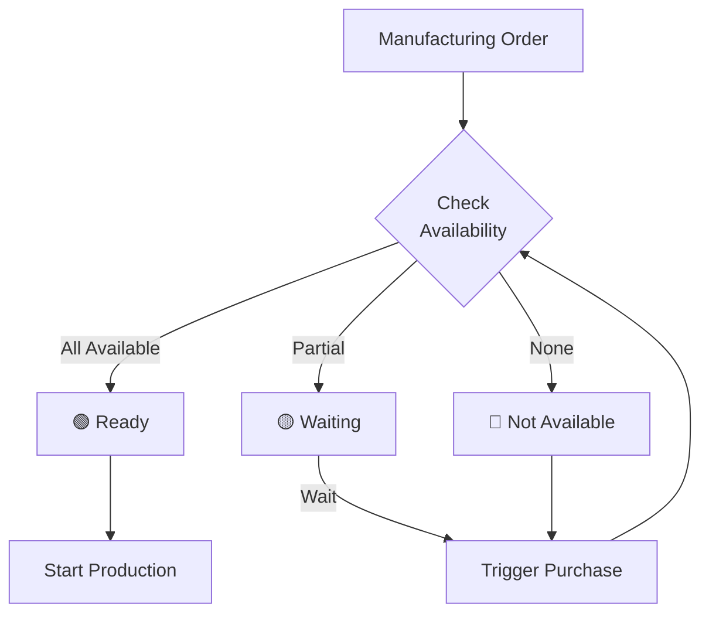

---

## Step 5: Work Orders

### 5.1 Work Order Concept

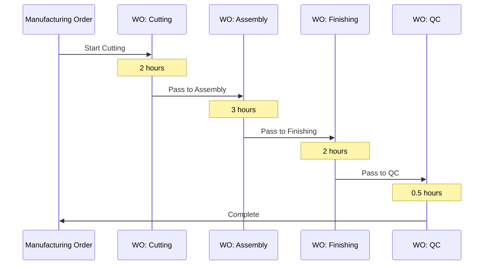

### 5.2 Work Order Tablet View

Navigasi: `Manufacturing → Work Orders → Work Orders`

Atau: Access melalui tablet di shop floor

**Work Order Card:**

```
┌─────────────────────────────────────────────┐
│ WO/00123 - Frame Assembly                   │
├─────────────────────────────────────────────┤
│ Product: FGSF001 - Sofa 3-Seater            │
│ MO: MO/00456                                │
│ Work Center: WC-02 Assembly Line 1          │
├─────────────────────────────────────────────┤
│ Expected Duration: 3h 00m                   │
│ Status: ⏳ In Progress                       │
│ Progress: ████████░░ 80%                    │
├─────────────────────────────────────────────┤
│ [START] [PAUSE] [DONE] [QUALITY] [SCRAP]    │
└─────────────────────────────────────────────┘
```

### 5.3 Work Order Operations

| Action | Description | When to Use |
|--------|-------------|-------------|
| **Start** | Begin timer | Worker starts operation |
| **Pause** | Stop timer temporarily | Break, waiting material |
| **Block** | Mark as blocked | Issue preventing work |
| **Done** | Complete operation | Operation finished |
| **Quality** | Record quality check | Inline QC |
| **Scrap** | Record waste | Defects found |

### 5.4 Recording Production Time

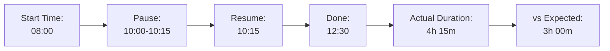

---

## Step 6: Production Tracking

### 6.1 Shop Floor Control

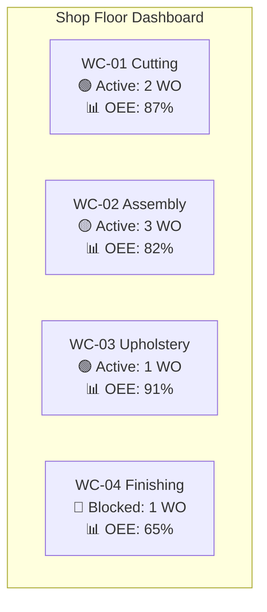

### 6.2 Production Recording

**Consume Materials:**
```python
# Bahan dikonsumsi saat MO start/progress
# Automatic: berdasarkan BoM
# Manual: adjust actual consumption
```

**Produce Finished Goods:**
```python
# FG diproduksi saat MO done
# Qty Produced dapat berbeda dari Qty Planned
# Under-production: partial, backorder
# Over-production: allowed dengan warning
```

### 6.3 By-Products

Produk sampingan dari proses produksi:

| Main Product | By-Product | Qty | Handling |
|--------------|------------|-----|----------|
| Kayu cutting | Wood Scraps | 10% | Send to scrap location |
| Fabric cutting | Fabric Remnants | 5% | Reuse or sell |

**BoM Configuration:**
1. BoM → By-Products tab
2. Add by-product dan quantity
3. Set destination location

---

## Step 7: Quality Control (Manufacturing)

### 7.1 Quality Points

Navigasi: `Manufacturing → Quality → Quality Control Points`

| Control Point | Type | Operation | Frequency |
|---------------|------|-----------|-----------|
| Wood Moisture Check | Measure | Before Cutting | Each batch |
| Frame Stability | Pass/Fail | After Assembly | Each unit |
| Finish Quality | Pass/Fail | After Finishing | Each unit |
| Final Inspection | Checklist | Before Packing | Each unit |

### 7.2 Quality Check Workflow

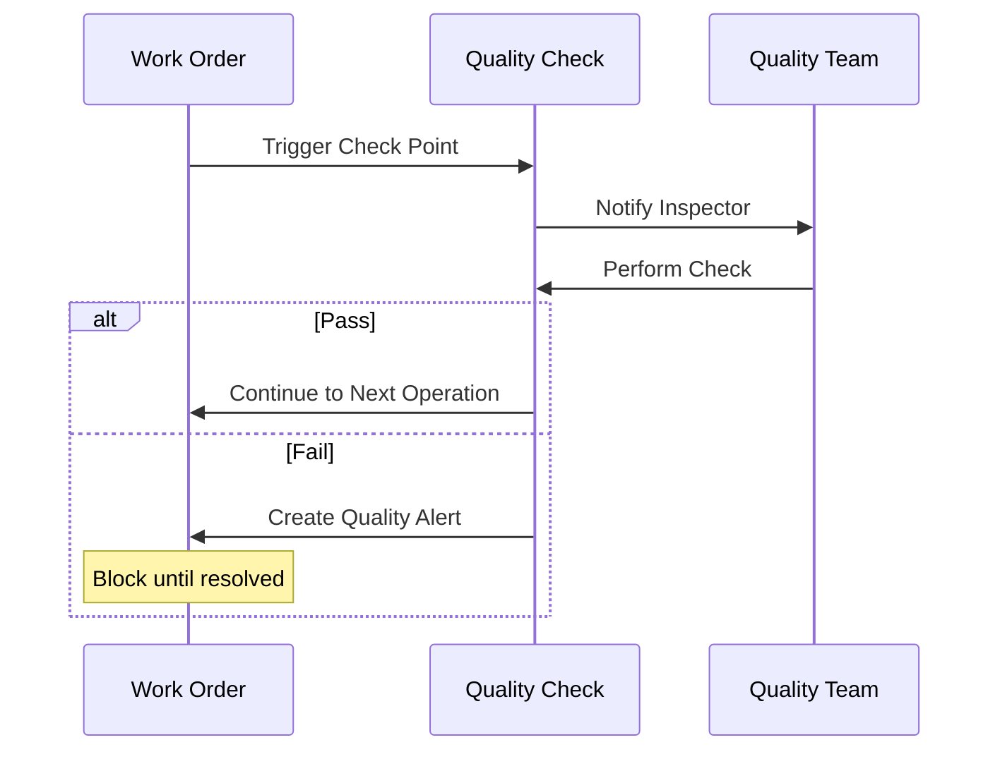

### 7.3 Quality Alert

| Alert Type | Severity | Action Required |
|------------|----------|-----------------|
| Minor Defect | Low | Rework, continue |
| Major Defect | Medium | Isolate, analyze |
| Critical Defect | High | Stop production, investigate |

---

## Step 8: Subcontracting

### 8.1 Subcontracting Concept

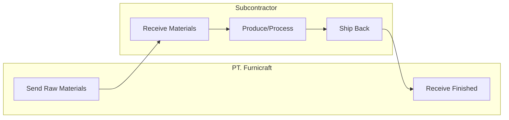

### 8.2 Subcontracting Setup

**Step 1: Create Subcontractor Vendor**
```
Contacts → Create → 
✅ Is Vendor
✅ Is Subcontractor
```

**Step 2: Create Subcontracted BoM**
```
Product: Finished Chair (Subcontracted Finishing)
BoM Type: Subcontracting
Subcontractor: CV. Finishing Pro
Components: Chair Body, Finishing Materials
```

**Step 3: Purchase Subcontracting Service**
```
Create PO to Subcontractor →
Product: Chair (Subcontracted) →
Auto-create: 
  - Delivery to Subcontractor (materials)
  - Receipt from Subcontractor (finished goods)
```

### 8.3 Subcontracting Flow

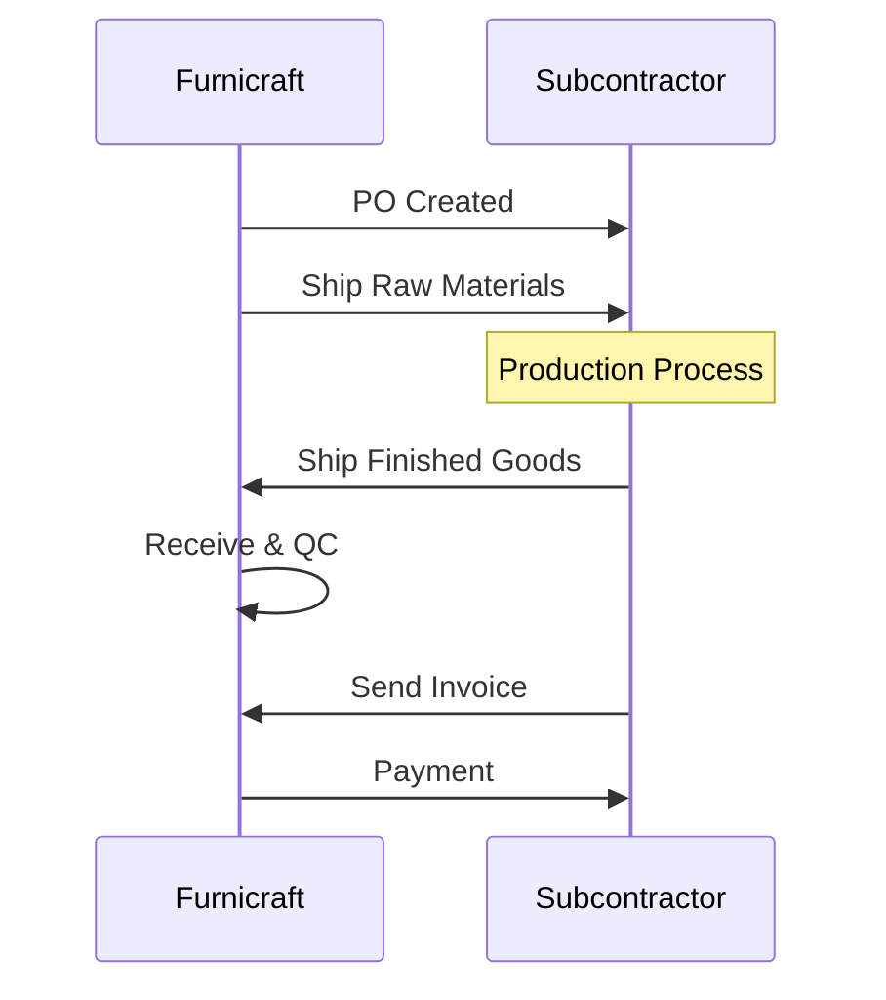

---

## Step 9: Planning & Scheduling

### 9.1 Production Planning

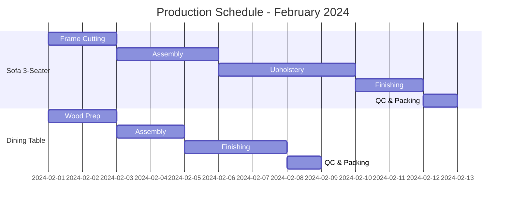

### 9.2 Capacity Planning

| Work Center | Available Hours/Day | Current Load | Utilization |
|-------------|---------------------|--------------|-------------|
| WC-01 Cutting | 16 hours | 14 hours | 87.5% |
| WC-02 Assembly L1 | 32 hours | 28 hours | 87.5% |
| WC-03 Assembly L2 | 32 hours | 20 hours | 62.5% |
| WC-04 Upholstery | 24 hours | 22 hours | 91.7% |
| WC-05 Finishing | 16 hours | 16 hours | 100% ⚠️ |

### 9.3 MPS (Master Production Schedule)

Navigasi: `Manufacturing → Planning → Master Production Schedule`

| Product | Week 1 | Week 2 | Week 3 | Week 4 |
|---------|--------|--------|--------|--------|
| Sofa 3-Seater | 10 | 12 | 15 | 12 |
| Dining Table | 8 | 10 | 10 | 8 |
| Office Chair | 20 | 25 | 25 | 20 |

---

## Step 10: Reporting & Analytics

### 10.1 Manufacturing Reports

| Report | Navigation | Purpose |
|--------|------------|---------|
| Production Analysis | Manufacturing → Reporting → Production | Volume, efficiency |
| Cost Analysis | Manufacturing → Reporting → Cost | Actual vs standard |
| Work Center Load | Manufacturing → Reporting → Work Centers | Capacity |
| Quality Analysis | Quality → Reporting → Analysis | Defects, trends |

### 10.2 Key Metrics

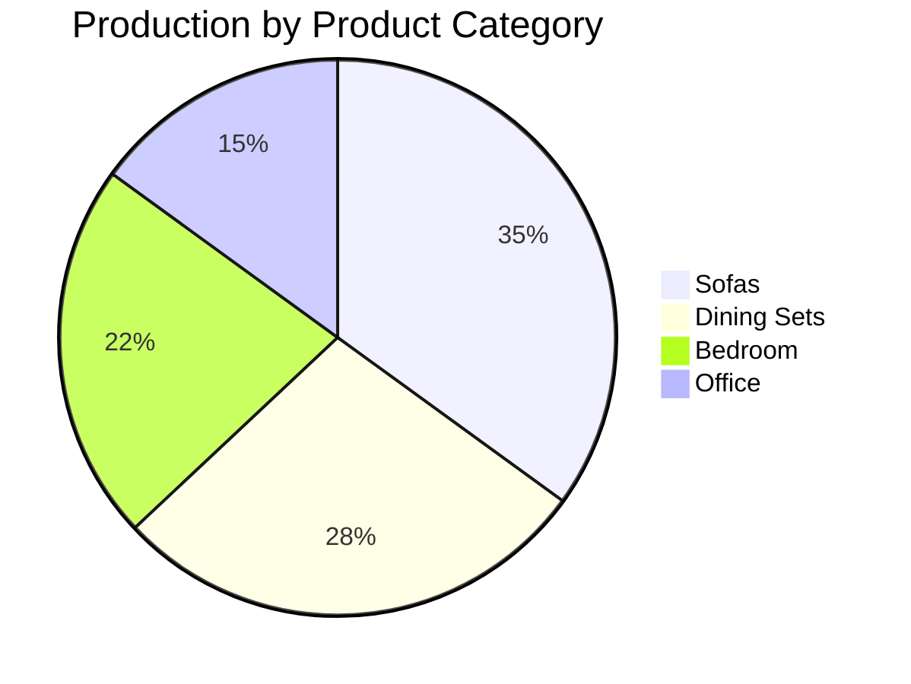

| KPI | Formula | Target |
|-----|---------|--------|
| OEE | Availability × Performance × Quality | > 85% |
| Cycle Time | Total Production Time / Units | Within standard |
| First Pass Yield | Good Units / Total Units | > 95% |
| On-Time Delivery | On-Time MO / Total MO | > 95% |
| Scrap Rate | Scrap Cost / Total Material | < 3% |

### 10.3 Production Dashboard

```
┌────────────────────────────────────────────────────┐
│ PRODUCTION DASHBOARD - February 2024               │
├────────────────────────────────────────────────────┤
│ Today's Production                                 │
│ ✅ Completed: 15 units     🔄 In Progress: 8 units │
│ ⏳ Scheduled: 12 units     ❌ Blocked: 1 unit     │
├────────────────────────────────────────────────────┤
│ Work Center Status                                 │
│ 🟢 WC-01: Running    🟢 WC-02: Running            │
│ 🟡 WC-03: Idle       🔴 WC-04: Blocked            │
├────────────────────────────────────────────────────┤
│ This Month                                         │
│ 📦 Produced: 245 units    💰 Value: Rp 2.4M       │
│ 📊 OEE: 86.5%            🎯 On-Time: 94%         │
└────────────────────────────────────────────────────┘
```

---

## Integration Points

### Manufacturing → Sales


### Manufacturing → Purchase

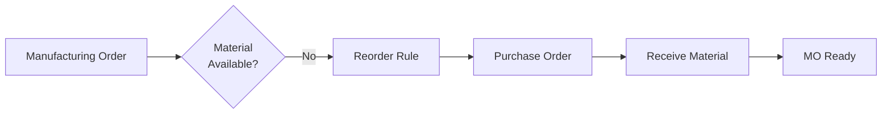

### Manufacturing → Inventory


---

## Checklist Manufacturing Setup

### Configuration
- [ ] Module MRP installed
- [ ] Work Orders enabled
- [ ] Quality Control enabled

### Master Data
- [ ] Work Centers created
- [ ] BoMs untuk semua products
- [ ] Operations/Routing defined

### Production
- [ ] MO workflow tested
- [ ] Work Order tablet configured
- [ ] Barcode scanning enabled

### Quality
- [ ] Quality control points defined
- [ ] Alert workflow configured

---

## Troubleshooting

### MO tidak bisa di-confirm

1. Check BoM exists untuk product
2. Verify component availability
3. Check work center capacity

### Work Order stuck

1. Check preceding WO complete
2. Verify material reserved
3. Check work center availability

### Quality check blocking

1. Review quality alert
2. Assign responsible person
3. Resolve and update status

---

*Sebelumnya: [05-purchase.md](05-purchase.md)*

*Lanjut ke: [07-sales.md](07-sales.md)*
