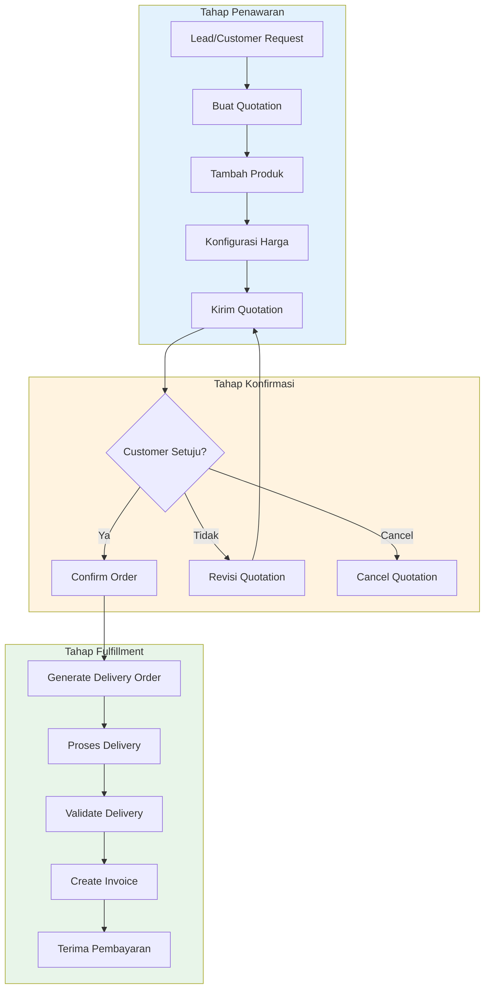
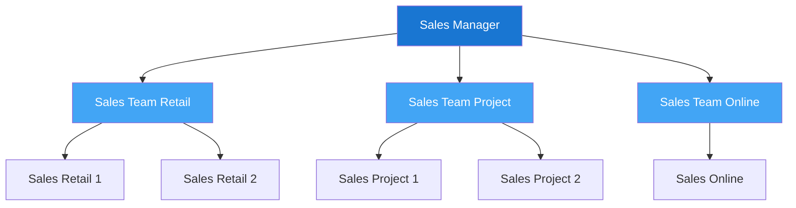
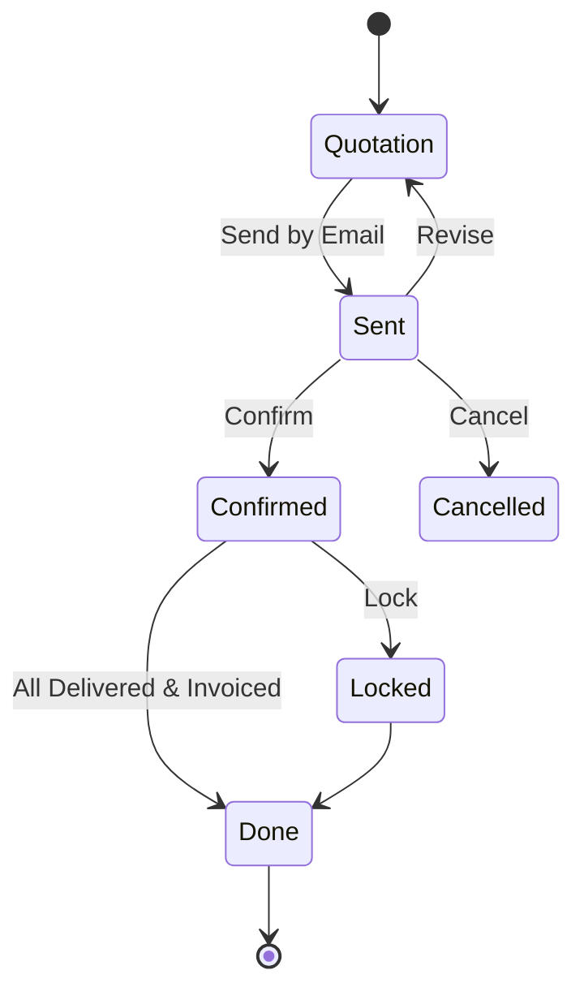
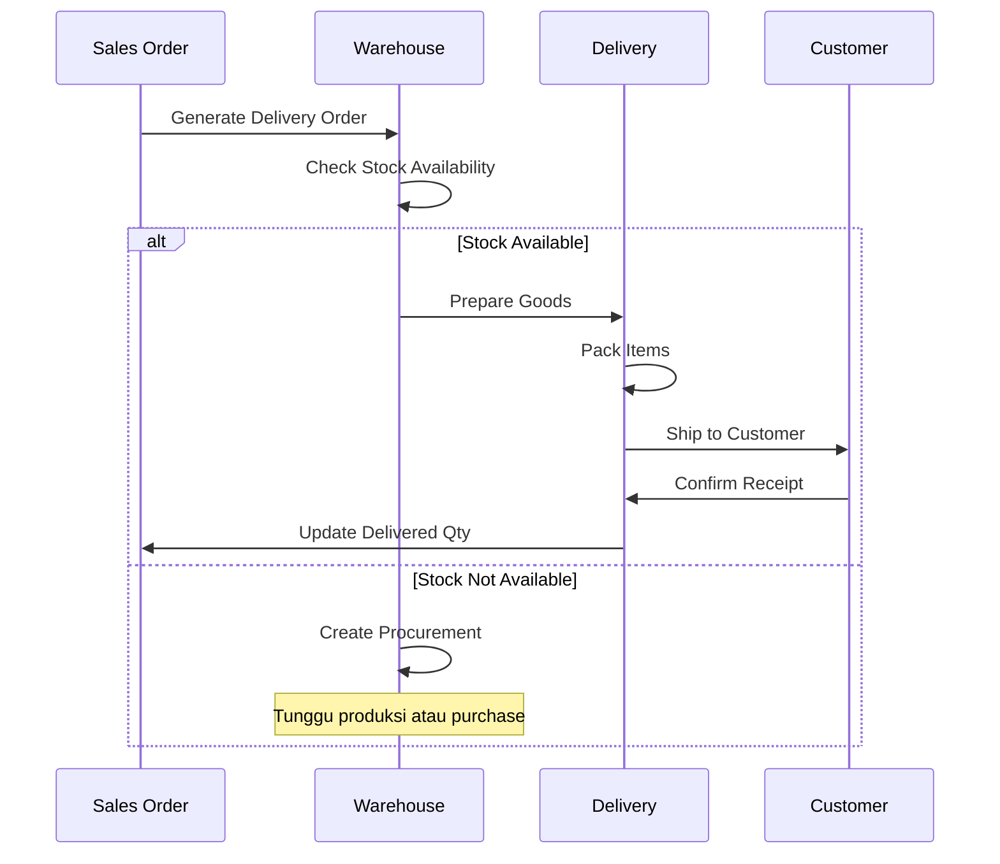
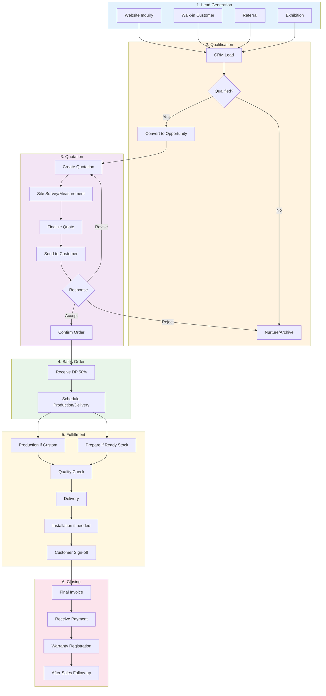
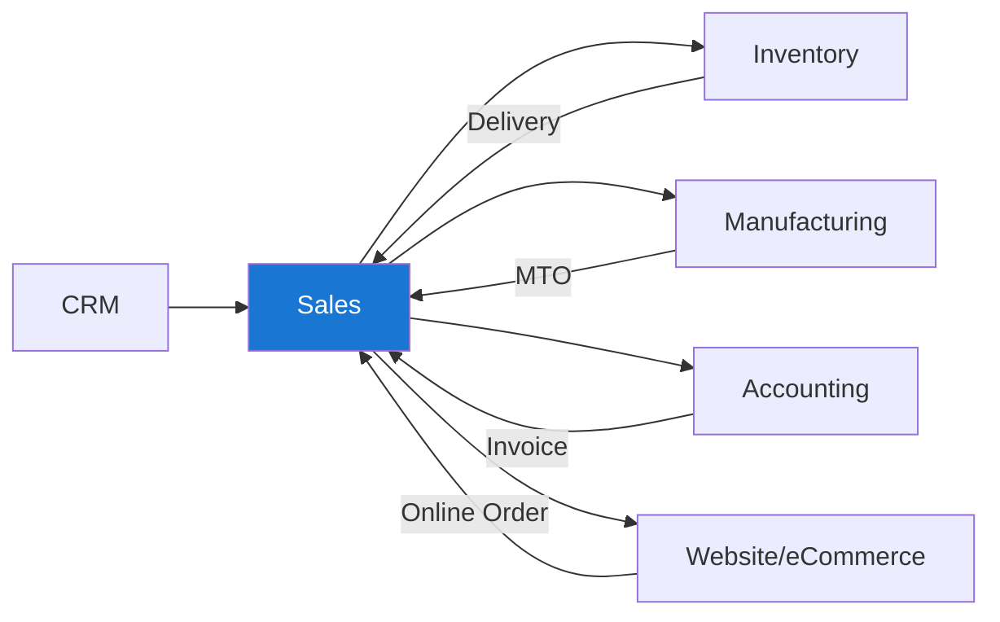

# Modul 07: Penjualan (Sales)

## Tujuan Modul

Mengelola proses penjualan dari penawaran hingga konfirmasi pesanan untuk PT. Furnicraft Indonesia.

---

## Diagram Alur Penjualan



---

## 1. Aktivasi Modul Sales

### Langkah Instalasi

1. **Apps** → Cari **Sales**
2. Klik **Install**

### Fitur Tambahan yang Direkomendasikan

| Fitur | Penggunaan |
|-------|-----------|
| Quotation Templates | Template penawaran standar |
| Customer Addresses | Multiple shipping addresses |
| Product Configurator | Produk dengan varian |
| Online Signature | Tanda tangan digital customer |
| Lock Confirmed Sales | Cegah perubahan SO terconfirm |

---

## 2. Konfigurasi Sales

### Settings → Sales → Quotations & Orders

```
[✓] Quotation Templates
[✓] Quotation Deadlines - Batas waktu penawaran
[✓] Customer Addresses - Delivery & Invoice berbeda
[✓] Lock Confirmed Sales
[✓] Pro-Forma Invoice
```

### Settings → Sales → Pricing

```
[✓] Discounts - Diskon per line item
[✓] Margins - Tampilkan margin keuntungan
[✓] Pricelists - Multiple price list
    └── Multiple Prices per Product
[✓] Coupons & Promotions - Promo code
```

### Settings → Sales → Shipping

```
[✓] Delivery Methods - Metode pengiriman
    Untuk PT. Furnicraft:
    - Self Pickup (Ambil Sendiri)
    - Truck Delivery (Jabodetabek)
    - Ekspedisi (Luar Jabodetabek)
```

---

## 3. Tim Sales PT. Furnicraft

### Struktur Tim



### Membuat Sales Team

**Sales → Configuration → Sales Teams**

#### Team 1: Sales Retail

```
Team Name: Sales Retail
Team Leader: Ahmad Fauzi
Email Alias: retail@furnicraft.co.id
Invoice Target: Rp 500.000.000/bulan
```

#### Team 2: Sales Project (B2B)

```
Team Name: Sales Project
Team Leader: Siti Nurhaliza
Email Alias: project@furnicraft.co.id
Invoice Target: Rp 1.000.000.000/bulan
```

#### Team 3: Sales Online

```
Team Name: Sales Online
Team Leader: Budi Santoso
Email Alias: online@furnicraft.co.id
Invoice Target: Rp 300.000.000/bulan
```

---

## 4. Quotation Templates

### Membuat Template Penawaran

**Sales → Configuration → Quotation Templates**

#### Template: Penawaran Furniture Rumah

```
Name: Furniture Rumah
Quotation Validity: 14 days
Confirmation Mail Template: Sales: Order Confirmation

Products (Optional Lines):
├── [MTJ-SEN-RST-001] Meja Makan Sentana Rustic 8 Kursi
├── [KRS-SEN-RST-001] Kursi Makan Sentana Rustic
├── [BUF-SEN-RST-001] Buffet Sentana Rustic
└── [LMR-SEN-RST-001] Lemari Pakaian Sentana 3 Pintu
```

**Terms & Conditions:**
```
SYARAT & KETENTUAN PT. FURNICRAFT INDONESIA

1. PEMBAYARAN
   - DP minimal 50% saat order dikonfirmasi
   - Pelunasan sebelum pengiriman
   - Transfer ke: Bank BCA 123-456-7890 a.n. PT Furnicraft Indonesia

2. PENGIRIMAN
   - Estimasi pengiriman 14-21 hari kerja untuk produk ready
   - Custom order 30-45 hari kerja
   - Biaya pengiriman ditanggung pembeli (kecuali promo)

3. GARANSI
   - Garansi struktur kayu 2 tahun
   - Garansi finishing 1 tahun
   - Tidak termasuk kerusakan akibat pemakaian tidak wajar

4. RETUR & KOMPLAIN
   - Komplain diterima maksimal 3 hari setelah barang diterima
   - Foto/video kerusakan wajib disertakan
```

#### Template: Penawaran Project (B2B)

```
Name: Project Furniture B2B
Quotation Validity: 30 days
Confirmation Mail Template: Sales: Order Confirmation

Optional Products:
├── Kategori: Office Furniture
├── Kategori: Hotel Furniture
└── Kategori: Restaurant Furniture

Terms & Conditions:
- Payment Terms: 30 Days
- Include: Delivery, Installation, Training
```

---

## 5. Pricelist Configuration

### Pricelist untuk PT. Furnicraft

**Sales → Products → Pricelists**

#### Pricelist 1: Harga Retail (Default)

```
Name: Retail Price
Currency: IDR
Selectable: Yes (Website, POS)

Price Rules: (kosong - gunakan harga Sales Price)
```

#### Pricelist 2: Harga Reseller

```
Name: Reseller Price
Currency: IDR
Selectable: No

Price Rules:
├── All Products: 15% discount dari Sales Price
└── Min Quantity: 5 units
```

#### Pricelist 3: Harga Project

```
Name: Project Price
Currency: IDR
Selectable: No

Price Rules:
├── All Products: 20% discount dari Sales Price
├── Min Quantity: 20 units
└── Validity: 30 hari
```

#### Pricelist 4: Harga Export

```
Name: Export Price (USD)
Currency: USD

Price Rules:
├── All Products: Formula based
└── Formula: (Sales Price + 15%) / Exchange Rate
```

---

## 6. Proses Quotation

### 6.1 Membuat Quotation Baru

**Sales → Orders → Quotations → Create**

#### Contoh: Quotation untuk CV Mitra Jaya

```
Customer: CV Mitra Jaya
Invoice Address: Jl. Raya Bogor No. 45, Jakarta Timur
Delivery Address: (sama)
Expiration: 30 hari
Pricelist: Reseller Price
Payment Terms: 15 Days
Salesperson: Ahmad Fauzi
Sales Team: Sales Retail
```

#### Order Lines:

| Produk | Qty | Unit Price | Disc (%) | Subtotal |
|--------|-----|------------|----------|----------|
| Meja Makan Sentana 8 Kursi | 5 | Rp 12.750.000 | 15% | Rp 54.187.500 |
| Kursi Makan Sentana (set 8) | 5 | Rp 8.500.000 | 15% | Rp 36.125.000 |
| Buffet Sentana Rustic | 3 | Rp 7.650.000 | 15% | Rp 19.507.500 |

**Untaxed Amount: Rp 109.820.000**
**Tax (11%): Rp 12.080.200**
**Total: Rp 121.900.200**

### 6.2 Optional Products

Tambahkan produk opsional yang mungkin diminati:

```
Optional Products:
├── Kursi Tambahan (per unit)
├── Kaca Meja Tempered 10mm
└── Set Bantalan Kursi Premium
```

### 6.3 Kirim Quotation

1. Klik **Send by Email**
2. Review email template
3. Lampirkan PDF quotation
4. **Send**

### 6.4 Customer Signature (Online)

Jika Online Signature diaktifkan:
1. Customer menerima email dengan link
2. Customer bisa review quotation online
3. Customer sign secara digital
4. Quotation otomatis menjadi Sales Order

---

## 7. Konfirmasi Sales Order

### 7.1 Dari Quotation ke Sales Order



### 7.2 Konfirmasi Order

1. Buka Quotation yang sudah disetujui
2. Klik **Confirm**
3. Quotation berubah menjadi **Sales Order**
4. Nomor berubah: S0001 → SO001

### 7.3 Apa yang Terjadi Setelah Konfirmasi?

```
[SO CONFIRMED]
     │
     ├─── [Delivery Order Created] → Kirim ke Warehouse
     │
     ├─── [MO Created] → Jika Make to Order
     │
     └─── [Invoice Draft] → Jika Invoice Policy = Ordered
```

---

## 8. Delivery Order dari Sales

### Alur Delivery

**Sales → Orders → Sales Orders → [Pilih SO] → Delivery Smart Button**



### Status Delivery di Sales Order

| Status | Artinya |
|--------|---------|
| Nothing to Deliver | Belum ada delivery (draft) |
| Waiting | Waiting for stock/manufacturing |
| Ready | Stock ready, siap kirim |
| Partially | Sebagian sudah dikirim |
| Done | Semua sudah dikirim |

---

## 9. Invoicing

### Invoice Policy

**Products → [Product] → Sales Tab → Invoicing Policy**

| Policy | Kapan Digunakan |
|--------|-----------------|
| Ordered Quantities | Invoice saat order confirm |
| Delivered Quantities | Invoice setelah barang dikirim |

**Rekomendasi PT. Furnicraft:**
- Furniture Ready Stock: **Ordered Quantities** (bayar dulu)
- Custom Order: **Delivered Quantities** (bayar setelah selesai)

### Membuat Invoice

1. **Sales Order → Create Invoice**
2. Pilih:
   - **Regular Invoice** - Invoice penuh
   - **Down Payment (percentage)** - DP persentase
   - **Down Payment (fixed)** - DP nominal tetap

### Contoh: Skema DP 50%

```
Order Total: Rp 121.900.200

Invoice 1 (DP): Rp 60.950.100 (50%)
Invoice 2 (Pelunasan): Rp 60.950.100 (50%)
```

---

## 10. Reporting Sales

### Dashboard Sales

**Sales → Reporting → Sales**

#### Key Metrics:

| Metric | Deskripsi |
|--------|-----------|
| Quotation Sent | Jumlah penawaran terkirim |
| Quotation Conversion Rate | % quotation jadi order |
| Total Sales | Total penjualan |
| Average Order Value | Rata-rata nilai order |

### Pivot Analysis

**Group By:**
- Salesperson
- Sales Team
- Product Category
- Month/Quarter

**Measures:**
- Untaxed Amount
- Quantity
- Margin (jika diaktifkan)

### Sales by Product Category

```
┌─────────────────────────────────────────────────────────┐
│ Product Category    │  Q1 2024  │  Q2 2024  │  Growth   │
├─────────────────────────────────────────────────────────┤
│ Furniture Ruang Tamu│ Rp 450 jt │ Rp 520 jt │  +15.6%   │
│ Furniture Kamar     │ Rp 380 jt │ Rp 410 jt │  +7.9%    │
│ Furniture Makan     │ Rp 320 jt │ Rp 395 jt │  +23.4%   │
│ Furniture Kantor    │ Rp 180 jt │ Rp 245 jt │  +36.1%   │
└─────────────────────────────────────────────────────────┘
```

---

## 11. Sales Workflow untuk PT. Furnicraft

### Workflow Penjualan Lengkap



---

## 12. Contoh Transaksi Lengkap

### Skenario: Penjualan Project Hotel

**Customer:** PT. Hotel Nusantara
**Kebutuhan:** Furniture 50 kamar hotel

#### Step 1: Quotation

```
Quotation: S00045
Customer: PT. Hotel Nusantara
Pricelist: Project Price (20% discount)
Validity: 30 days
Payment Terms: 30% DP, 70% setelah instalasi

Order Lines:
├── Tempat Tidur King Size x 50     @ Rp 8.000.000  = Rp 400.000.000
├── Nakas 2 Laci x 100              @ Rp 1.200.000  = Rp 120.000.000
├── Meja Kerja Minimalis x 50       @ Rp 2.400.000  = Rp 120.000.000
├── Kursi Kerja Standard x 50       @ Rp 1.600.000  = Rp  80.000.000
├── Lemari Pakaian 2 Pintu x 50     @ Rp 4.000.000  = Rp 200.000.000
├── Meja Rias + Mirror x 50         @ Rp 2.000.000  = Rp 100.000.000
└── Rak TV Gantung x 50             @ Rp 1.600.000  = Rp  80.000.000

Subtotal:                                            Rp 1.100.000.000
Discount (20%):                                     (Rp   220.000.000)
Installation Service:                                Rp    55.000.000
─────────────────────────────────────────────────────────────────────
Untaxed:                                             Rp   935.000.000
PPN 11%:                                             Rp   102.850.000
─────────────────────────────────────────────────────────────────────
GRAND TOTAL:                                         Rp 1.037.850.000
```

#### Step 2: Confirm & DP

```
Sales Order: SO00045
DP Invoice (30%): Rp 311.355.000
Status: DP Received ✓
```

#### Step 3: Production Schedule

```
Manufacturing Orders:
├── MO/2024/00145 - Tempat Tidur x 50 (Lead time: 21 days)
├── MO/2024/00146 - Nakas x 100 (Lead time: 14 days)
├── ... dan seterusnya
```

#### Step 4: Delivery & Installation

```
Delivery Orders:
├── WH/OUT/00345 - Batch 1 (Kamar 1-20)
├── WH/OUT/00346 - Batch 2 (Kamar 21-35)
└── WH/OUT/00347 - Batch 3 (Kamar 36-50)

Installation: 3 hari (2 teknisi)
```

#### Step 5: Final Invoice & Closing

```
Final Invoice (70%): Rp 726.495.000
Total Received: Rp 1.037.850.000 ✓
Warranty Registered: 2 years structural
After Sales: Follow-up call scheduled in 30 days
```

---

## 13. Tips & Best Practices

### Do's ✅

1. **Selalu gunakan Quotation Template** untuk konsistensi
2. **Set Quotation Deadline** agar customer aware
3. **Gunakan Pricelist** untuk segmentasi harga
4. **Lock Confirmed Orders** untuk mencegah perubahan
5. **Track Margin** untuk monitor profitability
6. **Follow-up quotation** yang belum direspons

### Don'ts ❌

1. **Jangan buat SO langsung** tanpa quotation (untuk audit trail)
2. **Jangan override harga manual** terlalu sering
3. **Jangan skip DP** untuk order custom besar
4. **Jangan kirim tanpa validasi** alamat pengiriman
5. **Jangan invoice sebelum delivery** (untuk delivered quantities policy)

---

## 14. Integrasi dengan Modul Lain



---

## Checklist Implementasi

- [ ] Install modul Sales
- [ ] Konfigurasi Settings Sales
- [ ] Buat Sales Teams
- [ ] Buat Quotation Templates
- [ ] Setup Pricelists
- [ ] Konfigurasi Delivery Methods
- [ ] Setup Payment Terms
- [ ] Train sales team
- [ ] Test quotation to invoice flow
- [ ] Test delivery integration

---

**Dokumen Berikutnya:** [08-accounting.md](./08-accounting.md) - Akuntansi & Keuangan

