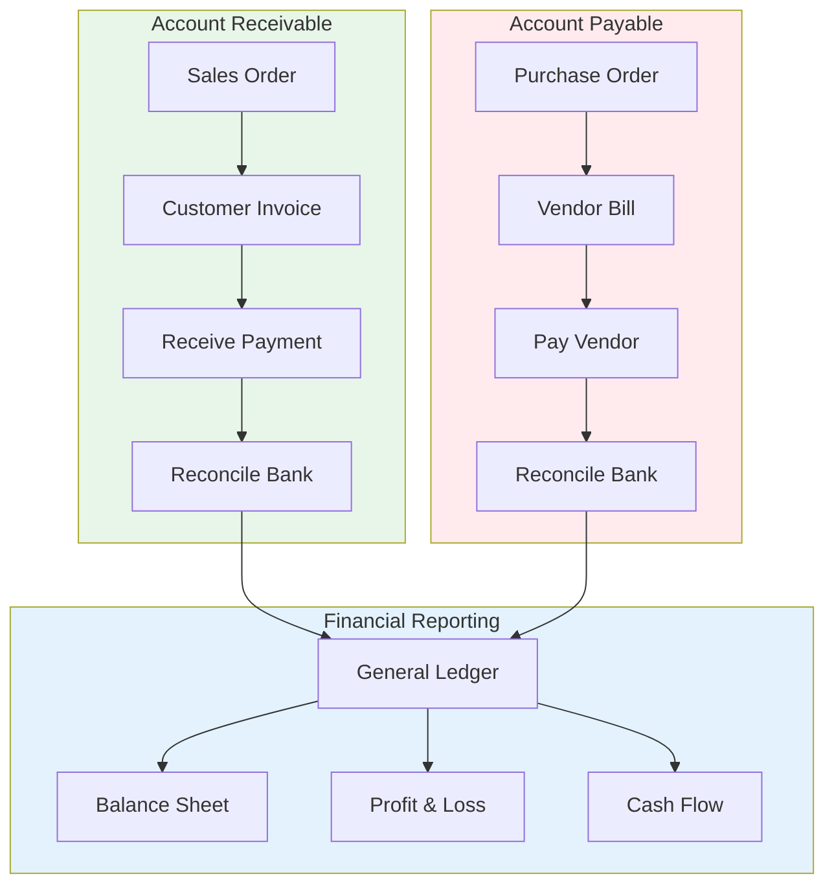
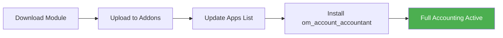
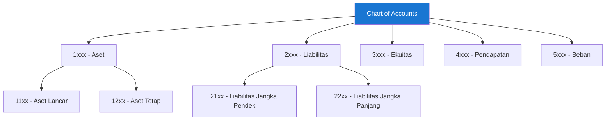
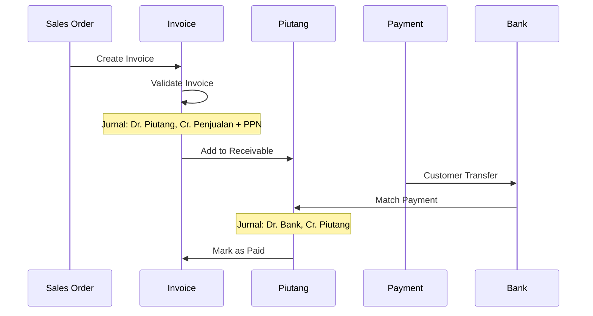
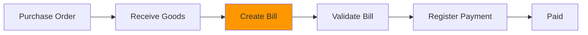
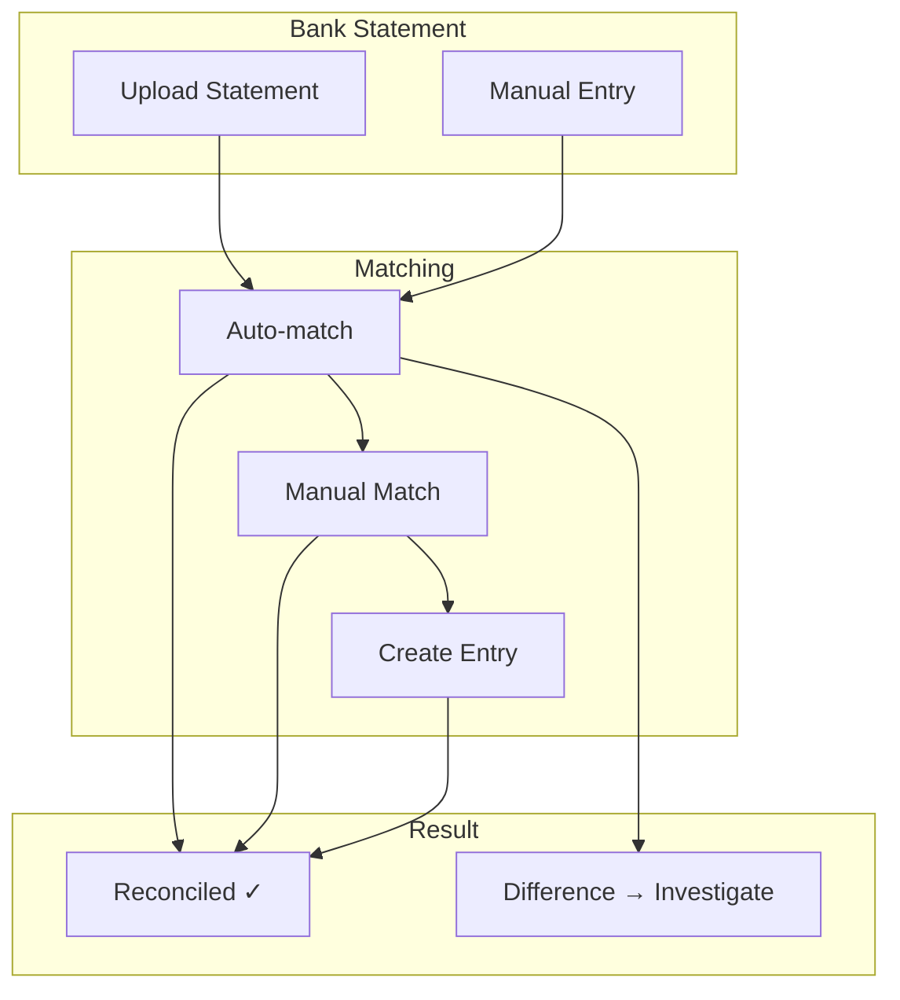
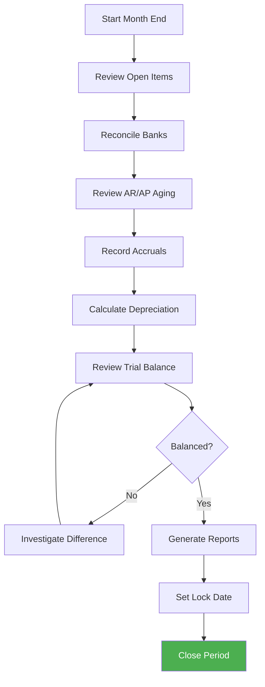

# Modul 08: Akuntansi & Keuangan (Accounting)

> **Catatan Penting**: Dokumen ini menggunakan **Odoo 16 Community Edition (CE)**. Untuk fitur akuntansi lengkap, kita menggunakan modul dari **Odoo Mates** dan **OCA (Odoo Community Association)**.

## Tujuan Modul

Mengelola seluruh aspek keuangan PT. Furnicraft Indonesia: chart of accounts, invoicing, pembayaran, rekonsiliasi bank, dan pelaporan keuangan sesuai standar akuntansi Indonesia (PSAK).

---

## Diagram Alur Akuntansi



---

## 1. Aktivasi Modul Accounting (Community Edition)

### 1.1 Modul Bawaan Odoo CE

Odoo 16 Community Edition menyediakan modul **Invoicing** sebagai modul akuntansi dasar. Untuk fitur lengkap, kita perlu menginstall modul tambahan.

**Apps → Cari dan Install:**

| Modul Bawaan CE | Fungsi |
|-----------------|--------|
| Invoicing (`account`) | Invoice pelanggan & vendor bill |
| Analytic Accounting | Cost center & project accounting |

### 1.2 Mengaktifkan Full Accounting dengan Odoo Mates

Untuk mendapatkan fitur akuntansi lengkap seperti di Enterprise, install modul **om_account_accountant** dari Odoo Mates:



#### Langkah Instalasi:

1. **Download modul Odoo Mates:**
   - URL: https://apps.odoo.com/apps/modules/16.0/om_account_accountant
   - Atau dari GitHub: https://github.com/odoomates

2. **Upload ke server:**
   ```bash
   # Copy ke folder addons
   cp -r om_account_accountant /opt/odoo16/custom-addons/
   
   # Restart Odoo service
   sudo systemctl restart odoo16
   ```

3. **Update Apps List:**
   - Aktifkan **Developer Mode** (Settings → Developer Tools)
   - Apps → Update Apps List

4. **Install Module:**
   - Apps → Cari "Odoo Mates Accounting"
   - Klik **Install**

### 1.3 Fitur yang Tersedia dengan om_account_accountant

| Fitur | Deskripsi |
|-------|-----------|
| Financial Reports | Balance Sheet, Profit & Loss, Trial Balance |
| General Ledger | Buku besar lengkap |
| Partner Ledger | Buku besar per customer/vendor |
| Aged Receivable/Payable | Laporan umur piutang/hutang |
| Bank Reconciliation | Rekonsiliasi bank statement |
| Journal Entries | Manual journal entries |
| Fiscal Year Closing | Tutup buku tahunan |
| Asset Management | Manajemen aset tetap & penyusutan |
| Recurring Entries | Jurnal berulang otomatis |

### 1.4 Modul OCA Tambahan (Opsional)

Untuk fitur lebih lengkap, install modul dari **OCA** (Odoo Community Association):

| Modul OCA | Fungsi | Repository |
|-----------|--------|------------|
| `account_financial_report` | Laporan keuangan enhanced | OCA/account-financial-reporting |
| `partner_statement` | Customer/Vendor statement | OCA/account-financial-reporting |
| `account_asset_management` | Asset lifecycle management | OCA/account-financial-tools |
| `account_payment_partner` | Payment mode per partner | OCA/bank-payment |

> **Catatan**: Semua modul OCA gratis dan open source (AGPL-3 license).
> Repository: https://github.com/OCA

---

## 2. Konfigurasi Awal Accounting

### 2.1 Fiscal Localization

**Invoicing → Configuration → Settings**

```
Fiscal Localization:
├── Package: Indonesia - Accounting
└── Chart of Accounts: Indonesian Chart of Accounts

Currencies:
├── Main Currency: IDR - Indonesian Rupiah
└── Automatic Currency Rates: Bank Indonesia (optional)
```

### 2.2 Fiscal Year

```
Fiscal Year: 1 Januari - 31 Desember
Lock Date: (set setelah audit)
Tax Lock Date: (set setelah pelaporan pajak)
```

### 2.3 Default Accounts

```
Account Receivable: 1131 - Piutang Usaha
Account Payable: 2111 - Hutang Usaha
Default Income Account: 4111 - Penjualan Barang Dagangan
Default Expense Account: 5111 - Beban Pokok Penjualan
```

---

## 3. Chart of Accounts (CoA)

### Struktur CoA PT. Furnicraft Indonesia



### Detail Chart of Accounts

**Invoicing → Configuration → Chart of Accounts**

#### 1xxx - ASET

```
1100 - Aset Lancar
├── 1111 - Kas Kecil (Petty Cash)
├── 1112 - Kas Besar
├── 1121 - Bank BCA IDR
├── 1122 - Bank Mandiri IDR
├── 1123 - Bank BCA USD
├── 1131 - Piutang Usaha
├── 1132 - Piutang Karyawan
├── 1133 - Cadangan Kerugian Piutang (Contra)
├── 1141 - Persediaan Bahan Baku
├── 1142 - Persediaan Barang Dalam Proses
├── 1143 - Persediaan Barang Jadi
├── 1151 - Uang Muka Supplier
├── 1152 - Uang Muka Sewa
├── 1161 - PPN Masukan
└── 1162 - PPh Dibayar Dimuka

1200 - Aset Tetap
├── 1211 - Tanah
├── 1221 - Bangunan
├── 1222 - Akumulasi Penyusutan Bangunan (Contra)
├── 1231 - Mesin & Peralatan
├── 1232 - Akumulasi Penyusutan Mesin (Contra)
├── 1241 - Kendaraan
├── 1242 - Akumulasi Penyusutan Kendaraan (Contra)
├── 1251 - Peralatan Kantor
├── 1252 - Akumulasi Penyusutan Peralatan (Contra)
└── 1261 - Aset Dalam Penyelesaian
```

#### 2xxx - LIABILITAS

```
2100 - Liabilitas Jangka Pendek
├── 2111 - Hutang Usaha
├── 2112 - Hutang Bank Jangka Pendek
├── 2121 - Hutang Gaji
├── 2122 - Hutang Bonus
├── 2131 - PPN Keluaran
├── 2132 - PPh 21 Terutang
├── 2133 - PPh 23 Terutang
├── 2134 - PPh 25/29 Terutang
├── 2141 - Pendapatan Diterima Dimuka
├── 2142 - Uang Muka Pelanggan (DP Customer)
└── 2151 - Biaya yang Masih Harus Dibayar

2200 - Liabilitas Jangka Panjang
├── 2211 - Hutang Bank Jangka Panjang
└── 2221 - Hutang Leasing
```

#### 3xxx - EKUITAS

```
3000 - Ekuitas
├── 3111 - Modal Saham
├── 3121 - Agio Saham
├── 3211 - Laba Ditahan
├── 3212 - Laba Tahun Berjalan
└── 3221 - Dividen
```

#### 4xxx - PENDAPATAN

```
4100 - Pendapatan Operasional
├── 4111 - Penjualan Barang Dagangan
├── 4112 - Penjualan Jasa Instalasi
├── 4113 - Penjualan Jasa Desain
├── 4121 - Diskon Penjualan (Contra)
├── 4122 - Retur Penjualan (Contra)
└── 4131 - Pendapatan Pengiriman

4200 - Pendapatan Lain-lain
├── 4211 - Pendapatan Bunga
├── 4212 - Keuntungan Selisih Kurs
└── 4221 - Pendapatan Lain-lain
```

#### 5xxx - BEBAN

```
5100 - Beban Pokok Penjualan
├── 5111 - HPP - Bahan Baku
├── 5112 - HPP - Tenaga Kerja Langsung
├── 5113 - HPP - Overhead Pabrik
└── 5114 - HPP - Barang Dagang

5200 - Beban Operasional
├── 5211 - Beban Gaji & Tunjangan
├── 5212 - Beban BPJS
├── 5213 - Beban THR & Bonus
├── 5221 - Beban Sewa
├── 5222 - Beban Listrik & Air
├── 5223 - Beban Telepon & Internet
├── 5231 - Beban Perlengkapan Kantor
├── 5232 - Beban Pemeliharaan
├── 5241 - Beban Penyusutan
├── 5242 - Beban Amortisasi
├── 5251 - Beban Perjalanan Dinas
├── 5252 - Beban Iklan & Promosi
├── 5253 - Beban Entertainment
├── 5261 - Beban Asuransi
├── 5262 - Beban Pajak
└── 5271 - Beban Lain-lain

5300 - Beban Lain-lain
├── 5311 - Beban Bunga Bank
├── 5312 - Kerugian Selisih Kurs
└── 5321 - Beban Lain-lain Non-Operasional
```

---

## 4. Konfigurasi Pajak (Taxes)

### 4.1 Setup Pajak Indonesia

**Invoicing → Configuration → Taxes**

#### PPN (Pajak Pertambahan Nilai)

```
Name: PPN 11%
Tax Type: Sales
Tax Computation: Percentage of Price
Amount: 11%
Tax Scope: Goods
Label on Invoices: PPN 11%

Account:
├── Tax Account (Sales): 2131 - PPN Keluaran
└── Tax Account (Purchase): 1161 - PPN Masukan
```

#### PPh 23 - Jasa

```
Name: PPh 23 - Jasa 2%
Tax Type: Purchase (Withholding)
Tax Computation: Percentage of Price
Amount: -2%
Tax Scope: Services
Label on Invoices: PPh 23 (2%)

Account:
└── Tax Account: 2133 - PPh 23 Terutang
```

#### PPh 22 - Pembelian Barang

```
Name: PPh 22 - 1.5%
Tax Type: Purchase (Withholding)
Tax Computation: Percentage of Price
Amount: -1.5%

Account:
└── Tax Account: 1162 - PPh Dibayar Dimuka
```

### 4.2 Fiscal Position

**Invoicing → Configuration → Fiscal Positions**

```
Fiscal Position: Pembeli Besar (PKP)
├── PPN 11% → PPN 11%
└── No Tax → PPN 11%

Fiscal Position: Non-PKP
├── PPN 11% → No Tax
└── (Tidak dikenakan PPN)

Fiscal Position: Export
├── PPN 11% → PPN 0%
└── (PPN dibebaskan untuk export)
```

---

## 5. Journals

### Konfigurasi Jurnal

**Invoicing → Configuration → Journals**

#### Sales Journal

```
Name: Faktur Penjualan
Type: Sales
Short Code: INV
Default Account: 1131 - Piutang Usaha
Currency: IDR
Sequence: INV/2024/0001
```

#### Purchase Journal

```
Name: Faktur Pembelian
Type: Purchase
Short Code: BILL
Default Account: 2111 - Hutang Usaha
Currency: IDR
```

#### Bank Journals

```
Name: Bank BCA IDR
Type: Bank
Short Code: BCA
Bank Account: 1121 - Bank BCA IDR
Bank: Bank Central Asia
Account Number: 123-456-7890

Name: Bank Mandiri IDR
Type: Bank
Short Code: MDR
Bank Account: 1122 - Bank Mandiri IDR
Account Number: 987-654-3210
```

#### Cash Journal

```
Name: Kas Kecil
Type: Cash
Short Code: CSH
Account: 1111 - Kas Kecil
```

#### Miscellaneous Journal

```
Name: Jurnal Umum
Type: Miscellaneous
Short Code: MISC
Default Account: (none)
```

---

## 6. Customer Invoice

### Alur Invoice Customer



### Membuat Invoice dari Sales Order

1. **Sales → Sales Orders → [Pilih SO]**
2. Klik **Create Invoice**
3. Pilih opsi:
   - Regular Invoice
   - Down Payment (percentage)
   - Down Payment (fixed amount)

### Contoh Invoice

```
╔═══════════════════════════════════════════════════════════════╗
║                    PT. FURNICRAFT INDONESIA                    ║
║                    Jl. Industri Furniture No. 88               ║
║                    Cileungsi, Bogor 16820                      ║
║                    NPWP: 01.234.567.8-012.000                  ║
╠═══════════════════════════════════════════════════════════════╣
║  FAKTUR PENJUALAN                         No: INV/2024/00123  ║
║  Tanggal: 9 Februari 2024                                      ║
╠═══════════════════════════════════════════════════════════════╣
║  Kepada:                                                       ║
║  CV. Mitra Jaya                                               ║
║  Jl. Raya Bogor No. 45, Jakarta Timur 13510                   ║
║  NPWP: 02.345.678.9-023.000                                   ║
╠═══════════════════════════════════════════════════════════════╣
║  No │ Deskripsi              │ Qty │ Harga     │ Subtotal     ║
╠═══════════════════════════════════════════════════════════════╣
║  1  │ Meja Makan Sentana     │  5  │ 12.750.000│  63.750.000  ║
║  2  │ Kursi Makan Set (8)    │  5  │  8.500.000│  42.500.000  ║
║  3  │ Buffet Sentana Rustic  │  3  │  7.650.000│  22.950.000  ║
╠═══════════════════════════════════════════════════════════════╣
║                                  DPP      │   129.200.000     ║
║                                  PPN 11%  │    14.212.000     ║
║                                  ─────────────────────────────║
║                                  TOTAL    │   143.412.000     ║
╚═══════════════════════════════════════════════════════════════╝
```

### Jurnal Entry Invoice

```
Tanggal: 9 Feb 2024
Ref: INV/2024/00123

Debit:
├── 1131 Piutang Usaha          143.412.000

Credit:
├── 4111 Penjualan               129.200.000
└── 2131 PPN Keluaran             14.212.000
```

---

## 7. Vendor Bill

### Alur Vendor Bill



### Membuat Vendor Bill dari PO

1. **Purchase → Orders → Purchase Orders**
2. Pilih PO yang sudah receive
3. Klik **Create Bill**
4. Input nomor faktur vendor
5. Verify amount & tax
6. **Confirm**

### Contoh Jurnal Vendor Bill

```
Tanggal: 5 Feb 2024
Ref: BILL/2024/00045
Vendor: PT. Kayu Sejahtera
Vendor Invoice: FKS-2024-0892

Debit:
├── 1141 Persediaan Bahan Baku   85.000.000
├── 1161 PPN Masukan              9.350.000

Credit:
├── 2111 Hutang Usaha            92.502.500
└── 2133 PPh 23 Terutang          1.847.500 (2% dari DPP jasa, jika applicable)
```

---

## 8. Payment & Rekonsiliasi

### 8.1 Register Payment - Customer

1. Buka **Customer Invoice**
2. Klik **Register Payment**
3. Isi detail:
   ```
   Journal: Bank BCA IDR
   Payment Method: Manual
   Amount: 143.412.000
   Payment Date: 15 Feb 2024
   Memo: Pelunasan INV/2024/00123
   ```
4. **Create Payment**

### 8.2 Register Payment - Vendor

1. Buka **Vendor Bill**
2. Klik **Register Payment**
3. Isi detail pembayaran
4. **Create Payment**

### 8.3 Bank Reconciliation

**Invoicing → Bank → Reconciliation**

> **Catatan**: Fitur rekonsiliasi bank tersedia setelah install modul `om_account_accountant` dari Odoo Mates.



### Proses Rekonsiliasi

1. **Import Bank Statement** (OFX, CSV, or manual)
2. Odoo akan **auto-match** transaksi:
   - Customer payments → Invoices
   - Vendor payments → Bills
3. **Manual match** untuk yang tidak ter-match
4. **Create entry** untuk biaya bank, bunga, dll
5. **Validate** setelah semua selesai

---

## 9. Pelaporan Keuangan

### 9.1 Laporan Standar (dengan om_account_accountant)

**Invoicing → Reporting**

| Laporan | Deskripsi | Modul Required |
|---------|-----------|----------------|
| Balance Sheet | Neraca (Aset, Liabilitas, Ekuitas) | om_account_accountant |
| Profit and Loss | Laba Rugi | om_account_accountant |
| General Ledger | Buku Besar | om_account_accountant |
| Partner Ledger | Buku Besar per Partner | om_account_accountant |
| Aged Receivable | Umur Piutang | om_account_accountant |
| Aged Payable | Umur Hutang | om_account_accountant |
| Trial Balance | Neraca Saldo | om_account_accountant |
| Tax Report | Laporan Pajak | Built-in CE |

### 9.2 Contoh Laporan Laba Rugi

```
╔═══════════════════════════════════════════════════════════════╗
║              PT. FURNICRAFT INDONESIA                          ║
║                  LAPORAN LABA RUGI                             ║
║         Periode: 1 Januari - 31 Desember 2024                  ║
╠═══════════════════════════════════════════════════════════════╣
║  PENDAPATAN                                                    ║
║    Penjualan Barang Dagangan           12.500.000.000         ║
║    Penjualan Jasa Instalasi               850.000.000         ║
║    Diskon Penjualan                      (625.000.000)        ║
║    Retur Penjualan                       (125.000.000)        ║
║                                        ─────────────────       ║
║    Pendapatan Bersih                   12.600.000.000         ║
║                                                                ║
║  BEBAN POKOK PENJUALAN                                        ║
║    HPP - Bahan Baku                     5.200.000.000         ║
║    HPP - Tenaga Kerja Langsung          1.800.000.000         ║
║    HPP - Overhead Pabrik                  950.000.000         ║
║                                        ─────────────────       ║
║    Total HPP                            7.950.000.000         ║
║                                        ─────────────────       ║
║  LABA KOTOR                             4.650.000.000         ║
║                                                                ║
║  BEBAN OPERASIONAL                                            ║
║    Beban Gaji & Tunjangan               1.200.000.000         ║
║    Beban Sewa                             360.000.000         ║
║    Beban Utilitas                          96.000.000         ║
║    Beban Penyusutan                       240.000.000         ║
║    Beban Marketing                        180.000.000         ║
║    Beban Lain-lain                        124.000.000         ║
║                                        ─────────────────       ║
║    Total Beban Operasional              2.200.000.000         ║
║                                        ─────────────────       ║
║  LABA OPERASIONAL                       2.450.000.000         ║
║                                                                ║
║  PENDAPATAN/(BEBAN) LAIN-LAIN                                 ║
║    Pendapatan Bunga                        45.000.000         ║
║    Beban Bunga                           (180.000.000)        ║
║                                        ─────────────────       ║
║  LABA SEBELUM PAJAK                     2.315.000.000         ║
║    Pajak Penghasilan (22%)               (509.300.000)        ║
║                                        ═════════════════       ║
║  LABA BERSIH                            1.805.700.000         ║
╚═══════════════════════════════════════════════════════════════╝
```

### 9.3 Contoh Neraca (Balance Sheet)

```
╔═══════════════════════════════════════════════════════════════╗
║              PT. FURNICRAFT INDONESIA                          ║
║                      NERACA                                    ║
║              Per 31 Desember 2024                              ║
╠═══════════════════════════════════════════════════════════════╣
║  ASET                                                          ║
║  ────                                                          ║
║  Aset Lancar:                                                  ║
║    Kas & Bank                           1.250.000.000         ║
║    Piutang Usaha                        2.100.000.000         ║
║    Persediaan                           3.500.000.000         ║
║    Uang Muka & Biaya Dibayar Dimuka       350.000.000         ║
║                                        ─────────────────       ║
║    Total Aset Lancar                    7.200.000.000         ║
║                                                                ║
║  Aset Tetap:                                                   ║
║    Tanah                                2.000.000.000         ║
║    Bangunan                             4.500.000.000         ║
║    Mesin & Peralatan                    2.800.000.000         ║
║    Kendaraan                              750.000.000         ║
║    Akum. Penyusutan                    (1.950.000.000)        ║
║                                        ─────────────────       ║
║    Total Aset Tetap                     8.100.000.000         ║
║                                        ═════════════════       ║
║  TOTAL ASET                            15.300.000.000         ║
║                                                                ║
╠═══════════════════════════════════════════════════════════════╣
║  LIABILITAS & EKUITAS                                         ║
║  ─────────────────────                                         ║
║  Liabilitas Jangka Pendek:                                    ║
║    Hutang Usaha                         1.450.000.000         ║
║    Hutang Pajak                           320.000.000         ║
║    Biaya yang Masih Harus Dibayar         230.000.000         ║
║                                        ─────────────────       ║
║    Total Liabilitas Jk Pendek           2.000.000.000         ║
║                                                                ║
║  Liabilitas Jangka Panjang:                                   ║
║    Hutang Bank                          3.000.000.000         ║
║                                        ─────────────────       ║
║    Total Liabilitas Jk Panjang          3.000.000.000         ║
║                                                                ║
║  Ekuitas:                                                      ║
║    Modal Saham                          5.000.000.000         ║
║    Laba Ditahan                         3.494.300.000         ║
║    Laba Tahun Berjalan                  1.805.700.000         ║
║                                        ─────────────────       ║
║    Total Ekuitas                       10.300.000.000         ║
║                                        ═════════════════       ║
║  TOTAL LIABILITAS & EKUITAS            15.300.000.000         ║
╚═══════════════════════════════════════════════════════════════╝
```

---

## 10. Analytic Accounting

> **Catatan**: Analytic Accounting tersedia di Odoo CE secara bawaan.

### 10.1 Analytic Accounts (Cost Centers)

**Invoicing → Configuration → Analytic Accounts**

```
Analytic Structure PT. Furnicraft:
├── Showroom Jakarta
│   ├── SHR-JKT-001 - Showroom Kemang
│   └── SHR-JKT-002 - Showroom PIK
├── Showroom Surabaya
│   └── SHR-SBY-001 - Showroom Surabaya
├── Pabrik
│   ├── FAC-CLS-001 - Pabrik Cileungsi
│   └── FAC-SMG-001 - Pabrik Semarang
└── Projects
    ├── PRJ-2024-001 - Hotel Nusantara
    ├── PRJ-2024-002 - Kantor Bank XYZ
    └── PRJ-2024-003 - Apartemen ABC
```

### 10.2 Penggunaan Analytic

Pada setiap journal entry atau invoice line, pilih **Analytic Account**:

```
Invoice Line: Penjualan Furniture
├── Product: Meja Meeting Besar
├── Amount: Rp 25.000.000
└── Analytic Account: PRJ-2024-002 - Kantor Bank XYZ
```

### 10.3 Laporan Analytic

**Invoicing → Reporting → Analytic**

Lihat:
- Revenue per project
- Cost per cost center
- Profitability per location

---

## 11. Manajemen Aset Tetap

> **Catatan**: Untuk manajemen aset tetap di CE, gunakan modul `om_account_accountant` dari Odoo Mates atau `account_asset_management` dari OCA.

### 11.1 Setup Kategori Aset

**Invoicing → Configuration → Asset Categories**

```
Kategori: Kendaraan
├── Journal: Jurnal Umum
├── Asset Account: 1241 - Kendaraan
├── Depreciation Account: 5241 - Beban Penyusutan
├── Accumulated Depreciation: 1242 - Akum. Peny. Kendaraan
├── Method: Linear
├── Duration: 8 tahun
└── Prorata: Monthly
```

### 11.2 Registrasi Aset Baru

```
Aset: Toyota Hiace 2024
├── Category: Kendaraan
├── Gross Value: Rp 550.000.000
├── Acquisition Date: 1 Feb 2024
├── Method: Linear
├── Duration: 8 tahun (96 bulan)
├── Monthly Depreciation: Rp 5.729.167
└── Residual Value: Rp 0
```

### 11.3 Jurnal Penyusutan Bulanan (Otomatis)

```
Tanggal: 28 Feb 2024
Ref: DEPR/2024/02/001

Debit:
├── 5241 Beban Penyusutan         5.729.167

Credit:
├── 1242 Akum. Peny. Kendaraan    5.729.167
```

---

## 12. Multi-Currency

### Konfigurasi Multi-Currency

1. Enable **Multi-Currencies** di Settings
2. Add currencies: USD, SGD, EUR
3. Set automatic rate update source

### Transaksi Mata Uang Asing

Contoh: Pembelian mesin dari supplier Jepang

```
Vendor Bill:
├── Vendor: Suzuki Machinery Co., Ltd
├── Currency: JPY
├── Amount: ¥ 15.000.000
├── Rate: 1 JPY = Rp 108
└── IDR Equivalent: Rp 1.620.000.000

Jurnal:
Dr. 1231 Mesin & Peralatan      1.620.000.000
Dr. 1161 PPN Masukan              178.200.000
    Cr. 2111 Hutang Usaha       1.798.200.000
```

---

## 13. Closing Period

### Proses Closing Bulanan



### Langkah-langkah

1. **Rekonsiliasi semua bank account**
2. **Review dan follow-up AR/AP**
3. **Catat jurnal penyesuaian:**
   - Penyusutan aset tetap
   - Amortisasi biaya dibayar dimuka
   - Accrued expenses
   - Prepaid expenses
4. **Generate trial balance**
5. **Review dan approve**
6. **Set lock date** untuk mencegah perubahan

---

## 14. Modul Summary untuk Odoo 16 CE

### Modul yang Harus Diinstall

| Modul | Sumber | Fungsi |
|-------|--------|--------|
| `account` (Invoicing) | Odoo CE Bawaan | Invoice & Bill dasar |
| `om_account_accountant` | Odoo Mates | Full accounting, reports, assets |
| `analytic` | Odoo CE Bawaan | Analytic accounting |

### Modul Opsional dari OCA

| Modul | Fungsi |
|-------|--------|
| `account_financial_report` | Enhanced financial reports |
| `partner_statement` | Customer/Vendor statements |
| `account_asset_management` | Alternative asset management |
| `account_payment_partner` | Payment mode per partner |

### Sumber Download

- **Odoo Mates**: https://apps.odoo.com/apps/modules/16.0/om_account_accountant
- **OCA**: https://github.com/OCA
- **YouTube Tutorial**: https://www.youtube.com/watch?v=UDwF6FkMCmo

---

## 15. Checklist Implementasi

- [ ] Install modul Invoicing (bawaan CE)
- [ ] Install modul `om_account_accountant` dari Odoo Mates
- [ ] Setup Fiscal Localization (Indonesia)
- [ ] Konfigurasi Chart of Accounts
- [ ] Setup Taxes (PPN, PPh)
- [ ] Konfigurasi Journals
- [ ] Setup Bank Accounts
- [ ] Konfigurasi Payment Terms
- [ ] Setup Analytic Accounts
- [ ] Konfigurasi Asset Categories (jika pakai asset management)
- [ ] Test full cycle: Invoice → Payment → Reconciliation
- [ ] Generate laporan keuangan
- [ ] Train finance team

---

**Dokumen Berikutnya:** [09-crm.md](./09-crm.md) - Customer Relationship Management
