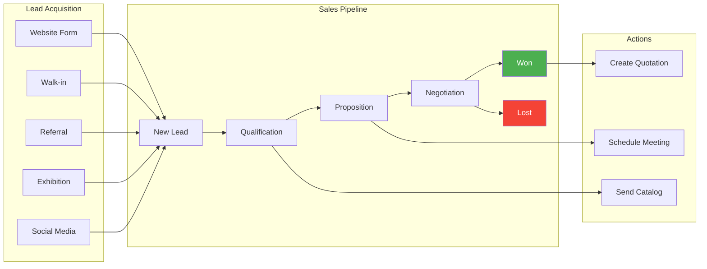
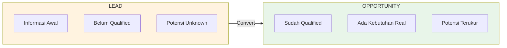
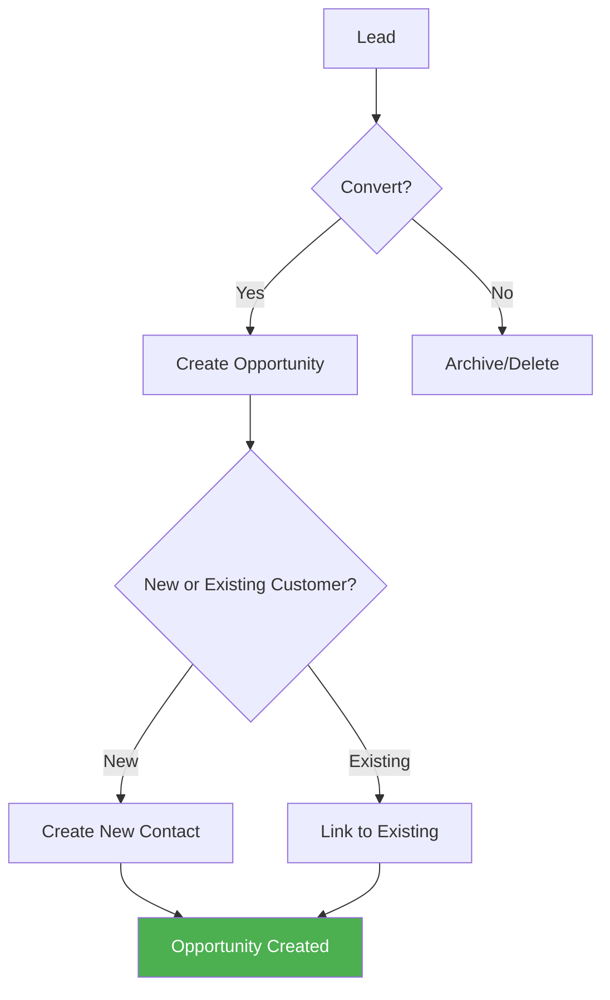
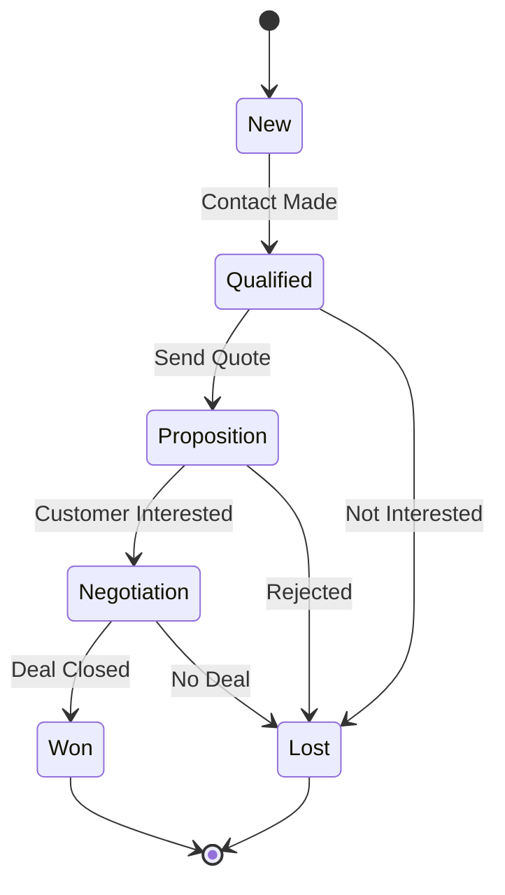
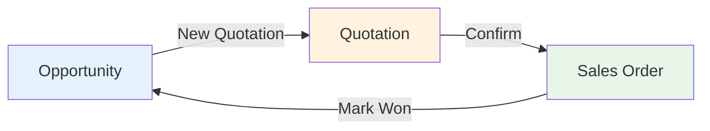
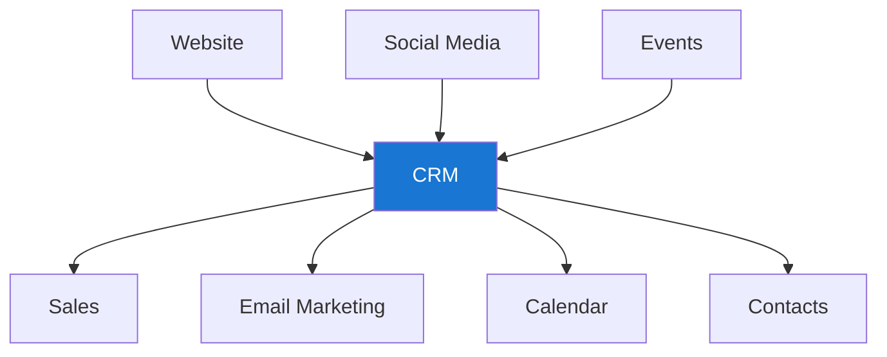

# Modul 09: CRM (Customer Relationship Management)

## Tujuan Modul

Mengelola hubungan pelanggan dari lead generation hingga konversi menjadi customer, termasuk tracking pipeline sales untuk PT. Furnicraft Indonesia.

---

## Diagram Alur CRM



---

## 1. Aktivasi Modul CRM

### Langkah Instalasi

1. **Apps** → Cari **CRM**
2. Klik **Install**

### Modul Terkait

| Modul | Fungsi | Edisi |
|-------|--------|-------|
| CRM | Core CRM functionality | CE ✓ |
| SMS Marketing | Kampanye SMS | CE ✓ |
| Email Marketing | Kampanye email | CE ✓ |

> **Catatan**: Lead Mining dan Automatic Lead Scoring adalah fitur **Enterprise only**. Di CE, gunakan scoring manual dengan stars (⭐) dan import leads dari sumber eksternal.

---

## 2. Konfigurasi CRM

### 2.1 Sales Teams

**CRM → Configuration → Sales Teams**

#### Tim CRM PT. Furnicraft

```
Team 1: Retail Team
├── Team Leader: Ahmad Fauzi
├── Members: Sales Retail 1, Sales Retail 2
├── Email Alias: retail@furnicraft.co.id
└── Target: Rp 500.000.000/month

Team 2: Project Team (B2B)
├── Team Leader: Siti Nurhaliza
├── Members: Sales Project 1, Sales Project 2
├── Email Alias: project@furnicraft.co.id
└── Target: Rp 1.000.000.000/month

Team 3: Online Team
├── Team Leader: Budi Santoso
├── Members: Sales Online 1
├── Email Alias: online@furnicraft.co.id
└── Target: Rp 300.000.000/month
```

### 2.2 Pipeline Stages

**CRM → Configuration → Stages**

```
Pipeline Stages:
├── 1. New (Probability: 10%)
│   └── Leads baru masuk, belum dikontak
├── 2. Qualified (Probability: 30%)
│   └── Sudah dikontak, ada kebutuhan nyata
├── 3. Proposition (Probability: 50%)
│   └── Quotation sudah dikirim
├── 4. Negotiation (Probability: 70%)
│   └── Dalam negosiasi harga/terms
├── 5. Won (Probability: 100%)
│   └── Deal closed, menjadi customer
└── 6. Lost (Probability: 0%)
    └── Lead tidak jadi (folded stage)
```

### 2.3 Lead Tags

**CRM → Configuration → Tags**

```
Tags:
├── Source
│   ├── Website
│   ├── Walk-in
│   ├── Referral
│   ├── Exhibition
│   └── Social Media
├── Interest
│   ├── Living Room
│   ├── Bedroom
│   ├── Dining Room
│   ├── Office Furniture
│   └── Custom Project
├── Budget
│   ├── Budget < 50 juta
│   ├── Budget 50-200 juta
│   └── Budget > 200 juta
└── Priority
    ├── Hot Lead
    ├── Warm Lead
    └── Cold Lead
```

---

## 3. Lead vs Opportunity

### Perbedaan



| Aspek | Lead | Opportunity |
|-------|------|-------------|
| Qualification | Belum | Sudah |
| Contact Person | Mungkin belum jelas | Jelas |
| Kebutuhan | Masih umum | Spesifik |
| Budget | Unknown | Teridentifikasi |
| Timeline | Tidak jelas | Ada target waktu |

### Kapan Convert Lead ke Opportunity?

Saat lead memenuhi kriteria **BANT**:
- **B**udget: Ada budget untuk beli
- **A**uthority: Kontak dengan decision maker
- **N**eed: Kebutuhan nyata teridentifikasi
- **T**imeline: Ada target waktu pembelian

---

## 4. Membuat Lead

### 4.1 Lead Manual

**CRM → Leads → Create**

```
Lead Name: Interior Kantor PT. ABC
Contact Name: Ir. Bambang Sutrisno
Email: bambang@ptabc.co.id
Phone: 0812-3456-7890
Company: PT. ABC Manufacturing

Tags: Office Furniture, Hot Lead, Budget > 200 juta
Source: Exhibition (IFEX 2024)

Expected Revenue: Rp 350.000.000
Priority: ⭐⭐⭐ (High)

Internal Notes:
- Bertemu di IFEX 2024
- Butuh furniture untuk kantor baru 500m²
- Timeline: Q2 2024
- Decision maker: Direktur Operasional
```

### 4.2 Lead dari Website Form

Setup website form yang terintegrasi dengan CRM:

```
Website Contact Form → Auto-create Lead
├── Name → Lead Name
├── Email → Email
├── Phone → Phone
├── Message → Description
└── Source → Auto-tag "Website"
```

### 4.3 Lead Sources (Manual Import)

Untuk Odoo CE, import leads dari sumber eksternal:

1. **CSV/Excel Import** - Export dari LinkedIn, database industri
2. **Website Form** - Leads otomatis dari contact form website
3. **Email Alias** - Email masuk ke alias@company.com menjadi lead
4. **Manual Entry** - Input langsung dari exhibition, walk-in, referral

---

## 5. Pipeline Management

### 5.1 Kanban View

```
╔═══════════════════════════════════════════════════════════════════════════╗
║  NEW          │ QUALIFIED     │ PROPOSITION   │ NEGOTIATION  │ WON        ║
╠═══════════════════════════════════════════════════════════════════════════╣
║ ┌───────────┐ │ ┌───────────┐ │ ┌───────────┐ │ ┌──────────┐ │ ┌────────┐ ║
║ │ Lead A    │ │ │ Lead C    │ │ │ Lead E    │ │ │ Lead G   │ │ │Lead I  │ ║
║ │ Rp 50 jt  │ │ │ Rp 120 jt │ │ │ Rp 80 jt  │ │ │ Rp 350jt │ │ │Rp 75jt │ ║
║ │ ⭐⭐      │ │ │ ⭐⭐⭐    │ │ │ ⭐⭐      │ │ │ ⭐⭐⭐   │ │ │ ✓      │ ║
║ └───────────┘ │ └───────────┘ │ └───────────┘ │ └──────────┘ │ └────────┘ ║
║ ┌───────────┐ │ ┌───────────┐ │ ┌───────────┐ │              │ ┌────────┐ ║
║ │ Lead B    │ │ │ Lead D    │ │ │ Lead F    │ │              │ │Lead J  │ ║
║ │ Rp 30 jt  │ │ │ Rp 200 jt │ │ │ Rp 150 jt │ │              │ │Rp 200j │ ║
║ │ ⭐        │ │ │ ⭐⭐⭐    │ │ │ ⭐⭐⭐    │ │              │ │ ✓      │ ║
║ └───────────┘ │ └───────────┘ │ └───────────┘ │              │ └────────┘ ║
╠═══════════════════════════════════════════════════════════════════════════╣
║  Rp 80 jt     │ Rp 320 jt     │ Rp 230 jt     │ Rp 350 jt    │ Rp 275 jt  ║
║  2 leads      │ 2 leads       │ 2 leads       │ 1 lead       │ 2 deals    ║
╚═══════════════════════════════════════════════════════════════════════════╝
```

### 5.2 Move Through Pipeline

Drag & drop card dari satu stage ke stage berikutnya, atau:

1. Buka opportunity
2. Klik stage bar di atas
3. Pilih stage baru

### 5.3 Activities & Next Steps

Setiap opportunity harus punya **next activity**:

```
Activities:
├── 📞 Phone Call - Follow up proposal
│   └── Due: Tomorrow
├── 📧 Email - Send revised quotation
│   └── Due: Feb 12
├── 📅 Meeting - Site visit
│   └── Due: Feb 15
└── 📋 To-Do - Prepare sample
    └── Due: Feb 14
```

---

## 6. Lead Scoring

### 6.1 Manual Scoring (Stars)

```
⭐       = Cold (low priority)
⭐⭐     = Warm (medium priority)
⭐⭐⭐   = Hot (high priority)
```

### 6.2 Manual Lead Scoring (CE)

Di Odoo CE, gunakan **Stars** dan **Tags** untuk scoring manual:

**Menggunakan Stars (Priority):**
```
⭐       = Cold (low priority)
⭐⭐     = Warm (medium priority)  
⭐⭐⭐   = Hot (high priority)
```

**Menggunakan Tags untuk Kategorisasi:**
| Tag | Criteria |
|-----|----------|
| `Has Contact Info` | Email + Phone lengkap |
| `Budget Identified` | Budget sudah diketahui |
| `Decision Maker` | Kontak dengan pengambil keputusan |
| `Timeline Clear` | Ada target waktu pembelian |
| `High Value` | Potensi > 100 juta |

**Best Practice CE:**
- Update stars secara berkala berdasarkan engagement
- Gunakan tags untuk filter dan segmentasi
- Review pipeline weekly untuk update prioritas

---

## 7. Convert Lead to Opportunity

### Proses Konversi



### Langkah Konversi

1. Buka Lead
2. Klik **Convert to Opportunity**
3. Pilih:
   - **Create new customer** - jika customer baru
   - **Link to existing customer** - jika sudah ada
   - **Merge with existing opportunities** - jika ada opportunity serupa
4. Assign salesperson
5. **Create Opportunity**

---

## 8. Opportunity Workflow

### Full Cycle Opportunity



### Opportunity Detail

```
Opportunity: Interior Kantor PT. ABC
Customer: PT. ABC Manufacturing
Contact: Ir. Bambang Sutrisno

Expected Revenue: Rp 350.000.000
Probability: 70% (Negotiation stage)
Expected Close Date: 28 Feb 2024

Salesperson: Siti Nurhaliza
Sales Team: Project Team

Tags: Office Furniture, Hot Lead

Timeline:
├── 5 Feb: Lead created (from Exhibition)
├── 7 Feb: First contact via phone
├── 10 Feb: Converted to opportunity
├── 12 Feb: Site visit & measurement
├── 15 Feb: Quotation sent
├── 20 Feb: Price negotiation meeting
└── (Next) 28 Feb: Expected closing
```

---

## 9. Create Quotation from Opportunity

### Langkah

1. Buka Opportunity
2. Klik **New Quotation**
3. Otomatis terisi:
   - Customer
   - Contact person
   - Opportunity reference
4. Add products & finalize
5. Send quotation
6. Update opportunity stage

### Link antara CRM & Sales



---

## 10. Mark as Won/Lost

### Mark as Won

1. Buka Opportunity
2. Klik **Mark Won** (atau drag to Won stage)
3. Opportunity status = **Won** ✓
4. Revenue tercatat di pipeline

### Mark as Lost

1. Buka Opportunity
2. Klik **Mark Lost**
3. Pilih **Lost Reason**:
   ```
   Lost Reasons:
   ├── Too expensive
   ├── Chose competitor
   ├── No budget
   ├── Postponed
   ├── No response
   └── Other
   ```
4. Opportunity status = **Lost** ✗

### Analisis Lost Reasons

**CRM → Reporting → Pipeline Analysis**

Filter by Lost Reason untuk insight mengapa deals hilang.

---

## 11. Customer Communication

### 11.1 Email Integration

**Settings → General Settings → Discuss → External Email Servers**

```
Incoming Mail Server:
├── Type: IMAP
├── Server: imap.furnicraft.co.id
├── Port: 993
└── Username: crm@furnicraft.co.id

Outgoing Mail Server:
├── Type: SMTP
├── Server: smtp.furnicraft.co.id
├── Port: 465
└── Username: crm@furnicraft.co.id
```

### 11.2 Email dari Opportunity

1. Buka Opportunity
2. Klik **Send Message** (di chatter)
3. Compose email
4. Send

Email tersimpan di history opportunity.

### 11.3 Log Phone Calls

1. Buka Opportunity
2. Klik **Log Note**
3. Catat hasil percakapan telepon
4. Schedule next activity

---

## 12. Activities & Calendar

### Schedule Activities

```
Activity Types:
├── 📞 Call - Phone call
├── 📧 Email - Email to send
├── 📅 Meeting - Face-to-face meeting
├── ✅ To-Do - Task to complete
└── 📤 Upload - Document to upload
```

### Calendar Integration

**CRM → My Activities** atau **Calendar**

Lihat semua scheduled activities dalam calendar view.

---

## 13. Reporting & Analytics

### 13.1 Pipeline Analysis

**CRM → Reporting → Pipeline**

| Metric | Deskripsi |
|--------|-----------|
| Expected Revenue | Total nilai pipeline |
| Weighted Revenue | Revenue × Probability |
| Win Rate | % opportunities won |
| Average Deal Size | Rata-rata nilai deal |
| Sales Cycle | Rata-rata waktu closing |

### 13.2 Dashboard

```
╔═══════════════════════════════════════════════════════════════╗
║                     CRM DASHBOARD - FEB 2024                   ║
╠═══════════════════════════════════════════════════════════════╣
║                                                                ║
║  PIPELINE VALUE          WIN RATE           AVG DEAL SIZE     ║
║  ┌────────────────┐      ┌──────────┐      ┌──────────────┐   ║
║  │                │      │          │      │              │   ║
║  │ Rp 2.85 M      │      │   32%    │      │ Rp 145 jt    │   ║
║  │ (+15% vs Jan)  │      │ (+5%)    │      │ (+8%)        │   ║
║  └────────────────┘      └──────────┘      └──────────────┘   ║
║                                                                ║
║  PIPELINE BY STAGE                                             ║
║  ┌─────────────────────────────────────────────────────────┐  ║
║  │ New        ████████                         Rp 320 jt   │  ║
║  │ Qualified  ██████████████                   Rp 580 jt   │  ║
║  │ Proposition████████████████████             Rp 850 jt   │  ║
║  │ Negotiation██████████████████████████       Rp 1.1 M    │  ║
║  └─────────────────────────────────────────────────────────┘  ║
║                                                                ║
║  TOP SALESPERSON                   LEAD SOURCES               ║
║  ┌─────────────────────────┐      ┌─────────────────────────┐ ║
║  │ 1. Siti N.   Rp 850 jt │      │ Website     ████   35%  │ ║
║  │ 2. Ahmad F.  Rp 620 jt │      │ Referral    ███    25%  │ ║
║  │ 3. Budi S.   Rp 480 jt │      │ Exhibition  ██     20%  │ ║
║  │ 4. Dewi A.   Rp 320 jt │      │ Walk-in     ██     15%  │ ║
║  │ 5. Eko P.    Rp 180 jt │      │ Other       █       5%  │ ║
║  └─────────────────────────┘      └─────────────────────────┘ ║
╚═══════════════════════════════════════════════════════════════╝
```

### 13.3 Cohort Analysis

Analisis kapan leads paling banyak convert berdasarkan:
- Source
- Salesperson
- Time period
- Product interest

---

## 14. Best Practices CRM

### Do's ✅

1. **Update pipeline setiap hari** - jaga data tetap fresh
2. **Log semua aktivitas** - email, call, meeting
3. **Set next activity** - setiap opportunity harus punya next step
4. **Qualify leads cepat** - jangan biarkan di New terlalu lama
5. **Analisis lost reasons** - pelajari mengapa deals hilang
6. **Follow-up tepat waktu** - jangan biarkan leads cold

### Don'ts ❌

1. **Jangan skip stages** - ikuti proses sales
2. **Jangan abaikan cold leads** - nurture atau archive
3. **Jangan overestimate probability** - be realistic
4. **Jangan lupa close old opportunities** - mark won/lost
5. **Jangan simpan data duplikat** - merge jika perlu

---

## 15. Integrasi dengan Modul Lain



---

## Checklist Implementasi

- [ ] Install modul CRM
- [ ] Setup Sales Teams
- [ ] Konfigurasi Pipeline Stages
- [ ] Setup Tags & Categories
- [ ] Konfigurasi Lead Scoring (optional)
- [ ] Setup Email Integration
- [ ] Create Lead Sources
- [ ] Setup Lost Reasons
- [ ] Train sales team
- [ ] Import existing leads (if any)

---

**Dokumen Berikutnya:** [10-hr.md](./10-hr.md) - Human Resources

