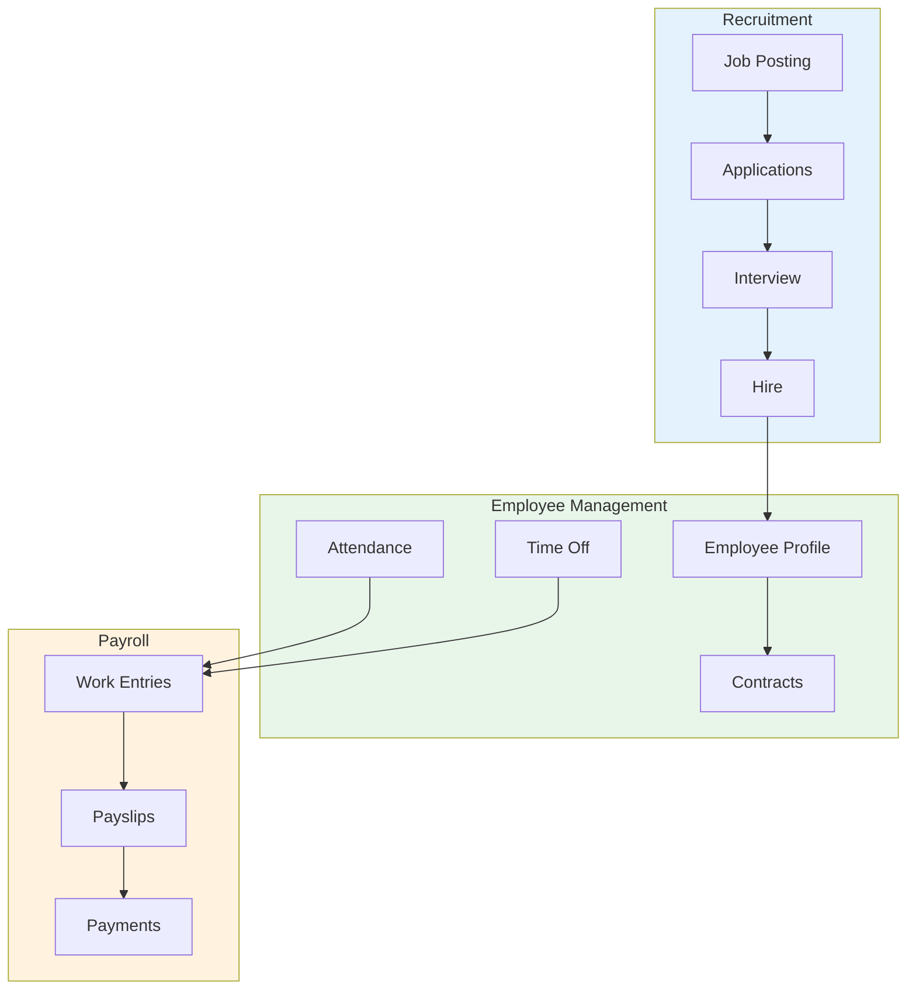
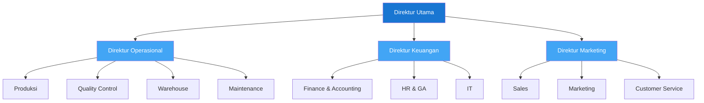
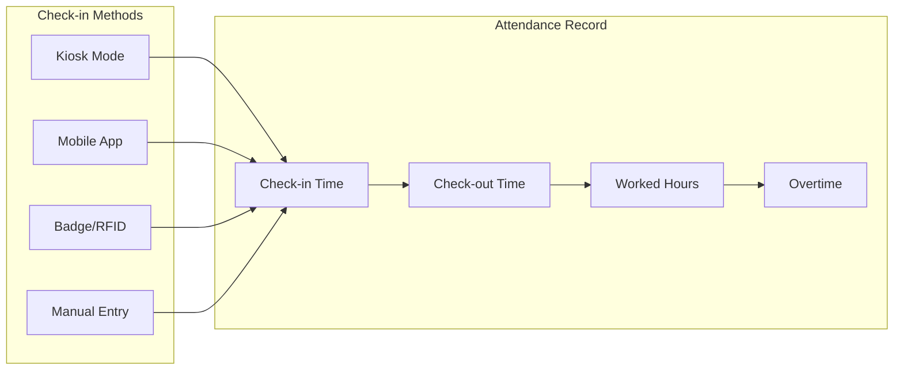
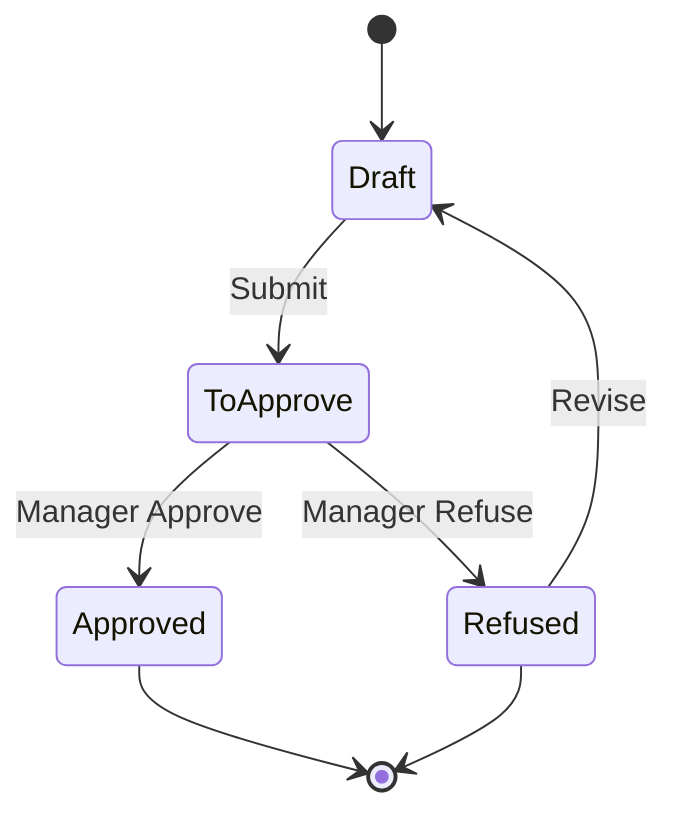
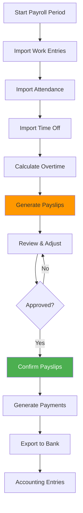
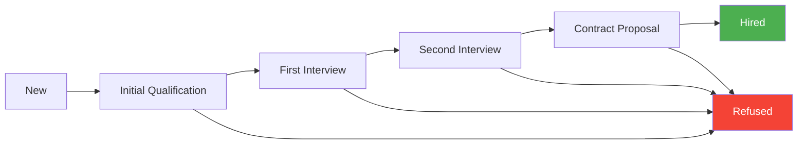

# Modul 10: Human Resources (HR)

## Tujuan Modul

Mengelola seluruh aspek sumber daya manusia PT. Furnicraft Indonesia: karyawan, kehadiran, cuti, payroll, dan rekrutmen.

---

## Diagram Alur HR



---

## 1. Aktivasi Modul HR

### Langkah Instalasi

**Apps** → Install modul-modul berikut:

| Modul | Fungsi | Edisi |
|-------|--------|-------|
| Employees | Data karyawan dasar | CE ✓ |
| Recruitment | Proses rekrutmen | CE ✓ |
| Time Off | Manajemen cuti | CE ✓ |
| Attendances | Absensi/kehadiran | CE ✓ |
| Payroll | Penggajian | CE ✓ |
| Expenses | Reimbursement | CE ✓ |

> **Catatan**: Appraisals (Performance Review) adalah modul **Enterprise only**. Untuk Odoo CE, gunakan:
> - OCA module `hr_appraisal_oca` dari [OCA HR repository](https://github.com/OCA/hr)
> - Atau kelola performance review secara manual via spreadsheet/dokumen terpisah

---

## 2. Struktur Organisasi

### Departemen PT. Furnicraft



### Setup Departemen

**Employees → Configuration → Departments**

```
Departments:
├── Direksi
│   └── Manager: Direktur Utama
├── Produksi
│   ├── Parent: Operasional
│   └── Manager: Kepala Produksi
├── Quality Control
│   ├── Parent: Operasional
│   └── Manager: QC Manager
├── Warehouse
│   ├── Parent: Operasional
│   └── Manager: Warehouse Manager
├── Finance & Accounting
│   ├── Parent: Keuangan
│   └── Manager: Finance Manager
├── HR & GA
│   ├── Parent: Keuangan
│   └── Manager: HR Manager
├── Sales
│   ├── Parent: Marketing
│   └── Manager: Sales Manager
└── Marketing
    ├── Parent: Marketing
    └── Manager: Marketing Manager
```

---

## 3. Job Positions

### Setup Jabatan

**Employees → Configuration → Job Positions**

```
Job Positions:
├── Direktur Utama
│   └── Department: Direksi
├── Direktur Operasional
│   └── Department: Direksi
├── Kepala Produksi
│   ├── Department: Produksi
│   └── Expected Employees: 1
├── Supervisor Produksi
│   ├── Department: Produksi
│   └── Expected Employees: 4
├── Operator Mesin
│   ├── Department: Produksi
│   └── Expected Employees: 20
├── Tukang Kayu Senior
│   ├── Department: Produksi
│   └── Expected Employees: 15
├── Tukang Finishing
│   ├── Department: Produksi
│   └── Expected Employees: 10
├── QC Inspector
│   ├── Department: Quality Control
│   └── Expected Employees: 5
├── Warehouse Staff
│   ├── Department: Warehouse
│   └── Expected Employees: 8
├── Sales Executive
│   ├── Department: Sales
│   └── Expected Employees: 10
├── Staff Accounting
│   ├── Department: Finance & Accounting
│   └── Expected Employees: 4
└── HR Staff
    ├── Department: HR & GA
    └── Expected Employees: 2
```

---

## 4. Data Karyawan

### 4.1 Membuat Profil Karyawan

**Employees → Employees → Create**

```
┌─────────────────────────────────────────────────────────────────┐
│                    PROFIL KARYAWAN                              │
├─────────────────────────────────────────────────────────────────┤
│ Nama: Ahmad Fauzi                                               │
│ NIK: EMP001                                                     │
│ Jabatan: Sales Manager                                          │
│ Departemen: Sales                                               │
│ Manager: Direktur Marketing                                     │
│ Coach: -                                                        │
│                                                                 │
│ WORK INFORMATION                                                │
│ ├── Work Address: Kantor Pusat Jakarta                         │
│ ├── Work Phone: (021) 123-4567 ext 201                         │
│ ├── Work Mobile: 0812-3456-7890                                │
│ ├── Work Email: ahmad.fauzi@furnicraft.co.id                   │
│ └── Resource Calendar: Standar 40 jam/minggu                   │
│                                                                 │
│ PRIVATE INFORMATION                                             │
│ ├── Private Address: Jl. Melati No. 15, Jakarta Selatan        │
│ ├── Private Email: ahmad.fauzi@gmail.com                       │
│ ├── Phone: 0813-9876-5432                                      │
│ ├── Bank Account: BCA 123-456-7890                             │
│ ├── Emergency Contact: Siti (Istri) - 0812-1111-2222           │
│ ├── Gender: Male                                               │
│ ├── Date of Birth: 15 Maret 1985                               │
│ ├── Place of Birth: Jakarta                                    │
│ ├── Country: Indonesia                                         │
│ ├── Marital Status: Married                                    │
│ ├── Number of Dependent: 2                                     │
│ └── NPWP: 12.345.678.9-012.000                                 │
│                                                                 │
│ HR SETTINGS                                                     │
│ ├── Related User: ahmad.fauzi@furnicraft.co.id                 │
│ ├── Badge ID: (untuk absensi)                                  │
│ ├── PIN Code: ****                                             │
│ └── Timesheet Cost: Rp 150.000/hour                            │
└─────────────────────────────────────────────────────────────────┘
```

### 4.2 Employee Skills

**Tab Skills & Competencies**

```
Skills:
├── Sales & Negotiation: Expert (5/5)
├── Customer Relationship: Expert (5/5)
├── Leadership: Advanced (4/5)
├── Product Knowledge: Advanced (4/5)
├── Microsoft Office: Intermediate (3/5)
└── English: Intermediate (3/5)

Resume Lines (Experience):
├── 2015-2020: Sales Executive, PT. ABC Furniture
├── 2020-2022: Senior Sales, PT. XYZ Home
└── 2022-Now: Sales Manager, PT. Furnicraft Indonesia
```

---

## 5. Kontrak Karyawan

### Setup Contracts

**Employees → Employees → [Employee] → Contracts**

```
Contract: Ahmad Fauzi - PKWTT
├── Reference: CTR/2022/00015
├── Employee: Ahmad Fauzi
├── Contract Start: 1 Juli 2022
├── Contract End: (kosong - PKWTT/permanent)
├── Salary Structure: Staff - Monthly
├── Working Schedule: Standar 40 jam/minggu
│
├── SALARY INFORMATION
│   ├── Wage: Rp 15.000.000
│   ├── Wage Type: Monthly
│   ├── Transport Allowance: Rp 1.500.000
│   ├── Meal Allowance: Rp 1.000.000
│   ├── Position Allowance: Rp 2.500.000
│   └── Total: Rp 20.000.000
│
└── HR Responsible: HR Manager
```

### Tipe Kontrak

```
Contract Types:
├── PKWTT (Permanent)
│   └── Tanpa batas waktu
├── PKWT (Contract)
│   └── Maksimal 5 tahun total
├── Probation (Masa Percobaan)
│   └── Maksimal 3 bulan
└── Internship (Magang)
    └── Program magang
```

---

## 6. Kehadiran (Attendance)

### 6.1 Attendance Tracking

**Attendance → Check In/Check Out**



### 6.2 Kiosk Mode

**Attendance → Kiosk Mode**

Tampilkan di tablet/komputer di pintu masuk:
1. Karyawan tap kartu atau input PIN
2. Sistem catat waktu masuk/keluar
3. Sinkronisasi dengan work entries

### 6.3 Contoh Attendance Record

```
┌─────────────────────────────────────────────────────────────────┐
│  ATTENDANCE - Ahmad Fauzi - Februari 2024                       │
├─────────────────────────────────────────────────────────────────┤
│ Date       │ Check In │ Check Out │ Worked  │ Overtime │ Status │
├─────────────────────────────────────────────────────────────────┤
│ 01 Feb     │ 08:15    │ 17:30     │ 9:15    │ 0:15     │ ✓      │
│ 02 Feb     │ 08:00    │ 17:00     │ 9:00    │ -        │ ✓      │
│ 03 Feb     │ -        │ -         │ -       │ -        │ Weekend│
│ 04 Feb     │ -        │ -         │ -       │ -        │ Weekend│
│ 05 Feb     │ 08:05    │ 18:30     │ 10:25   │ 1:25     │ ✓      │
│ 06 Feb     │ 08:00    │ 17:00     │ 9:00    │ -        │ ✓      │
│ 07 Feb     │ -        │ -         │ -       │ -        │ Cuti   │
│ ...        │          │           │         │          │        │
└─────────────────────────────────────────────────────────────────┘
```

---

## 7. Time Off (Cuti)

### 7.1 Time Off Types

**Time Off → Configuration → Time Off Types**

```
Time Off Types PT. Furnicraft:
├── Annual Leave (Cuti Tahunan)
│   ├── Allocation: 12 days/year
│   ├── Request Type: Allocation
│   └── Accrual: Monthly (1 day/month)
│
├── Sick Leave (Sakit)
│   ├── Allocation: No limit (dengan surat dokter)
│   ├── Request Type: No Allocation
│   └── Attachment Required: Yes
│
├── Maternity Leave (Cuti Melahirkan)
│   ├── Allocation: 90 days
│   └── Request Type: No Allocation
│
├── Paternity Leave (Cuti Ayah)
│   ├── Allocation: 2 days
│   └── Request Type: No Allocation
│
├── Marriage Leave (Cuti Menikah)
│   ├── Allocation: 3 days
│   └── Request Type: No Allocation
│
├── Bereavement Leave (Cuti Kedukaan)
│   ├── Allocation: 3 days (keluarga inti)
│   └── Request Type: No Allocation
│
└── Unpaid Leave (Cuti Tanpa Gaji)
    ├── Allocation: Unlimited
    ├── Request Type: No Allocation
    └── Unpaid: Yes
```

### 7.2 Request Time Off

**Time Off → My Time Off → New**

```
Time Off Request:
├── Type: Annual Leave
├── From: 15 Feb 2024 (Morning)
├── To: 16 Feb 2024 (Afternoon)
├── Duration: 2 days
├── Description: Liburan keluarga
└── Attachment: -

Status: Waiting for Approval
Approver: Direktur Marketing
```

### 7.3 Approval Workflow



### 7.4 Leave Dashboard

```
╔═══════════════════════════════════════════════════════════════╗
║          MY TIME OFF BALANCE - Ahmad Fauzi                     ║
╠═══════════════════════════════════════════════════════════════╣
║                                                                ║
║  Annual Leave                                                  ║
║  ├── Allocated: 12 days                                       ║
║  ├── Taken: 4 days                                            ║
║  ├── Requested: 2 days                                        ║
║  └── Remaining: 6 days                                        ║
║  [████████████░░░░░░░░░░░░]  50% used                         ║
║                                                                ║
║  Sick Leave                                                    ║
║  ├── Taken: 2 days                                            ║
║  └── No limit                                                 ║
║                                                                ║
║  Marriage Leave                                                ║
║  └── Not used                                                 ║
║                                                                ║
╚═══════════════════════════════════════════════════════════════╝
```

---

## 8. Payroll

### 8.1 Struktur Gaji

**Payroll → Configuration → Salary Structure Types**

```
Structure Type: Indonesian Payroll
├── Wage Type: Monthly
├── Default Scheduled Pay: Monthly
└── Default Working Hours: 173.33 hours/month

Salary Structures:
├── Staff - Monthly
├── Manager - Monthly
├── Operator - Daily
└── Executive - Monthly
```

### 8.2 Salary Rules

**Payroll → Configuration → Salary Rules**

```
Salary Rules - Staff Monthly:
│
├── BASIC
│   └── Gaji Pokok (100% of Contract Wage)
│
├── ALLOWANCES (+)
│   ├── Tunjangan Transport
│   ├── Tunjangan Makan
│   ├── Tunjangan Jabatan
│   ├── Tunjangan Keluarga
│   └── Overtime
│
├── GROSS
│   └── Gaji Kotor = Basic + Allowances
│
├── DEDUCTIONS (-)
│   ├── BPJS Kesehatan (1% employee)
│   ├── BPJS Ketenagakerjaan - JHT (2% employee)
│   ├── BPJS Ketenagakerjaan - JP (1% employee)
│   ├── PPh 21
│   └── Potongan Lain (pinjaman, dll)
│
└── NET
    └── Take Home Pay = Gross - Deductions
```

### 8.3 Contoh Slip Gaji

```
╔═══════════════════════════════════════════════════════════════╗
║                    PT. FURNICRAFT INDONESIA                    ║
║                         SLIP GAJI                              ║
║                     Periode: Februari 2024                     ║
╠═══════════════════════════════════════════════════════════════╣
║  Nama Karyawan  : Ahmad Fauzi                                  ║
║  NIK            : EMP001                                       ║
║  Jabatan        : Sales Manager                                ║
║  Departemen     : Sales                                        ║
║  Status         : PKWTT                                        ║
╠═══════════════════════════════════════════════════════════════╣
║  PENGHASILAN                                                   ║
║  ────────────────────────────────────────────────────────────  ║
║  Gaji Pokok                                    15.000.000      ║
║  Tunjangan Transport                            1.500.000      ║
║  Tunjangan Makan                                1.000.000      ║
║  Tunjangan Jabatan                              2.500.000      ║
║  Overtime (5 jam × Rp 130.000)                    650.000      ║
║  ────────────────────────────────────────────────────────────  ║
║  TOTAL PENGHASILAN                             20.650.000      ║
╠═══════════════════════════════════════════════════════════════╣
║  POTONGAN                                                      ║
║  ────────────────────────────────────────────────────────────  ║
║  BPJS Kesehatan (1%)                              200.000      ║
║  BPJS JHT (2%)                                    400.000      ║
║  BPJS JP (1%)                                     200.000      ║
║  PPh 21                                         1.250.000      ║
║  ────────────────────────────────────────────────────────────  ║
║  TOTAL POTONGAN                                 2.050.000      ║
╠═══════════════════════════════════════════════════════════════╣
║  TAKE HOME PAY                                 18.600.000      ║
║                                                                ║
║  Terbilang: Delapan Belas Juta Enam Ratus Ribu Rupiah          ║
╠═══════════════════════════════════════════════════════════════╣
║  KONTRIBUSI PERUSAHAAN                                         ║
║  BPJS Kesehatan (4%)                              800.000      ║
║  BPJS JHT (3.7%)                                  740.000      ║
║  BPJS JKK (0.24%)                                  48.000      ║
║  BPJS JKM (0.3%)                                   60.000      ║
║  BPJS JP (2%)                                     400.000      ║
╚═══════════════════════════════════════════════════════════════╝
```

### 8.4 Payroll Process



---

## 9. Recruitment

### 9.1 Job Posting

**Recruitment → Jobs → Create**

```
Job: Tukang Kayu Senior
Department: Produksi
Job Location: Pabrik Cileungsi
Employment Type: Full-time
Expected Employees: 5

Description:
─────────────────────────────────────────
Kami mencari Tukang Kayu Senior yang berpengalaman
untuk bergabung dengan tim produksi kami.

Kualifikasi:
• Pengalaman minimal 5 tahun di furniture kayu solid
• Mahir mengoperasikan mesin woodworking
• Bisa baca gambar teknik
• Teliti dan mengutamakan kualitas

Benefit:
• Gaji kompetitif
• BPJS Kesehatan & Ketenagakerjaan
• THR
• Bonus produksi
─────────────────────────────────────────

Recruiter: HR Staff
Published on Website: Yes
```

### 9.2 Application Stages



### 9.3 Process Application

1. Terima aplikasi (email, walk-in, website)
2. Initial screening (CV review)
3. Schedule interview
4. Interview records
5. Skill test (if needed)
6. Offer letter
7. Hire → Create Employee

---

## 10. Expenses (Reimbursement)

### 10.1 Expense Categories

**Expenses → Configuration → Expense Categories**

```
Categories:
├── Transportasi
│   ├── Taxi/Ojol
│   ├── Bensin
│   └── Tol & Parkir
├── Akomodasi
│   ├── Hotel
│   └── Penginapan
├── Meals
│   ├── Entertainment Client
│   └── Makan Dinas
├── Communication
│   ├── Pulsa/Internet
│   └── Telepon
└── Other
    ├── Office Supplies
    └── Miscellaneous
```

### 10.2 Submit Expense

**Expenses → My Expenses → Create**

```
Expense: Entertainment Client - PT. ABC
Category: Entertainment Client
Amount: Rp 850.000
Date: 10 Feb 2024
Employee: Ahmad Fauzi
Description: Makan malam dengan prospek PT. ABC Manufacturing
Attachments: receipt.jpg

Status: To Submit
```

### 10.3 Expense Report

Kumpulkan beberapa expense dalam satu report untuk approval:

```
Expense Report: Perjalanan Dinas Surabaya
├── Employee: Ahmad Fauzi
├── Date: 8-10 Feb 2024
│
├── Expenses:
│   ├── Tiket Pesawat: Rp 1.500.000
│   ├── Hotel 2 malam: Rp 1.200.000
│   ├── Taxi/Grab: Rp 350.000
│   ├── Makan: Rp 450.000
│   └── Entertainment: Rp 850.000
│
├── Total: Rp 4.350.000
└── Status: Waiting Approval
```

---

## 11. Performance Review (Alternatif CE)

Karena Appraisals adalah modul Enterprise, berikut alternatif untuk Odoo CE:

### 11.1 Menggunakan OCA Module

Install `hr_appraisal_oca` dari OCA:
```bash
git clone https://github.com/OCA/hr.git /opt/odoo16/custom-addons/oca-hr
```

### 11.2 Manual Process (Tanpa Module Tambahan)

Gunakan kombinasi fitur bawaan Odoo CE:

```
Performance Review Manual Process:
├── 1. Create Google Form / Survey
│   └── Link survey di Odoo (Surveys module - CE)
├── 2. Track via Employee Notes
│   └── Log catatan di employee profile
├── 3. Use Tags untuk Status
│   ├── Tag: "Review Pending"
│   ├── Tag: "Review Completed"
│   └── Tag: "Needs Improvement"
└── 4. Schedule dengan Calendar
    └── Set reminder untuk review period
```

### 11.3 Spreadsheet Template

Untuk tracking tanpa module:
- Goals & KPI per karyawan
- Self assessment form
- Manager evaluation
- Development plan

---

## 12. HR Reports

### 12.1 Headcount Report

```
╔═══════════════════════════════════════════════════════════════╗
║                   HEADCOUNT REPORT - FEB 2024                  ║
╠═══════════════════════════════════════════════════════════════╣
║  Department          │ Count │ Permanent │ Contract │ Intern  ║
╠═══════════════════════════════════════════════════════════════╣
║  Produksi            │   45  │    35     │    8     │    2    ║
║  Quality Control     │    5  │     5     │    -     │    -    ║
║  Warehouse           │    8  │     6     │    2     │    -    ║
║  Sales               │   10  │     8     │    2     │    -    ║
║  Marketing           │    5  │     4     │    1     │    -    ║
║  Finance & Accounting│    6  │     6     │    -     │    -    ║
║  HR & GA             │    4  │     4     │    -     │    -    ║
║  IT                  │    3  │     3     │    -     │    -    ║
║  Direksi             │    4  │     4     │    -     │    -    ║
╠═══════════════════════════════════════════════════════════════╣
║  TOTAL               │   90  │    75     │   13     │    2    ║
╚═══════════════════════════════════════════════════════════════╝
```

### 12.2 Attendance Summary

```
╔═══════════════════════════════════════════════════════════════╗
║               ATTENDANCE SUMMARY - FEB 2024                    ║
╠═══════════════════════════════════════════════════════════════╣
║  Working Days: 20                                              ║
║  Total Employees: 90                                           ║
║                                                                ║
║  Attendance Rate: 95.2%                                        ║
║  ├── On Time: 85%                                             ║
║  ├── Late: 10%                                                ║
║  └── Absent: 5%                                               ║
║                                                                ║
║  Leave Summary:                                                ║
║  ├── Annual Leave: 45 days (35 employees)                     ║
║  ├── Sick Leave: 12 days (10 employees)                       ║
║  └── Other: 5 days                                            ║
║                                                                ║
║  Overtime Hours: 320 hours                                     ║
╚═══════════════════════════════════════════════════════════════╝
```

---

## 13. Checklist Implementasi

- [ ] Install HR modules (Employees, Time Off, Attendance, Payroll)
- [ ] Setup company structure (Departments, Jobs)
- [ ] Konfigurasi Work Schedules
- [ ] Setup Time Off types & allocations
- [ ] Konfigurasi Attendance (Kiosk mode)
- [ ] Setup Salary Structures & Rules
- [ ] Setup Expense categories
- [ ] Import existing employee data
- [ ] Train HR team
- [ ] Test full payroll cycle

---

**Dokumen Berikutnya:** [11-project.md](./11-project.md) - Project Management

