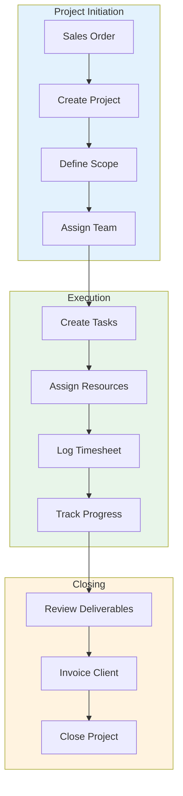
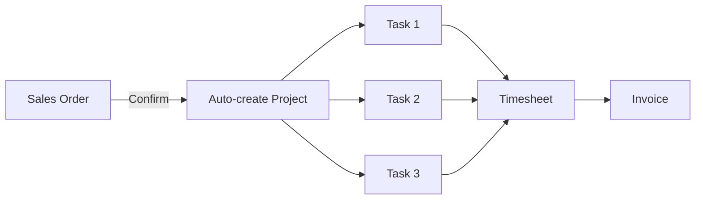

# Modul 11: Project Management

## Tujuan Modul

Mengelola proyek-proyek custom furniture PT. Furnicraft Indonesia: dari perencanaan, task management, timesheet, hingga billing.

---

## Diagram Alur Project



---

## 1. Aktivasi Modul Project

### Langkah Instalasi

**Apps** → Install modul:

| Modul | Fungsi | Edisi |
|-------|--------|-------|
| Project | Core project management | CE ✓ |
| Timesheets | Time tracking | CE ✓ |
| Documents | File management | CE ✓ |

> **Catatan**: Forecast / Resource Planning (`project_forecast`) adalah modul **Enterprise only**. Untuk Odoo CE, gunakan:
> - Gantt view bawaan untuk visualisasi timeline
> - Spreadsheet untuk resource allocation manual
> - OCA module `project_timeline` untuk enhanced timeline view

---

## 2. Project Configuration

### 2.1 Project Stages

**Project → Configuration → Stages**

```
Project Stages:
├── 1. New
├── 2. Design Phase
├── 3. Production
├── 4. Quality Check
├── 5. Delivery
└── 6. Done
```

### 2.2 Task Stages

**Project → Configuration → Task Stages**

```
Task Stages:
├── To Do
├── In Progress
├── Review
├── Done
└── Cancelled
```

---

## 3. Membuat Project

### 3.1 Project dari Sales Order



### 3.2 Project Manual

**Project → Projects → Create**

```
Project: Interior PT. ABC - Kantor Baru
├── Customer: PT. ABC Manufacturing
├── Sales Order Reference: SO/2024/00123
├── Project Manager: Ahmad Fauzi
├── Planned Date: 15 Feb - 15 Apr 2024
│
├── SETTINGS
│   ├── Allow Timesheets: ✓
│   ├── Allow Billable: ✓
│   ├── Allow Sub-tasks: ✓
│   └── Analytic Account: PRJ-ABC-2024
│
├── BILLING
│   ├── Invoicing Type: Based on Timesheet
│   └── Hourly Rate: Rp 150.000/hour
│
└── Tags: Office, B2B, High Priority
```

---

## 4. Task Management

### 4.1 Work Breakdown Structure

```
Project: Interior PT. ABC
│
├── Phase 1: Design (2 weeks)
│   ├── 1.1 Site Survey & Measurement
│   ├── 1.2 Design Concept
│   ├── 1.3 3D Rendering
│   └── 1.4 Client Approval
│
├── Phase 2: Production (4 weeks)
│   ├── 2.1 Material Procurement
│   ├── 2.2 Workstation Production
│   ├── 2.3 Meeting Table Production
│   ├── 2.4 Storage Cabinet Production
│   └── 2.5 Quality Control
│
├── Phase 3: Installation (1 week)
│   ├── 3.1 Delivery
│   ├── 3.2 Installation
│   └── 3.3 Final Touch Up
│
└── Phase 4: Handover
    ├── 4.1 Client Inspection
    ├── 4.2 Documentation
    └── 4.3 Project Closure
```

### 4.2 Task Detail

```
Task: Site Survey & Measurement
├── Project: Interior PT. ABC
├── Stage: To Do
├── Assigned to: Dewi (Designer)
├── Deadline: 18 Feb 2024
├── Initial Planned Hours: 8 hours
│
├── DESCRIPTION
│   └── Kunjungan ke lokasi kantor baru PT. ABC
│       untuk survey dan pengukuran detail.
│       - Ukur dimensi ruangan
│       - Foto kondisi existing
│       - Diskusi kebutuhan dengan client
│
├── SUB-TASKS
│   ├── ☐ Prepare measurement tools
│   ├── ☐ Visit site
│   ├── ☐ Document measurements
│   └── ☐ Upload photos
│
└── DEPENDENCIES
    └── Blocking: Design Concept
```

### 4.3 Kanban View

```
╔═══════════════════════════════════════════════════════════════════════╗
║  TO DO        │ IN PROGRESS  │ REVIEW        │ DONE                   ║
╠═══════════════════════════════════════════════════════════════════════╣
║ ┌───────────┐ │ ┌──────────┐ │ ┌───────────┐ │ ┌────────────────────┐ ║
║ │Site Survey│ │ │Design    │ │ │3D Render  │ │ │Client Meeting      │ ║
║ │Dewi       │ │ │Concept   │ │ │Review     │ │ │✓ Completed         │ ║
║ │8h planned │ │ │Eko       │ │ │Manager    │ │ │2h logged           │ ║
║ │Due: 18Feb │ │ │16h/24h   │ │ │           │ │ └────────────────────┘ ║
║ └───────────┘ │ └──────────┘ │ └───────────┘ │                        ║
║ ┌───────────┐ │              │               │                        ║
║ │Material   │ │              │               │                        ║
║ │Order      │ │              │               │                        ║
║ │Purchasing │ │              │               │                        ║
║ └───────────┘ │              │               │                        ║
╠═══════════════════════════════════════════════════════════════════════╣
║  3 tasks      │ 1 task       │ 1 task        │ 1 task                 ║
╚═══════════════════════════════════════════════════════════════════════╝
```

---

## 5. Timesheet

### 5.1 Log Time

**Timesheet → My Timesheet → Add a Line**

```
Timesheet Entry:
├── Date: 15 Feb 2024
├── Project: Interior PT. ABC
├── Task: Site Survey & Measurement
├── Description: Pengukuran ruangan + diskusi kebutuhan
├── Duration: 6 hours
└── Employee: Dewi
```

### 5.2 Weekly Timesheet View

```
╔═══════════════════════════════════════════════════════════════════════╗
║  TIMESHEET - Dewi - Week of 12-16 Feb 2024                            ║
╠═══════════════════════════════════════════════════════════════════════╣
║  Project/Task          │ Mon │ Tue │ Wed │ Thu │ Fri │ Total          ║
╠═══════════════════════════════════════════════════════════════════════╣
║  Interior PT. ABC                                                      ║
║  ├── Site Survey       │  -  │  -  │  -  │  6  │  2  │   8h          ║
║  ├── Design Concept    │  4  │  6  │  4  │  -  │  -  │  14h          ║
║  └── 3D Rendering      │  -  │  -  │  2  │  2  │  4  │   8h          ║
║                                                                        ║
║  Interior Hotel XYZ                                                    ║
║  └── Design Review     │  4  │  2  │  2  │  -  │  2  │  10h          ║
╠═══════════════════════════════════════════════════════════════════════╣
║  DAILY TOTAL           │  8  │  8  │  8  │  8  │  8  │  40h          ║
╚═══════════════════════════════════════════════════════════════════════╝
```

### 5.3 Timer Feature

Gunakan timer untuk track waktu real-time:

1. Buka task
2. Klik **Start** timer
3. Bekerja...
4. Klik **Stop** → otomatis log timesheet

---

## 6. Gantt Chart

### Project Timeline

```
Project: Interior PT. ABC
Timeline: 15 Feb - 15 Apr 2024

Week      │ 1 │ 2 │ 3 │ 4 │ 5 │ 6 │ 7 │ 8 │ 9 │
──────────┼───┼───┼───┼───┼───┼───┼───┼───┼───┤
Design    │███│███│   │   │   │   │   │   │   │
Survey    │█  │   │   │   │   │   │   │   │   │
Concept   │ ██│█  │   │   │   │   │   │   │   │
3D Render │   │██ │   │   │   │   │   │   │   │
Approval  │   │ █ │   │   │   │   │   │   │   │
Production│   │   │███│███│███│███│   │   │   │
Material  │   │   │██ │   │   │   │   │   │   │
Workstation│  │   │ ██│███│█  │   │   │   │   │
Tables    │   │   │   │  █│███│█  │   │   │   │
Cabinets  │   │   │   │   │ ██│███│   │   │   │
QC        │   │   │   │   │   │  █│█  │   │   │
Install   │   │   │   │   │   │   │███│   │   │
Delivery  │   │   │   │   │   │   │██ │   │   │
Setup     │   │   │   │   │   │   │ ██│   │   │
Touch Up  │   │   │   │   │   │   │   │█  │   │
Handover  │   │   │   │   │   │   │   │█  │   │
──────────┴───┴───┴───┴───┴───┴───┴───┴───┴───┘
          Feb                   Mar       Apr
```

---

## 7. Project Billing

### 7.1 Billing Types

| Type | Keterangan |
|------|------------|
| **Fixed Price** | Harga tetap per project |
| **Based on Timesheet** | Billing per jam kerja |
| **Based on Milestones** | Billing per deliverable |
| **Based on Delivered Qty** | Billing per unit |

### 7.2 Timesheet Invoicing


**Project → Billable → Create Invoice**

```
Invoice from Project: Interior PT. ABC
├── Customer: PT. ABC Manufacturing
├── Period: 15-28 Feb 2024
│
├── Lines:
│   ├── Site Survey: 8h × Rp 150.000 = Rp 1.200.000
│   ├── Design Concept: 24h × Rp 150.000 = Rp 3.600.000
│   └── 3D Rendering: 16h × Rp 150.000 = Rp 2.400.000
│
├── Subtotal: Rp 7.200.000
├── PPN 11%: Rp 792.000
└── Total: Rp 7.992.000
```

### 7.3 Milestone Billing

```
Milestones:
├── M1: Design Approval (30%)
│   └── Invoice: Rp 150.000.000
├── M2: Production Complete (50%)
│   └── Invoice: Rp 250.000.000
├── M3: Installation Done (15%)
│   └── Invoice: Rp 75.000.000
└── M4: Final Handover (5%)
    └── Invoice: Rp 25.000.000

Total Project Value: Rp 500.000.000
```

---

## 8. Project Updates & Communication

### 8.1 Project Updates

Post updates di chatter project:

```
[Update 20 Feb 2024 - Ahmad Fauzi]
Design phase completed. Client approved 3D rendering with minor revisions.
Starting production next week.

Attachments:
├── approved_design_v3.pdf
└── client_feedback.docx
```

### 8.2 Task Discussion

Setiap task punya chatter untuk diskusi:

```
Task: Design Concept
│
├── [15 Feb] Dewi: Initial design draft uploaded
├── [16 Feb] Manager: Please add more storage options
├── [17 Feb] Dewi: Revised version with extra cabinets
└── [18 Feb] Manager: Approved! Proceed to 3D render
```

---

## 9. Project Reports

### 9.1 Project Overview

```
╔═══════════════════════════════════════════════════════════════╗
║                PROJECT OVERVIEW - FEB 2024                     ║
╠═══════════════════════════════════════════════════════════════╣
║                                                                ║
║  Active Projects: 8                                            ║
║  ├── On Track: 6                                              ║
║  ├── At Risk: 1                                               ║
║  └── Delayed: 1                                               ║
║                                                                ║
║  Total Project Value: Rp 2.500.000.000                        ║
║  Invoiced: Rp 980.000.000 (39%)                               ║
║  Remaining: Rp 1.520.000.000                                  ║
║                                                                ║
║  Hours This Month:                                             ║
║  ├── Planned: 1,200h                                          ║
║  ├── Logged: 1,050h (87.5%)                                   ║
║  └── Billable: 920h (77%)                                     ║
║                                                                ║
╚═══════════════════════════════════════════════════════════════╝
```

### 9.2 Burndown Chart

```
Remaining Hours - Interior PT. ABC

Hours
400 │
    │█                                    
300 │██                                   
    │███                                  
200 │█████                  Actual: ───   
    │███████                Planned: - - -
100 │█████████                            
    │████████████                         
  0 ├─────────────────────────────────────
    W1  W2  W3  W4  W5  W6  W7  W8
```

### 9.3 Profitability Analysis

```
Project: Interior PT. ABC
│
├── Revenue
│   ├── Contract Value: Rp 500.000.000
│   └── Extra Work: Rp 35.000.000
│   └── Total Revenue: Rp 535.000.000
│
├── Costs
│   ├── Labor Cost: Rp 180.000.000
│   ├── Material Cost: Rp 220.000.000
│   ├── Overhead: Rp 25.000.000
│   └── Total Cost: Rp 425.000.000
│
└── Profit
    ├── Gross Profit: Rp 110.000.000
    └── Margin: 20.6%
```

---

## 10. Checklist Implementasi

- [ ] Install Project & Timesheet modules
- [ ] Setup Project Stages
- [ ] Setup Task Stages
- [ ] Konfigurasi Billing rates
- [ ] Create Project templates
- [ ] Setup Analytic accounts
- [ ] Train project managers
- [ ] Train team members (timesheet)
- [ ] Test full project cycle

---

**Dokumen Berikutnya:** [12-quality.md](./12-quality.md) - Quality Control

