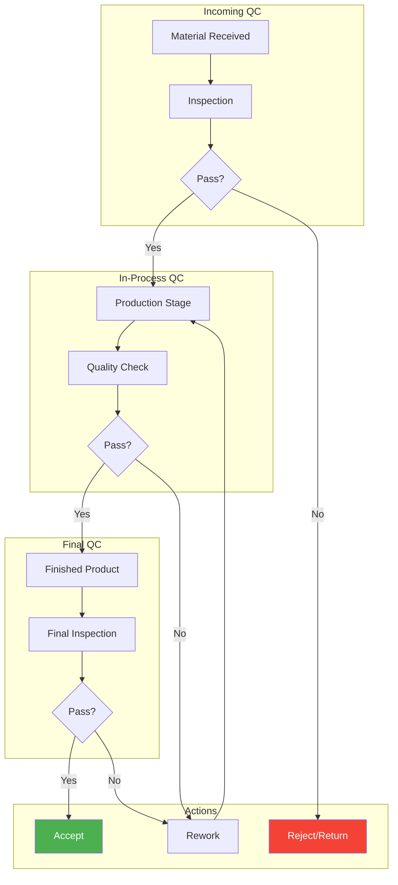
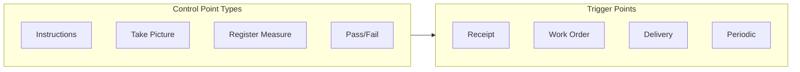
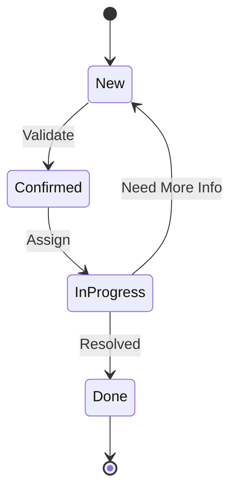
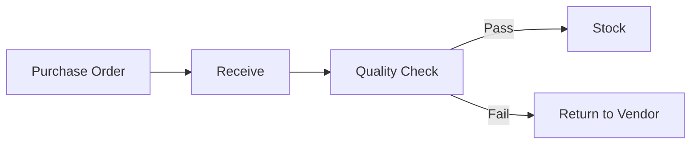
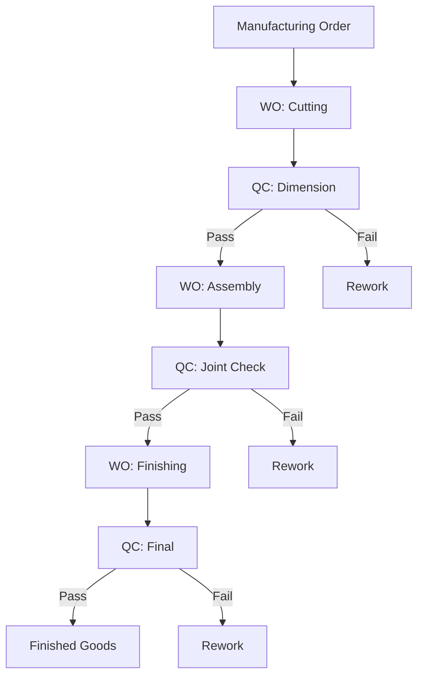

# Modul 12: Quality Control

## Tujuan Modul

Memastikan kualitas produk furnitur PT. Furnicraft Indonesia sesuai standar melalui quality control points, quality alerts, dan corrective actions.

---

## Diagram Alur Quality Control



---

## 1. Aktivasi Modul Quality

### Langkah Instalasi

**Apps** → Install modul:

| Modul | Fungsi | Edisi |
|-------|--------|-------|
| Quality | Core quality management | CE ✓ |
| Quality Control | Quality check points | CE ✓ |
| Quality Control - MRP | QC integration dengan Manufacturing | CE ✓ |

> **Catatan**: Semua modul Quality di atas tersedia di Odoo 16 Community Edition. Fitur quality control points, quality alerts, dan quality checks berfungsi penuh di CE.

### Enable Features

**Inventory → Settings → Operations**

- ✓ Quality Control

---

## 2. Quality Control Points

### 2.1 Control Point Types



### 2.2 Setup Control Points

**Quality → Control Points → Create**

#### Incoming Material Check

```
Control Point: Kayu Incoming Inspection
├── Product: Kayu Jati
├── Product Categories: Raw Material - Kayu
├── Operation Type: Receipts
├── Team: Quality Control
│
├── CONTROL POINT STEPS:
│   ├── Step 1: Visual Inspection
│   │   ├── Type: Instructions
│   │   └── Instruction: Periksa kondisi kayu:
│   │       - Tidak ada retak/pecah
│   │       - Tidak ada serangan hama
│   │       - Warna merata
│   │
│   ├── Step 2: Moisture Check
│   │   ├── Type: Register Measure
│   │   ├── Norm: 12% - 14%
│   │   ├── Tolerance: ± 1%
│   │   └── Unit: Percentage
│   │
│   ├── Step 3: Dimension Check
│   │   ├── Type: Register Measure
│   │   ├── Norm: As per PO
│   │   └── Tolerance: ± 5mm
│   │
│   └── Step 4: Photo Documentation
│       ├── Type: Take Picture
│       └── Instruction: Foto sample kayu
│
└── Failure Message: Reject material & notify supplier
```

#### In-Process Check (Production)

```
Control Point: Frame Assembly Check
├── Operation Type: Manufacturing Order
├── Work Order Operation: Perakitan Frame
├── Picking Type: Work Orders
│
├── STEPS:
│   ├── Step 1: Joint Inspection
│   │   ├── Type: Pass/Fail
│   │   └── Question: Semua sambungan rapat?
│   │
│   ├── Step 2: Dimension Check
│   │   ├── Type: Register Measure
│   │   ├── Norm: Per drawing
│   │   └── Tolerance: ± 2mm
│   │
│   └── Step 3: Photo Evidence
│       └── Type: Take Picture
│
└── Failure: Create rework order
```

#### Final Inspection

```
Control Point: Final Product Inspection
├── Product Categories: Finished Goods
├── Operation Type: Delivery Orders
│
├── STEPS:
│   ├── Step 1: Visual Check
│   │   ├── Type: Pass/Fail
│   │   └── Checklist:
│   │       ☐ Surface smooth, no scratches
│   │       ☐ Finishing merata
│   │       ☐ Hardware complete & functional
│   │       ☐ Label/barcode attached
│   │
│   ├── Step 2: Dimension Verification
│   │   └── Type: Register Measure
│   │
│   ├── Step 3: Function Test
│   │   ├── Type: Pass/Fail
│   │   └── Question: All functions working?
│   │
│   └── Step 4: Documentation
│       └── Type: Take Picture
│
└── Failure Message: Return to production for rework
```

---

## 3. Quality Checks

### 3.1 Melakukan Quality Check

Saat transfer/MO memiliki control point, sistem akan meminta quality check:

```
Quality Check Required!
├── Control Point: Final Product Inspection
├── Product: Meja Kantor Executive
├── Lot/Serial: LOT/2024/00456
│
├── Steps:
│   ├── [1] Visual Check ─── ⏳ Pending
│   ├── [2] Dimension ────── ⏳ Pending
│   ├── [3] Function Test ── ⏳ Pending
│   └── [4] Documentation ── ⏳ Pending
│
└── Actions: [Start] [Skip] [Fail]
```

### 3.2 Recording Results

```
Step: Dimension Verification
├── Norm: Length 180cm × Width 90cm × Height 75cm
├── Tolerance: ± 2mm
│
├── Measured Values:
│   ├── Length: 180.1 cm ✓
│   ├── Width: 89.8 cm ✓
│   └── Height: 75.0 cm ✓
│
└── Result: ✅ PASS
```

### 3.3 Failed Check

```
Step: Visual Check
├── Question: Surface smooth, no scratches?
│
├── Result: ❌ FAIL
├── Failure Reason: Scratch on top surface (see photo)
├── Photo: [attached]
│
└── Action Required: Create Quality Alert
```

---

## 4. Quality Alerts

### 4.1 Create Alert

**Quality → Quality Alerts → Create**

```
Quality Alert: QA/2024/00123
├── Title: Surface Scratch - Meja Executive LOT456
├── Product: Meja Kantor Executive
├── Lot/Serial: LOT/2024/00456
├── Team: Quality Control
├── Responsible: QC Inspector 1
│
├── DESCRIPTION:
│   └── Ditemukan goresan pada permukaan meja 
│       bagian atas saat final inspection.
│       Goresan ± 15cm, depth superficial.
│
├── ROOT CAUSE:
│   └── Handling tidak proper saat pemindahan
│       dari area finishing ke QC area.
│
├── CORRECTIVE ACTIONS:
│   ├── Action 1: Rework - sanding & re-finishing
│   ├── Action 2: Update SOP handling
│   └── Action 3: Training handling untuk tim
│
├── PRIORITY: ⭐⭐ Medium
└── STATUS: In Progress
```

### 4.2 Alert Stages



---

## 5. Quality Teams

### 5.1 Setup Teams

**Quality → Configuration → Teams**

```
Teams:
├── Incoming Quality Control
│   ├── Leader: QC Manager
│   ├── Members: QC Inspector 1, QC Inspector 2
│   └── Responsibilities:
│       - Raw material inspection
│       - Supplier quality evaluation
│
├── In-Process Quality Control
│   ├── Leader: Production Supervisor
│   ├── Members: QC In-Line 1, QC In-Line 2
│   └── Responsibilities:
│       - WIP inspection
│       - Process monitoring
│
└── Final Quality Control
    ├── Leader: QC Manager
    ├── Members: QC Inspector 3, QC Inspector 4
    └── Responsibilities:
        - Finished goods inspection
        - Pre-delivery check
```

---

## 6. Quality Standards

### 6.1 Standar Kualitas PT. Furnicraft

```
┌─────────────────────────────────────────────────────────────────┐
│               STANDAR KUALITAS PT. FURNICRAFT                   │
├─────────────────────────────────────────────────────────────────┤
│                                                                 │
│  RAW MATERIAL                                                   │
│  ├── Kayu Jati                                                 │
│  │   ├── Moisture: 12-14%                                      │
│  │   ├── Grade: A (first quality)                              │
│  │   └── No defects: crack, worm, knot                         │
│  │                                                             │
│  ├── Plywood                                                   │
│  │   ├── Thickness tolerance: ± 0.5mm                          │
│  │   └── Grade: Furniture grade                                │
│  │                                                             │
│  └── Hardware                                                  │
│      └── As per approved sample                                │
│                                                                 │
│  WORKMANSHIP                                                    │
│  ├── Dimension tolerance: ± 2mm                                │
│  ├── Joint gap: < 0.5mm                                        │
│  ├── Surface roughness: < Ra 3.2                               │
│  └── Corner radius: As per drawing                             │
│                                                                 │
│  FINISHING                                                      │
│  ├── Coating thickness: 80-120 micron                          │
│  ├── Gloss level: 70-80% (semi-gloss)                          │
│  ├── Color: Match to approved sample (ΔE < 2)                  │
│  └── No defects: orange peel, runs, fish eyes                  │
│                                                                 │
│  ASSEMBLY                                                       │
│  ├── All hardware functional                                   │
│  ├── Drawer smooth operation                                   │
│  ├── Door alignment: ± 1mm                                     │
│  └── Stability: no wobble                                      │
│                                                                 │
└─────────────────────────────────────────────────────────────────┘
```

---

## 7. Quality Workflow Integration

### 7.1 With Incoming



### 7.2 With Manufacturing



---

## 8. Reporting

### 8.1 Quality Dashboard

```
╔═══════════════════════════════════════════════════════════════╗
║                 QUALITY DASHBOARD - FEB 2024                   ║
╠═══════════════════════════════════════════════════════════════╣
║                                                                ║
║  INCOMING QUALITY                                              ║
║  ├── Inspected: 45 lots                                       ║
║  ├── Passed: 42 lots (93.3%)                                  ║
║  └── Rejected: 3 lots (6.7%)                                  ║
║  [█████████░] 93%                                             ║
║                                                                ║
║  IN-PROCESS QUALITY                                            ║
║  ├── Checks: 320                                              ║
║  ├── First Pass: 298 (93.1%)                                  ║
║  └── Rework: 22 (6.9%)                                        ║
║  [█████████░] 93%                                             ║
║                                                                ║
║  FINAL QUALITY                                                 ║
║  ├── Inspected: 180 units                                     ║
║  ├── Passed: 175 units (97.2%)                                ║
║  └── Failed: 5 units (2.8%)                                   ║
║  [██████████] 97%                                             ║
║                                                                ║
║  QUALITY ALERTS                                                ║
║  ├── Open: 8                                                  ║
║  ├── In Progress: 5                                           ║
║  └── Closed: 23                                               ║
║                                                                ║
║  TOP DEFECTS                                                   ║
║  ├── 1. Surface scratch (28%)                                 ║
║  ├── 2. Dimension out of spec (22%)                           ║
║  ├── 3. Finishing defect (18%)                                ║
║  ├── 4. Hardware issue (15%)                                  ║
│  └── 5. Assembly gap (12%)                                    ║
║                                                                ║
╚═══════════════════════════════════════════════════════════════╝
```

### 8.2 Defect Pareto Analysis

```
Defect Analysis - Feb 2024

Defect Type          │ Count │ Cumulative %
─────────────────────┼───────┼──────────────
Surface Scratch      │   14  │ ████████████████████████████ 28%
Dimension Error      │   11  │ ██████████████████████ 50%
Finishing Defect     │    9  │ ██████████████████ 68%
Hardware Issue       │    8  │ ████████████████ 84%
Assembly Gap         │    6  │ ████████████ 96%
Other                │    2  │ ████ 100%
─────────────────────┼───────┼
TOTAL                │   50  │
```

---

## 9. Continuous Improvement

### 9.1 CAPA (Corrective & Preventive Action)

```
CAPA Record: CAPA/2024/00015
├── Source: Quality Alert QA/2024/00123
├── Issue: Recurring surface scratches
│
├── ROOT CAUSE ANALYSIS (5 Why):
│   ├── Why 1: Scratch pada meja
│   ├── Why 2: Handling kasar
│   ├── Why 3: Tidak ada protective cover
│   ├── Why 4: SOP tidak ada
│   └── Why 5: Training kurang
│
├── CORRECTIVE ACTIONS:
│   ├── Use protective foam/blanket
│   ├── Update handling SOP
│   └── Retrain all handlers
│
├── PREVENTIVE ACTIONS:
│   ├── Install handling training for new hire
│   ├── Add protective cover to all WIP
│   └── Regular audit handling procedure
│
├── EFFECTIVENESS CHECK:
│   ├── Date: 28 Feb 2024
│   ├── Method: Monitor defect rate
│   └── Target: < 2% scratch defect
│
└── STATUS: Implemented - Monitoring
```

---

## 10. Checklist Implementasi

- [ ] Install Quality modules
- [ ] Setup Quality Teams
- [ ] Define quality standards
- [ ] Create Control Points - Incoming
- [ ] Create Control Points - In-Process
- [ ] Create Control Points - Final
- [ ] Setup alert workflow
- [ ] Train QC team
- [ ] Test full QC cycle
- [ ] Create reporting dashboards

---

**Dokumen Berikutnya:** [13-website-ecommerce.md](./13-website-ecommerce.md) - Website & E-Commerce

