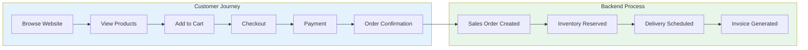
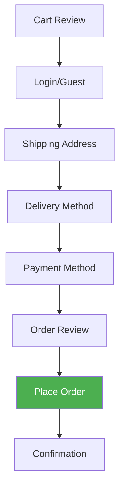
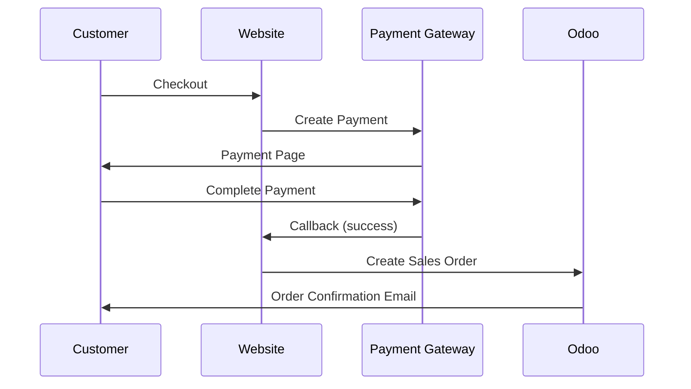

# Modul 13: Website & E-Commerce

## Tujuan Modul

Membangun kehadiran online PT. Furnicraft Indonesia melalui website company profile dan toko online terintegrasi dengan Odoo.

---

## Diagram Alur E-Commerce



---

## 1. Aktivasi Modul Website

### Langkah Instalasi

**Apps** → Install modul:

| Modul | Fungsi |
|-------|--------|
| Website | Core website builder |
| eCommerce | Online store |
| Website Sale Delivery | Shipping integration |
| Website Payment | Payment gateway |
| Website Blog | Blog content |
| Website Live Chat | Customer support |

---

## 2. Website Configuration

### 2.1 Basic Settings

**Website → Configuration → Settings**

```
Website Settings:
├── Website Name: PT. Furnicraft Indonesia
├── Website Domain: www.furnicraft.co.id
├── Company: PT. Furnicraft Indonesia
├── Default Language: Bahasa Indonesia
├── Additional Languages: English
│
├── FEATURES
│   ├── ✓ eCommerce
│   ├── ✓ Multi-language
│   ├── ✓ Live Chat
│   ├── ✓ Blog
│   └── ✓ Customer Portal
│
└── SEO
    ├── Google Analytics: UA-XXXXXXXXX
    ├── Google Tag Manager: GTM-XXXXXXX
    └── Facebook Pixel: XXXXXXXXXX
```

### 2.2 Website Theme

**Website → Configuration → Theme**

```
Theme: Clean Starter
├── Color Scheme:
│   ├── Primary: #8B4513 (Saddle Brown)
│   ├── Secondary: #D2691E (Chocolate)
│   ├── Accent: #228B22 (Forest Green)
│   └── Background: #FFF8DC (Cornsilk)
│
├── Typography:
│   ├── Heading: Playfair Display
│   └── Body: Open Sans
│
└── Layout: Wide (1400px container)
```

---

## 3. Website Structure

### 3.1 Page Structure

```
Website Structure:
│
├── Home (/)
│   ├── Hero Banner
│   ├── Featured Products
│   ├── Categories
│   ├── About Us Section
│   └── Testimonials
│
├── Products (/shop)
│   ├── Category Pages
│   │   ├── Living Room
│   │   ├── Bedroom
│   │   ├── Dining Room
│   │   └── Office
│   └── Product Detail Pages
│
├── About (/about-us)
│   ├── Company Profile
│   ├── Vision & Mission
│   ├── History
│   └── Team
│
├── Services (/services)
│   ├── Custom Furniture
│   ├── Interior Design
│   └── After Sales Service
│
├── Projects (/projects)
│   └── Portfolio Gallery
│
├── Blog (/blog)
│   └── Articles
│
├── Contact (/contact)
│   ├── Contact Form
│   ├── Map
│   └── Branch Locations
│
└── Shop (/shop)
    ├── Product Catalog
    ├── Cart
    ├── Checkout
    └── My Account
```

### 3.2 Menu Structure

**Website → Site → Menu**

```
Main Menu:
├── Home
├── Products ▾
│   ├── Living Room
│   ├── Bedroom
│   ├── Dining Room
│   ├── Office
│   └── Outdoor
├── Services ▾
│   ├── Custom Furniture
│   └── Interior Design
├── Projects
├── Blog
├── About Us
└── Contact

Footer Menu:
├── Column 1: Products
├── Column 2: Company
├── Column 3: Support
└── Column 4: Contact Info
```

---

## 4. E-Commerce Setup

### 4.1 Product Categories

**Website → eCommerce → Product Categories**

```
eCommerce Categories:
├── Living Room
│   ├── Sofa
│   ├── Coffee Table
│   ├── TV Cabinet
│   └── Bookshelf
├── Bedroom
│   ├── Bed Frame
│   ├── Wardrobe
│   ├── Nightstand
│   └── Dresser
├── Dining Room
│   ├── Dining Table
│   ├── Dining Chair
│   └── Sideboard
├── Office
│   ├── Desk
│   ├── Office Chair
│   ├── Filing Cabinet
│   └── Meeting Table
└── Outdoor
    ├── Garden Set
    └── Outdoor Chair
```

### 4.2 Product Page Setup

**Inventory → Products → [Product] → eCommerce Tab**

```
Product: Sofa Minimalis 3-Seater
│
├── WEBSITE DETAILS
│   ├── Available on Website: ✓
│   ├── Website Sequence: 10
│   ├── eCommerce Categories: Living Room > Sofa
│   └── Alternative Products: Sofa 2-Seater, Sofa L-Shape
│
├── DESCRIPTION
│   └── Sofa minimalis modern dengan desain clean dan
│       nyaman. Frame kayu jati solid dengan cushion
│       premium high-density foam. Tersedia dalam
│       berbagai pilihan warna fabric.
│
├── SPECIFICATIONS
│   ├── Dimensions: 200 × 85 × 80 cm
│   ├── Material: Jati solid, Fabric
│   ├── Color Options: Grey, Navy, Cream
│   └── Weight Capacity: 250 kg
│
├── IMAGES
│   ├── Main Image: sofa-3s-main.jpg
│   ├── Gallery:
│   │   ├── sofa-3s-front.jpg
│   │   ├── sofa-3s-side.jpg
│   │   ├── sofa-3s-detail.jpg
│   │   └── sofa-3s-room.jpg
│   └── Video: sofa-3s-demo.mp4
│
└── SEO
    ├── URL Key: sofa-minimalis-3-seater
    ├── Meta Title: Sofa Minimalis 3 Seater | Furnicraft
    └── Meta Description: Beli sofa minimalis...
```

---

## 5. Pricing & Promotions

### 5.1 Website Pricing

**Sales → Products → Pricelists**

```
Pricelist: Website (Retail)
├── Apply On: Website
├── Currency: IDR
│
├── Rules:
│   ├── All Products: Public price
│   ├── Living Room: -5% discount
│   ├── Sofa Minimalis 3-Seater: Rp 12.500.000
│   └── Quantity 2+: -10% additional
│
└── Selectable: Yes (customer can choose)
```

### 5.2 Promotions

**Website → eCommerce → Promotions**

```
Promotion: Flash Sale February
├── Name: Flash Sale February 2024
├── Period: 14-16 Feb 2024
├── Discount: 20% off
├── Apply On: Selected products
├── Promo Code: FLASH20
│
├── Rules:
│   ├── Min. Order: Rp 5.000.000
│   └── Max Discount: Rp 3.000.000
│
└── Display: Show countdown on website
```

---

## 6. Cart & Checkout

### 6.1 Cart Configuration

```
Cart Settings:
├── Minimum Order Value: Rp 1.000.000
├── Free Shipping Above: Rp 10.000.000
├── Show Stock Availability: Yes
├── Allow Backorder: No
└── Cart Abandonment Email: After 1 hour
```

### 6.2 Checkout Process



### 6.3 Checkout Fields

```
Checkout Form:
├── Billing Information
│   ├── Full Name*
│   ├── Email*
│   ├── Phone*
│   ├── Address*
│   ├── City*
│   ├── Province*
│   ├── Postal Code*
│   └── Country (Indonesia - fixed)
│
├── Shipping Information
│   ├── Same as billing: ☐
│   └── (Same fields if different)
│
└── Additional
    ├── Order Notes
    └── Promo Code
```

---

## 7. Shipping Integration

### 7.1 Delivery Methods

**Website → Configuration → Shipping Methods**

```
Shipping Methods:
├── Regular Delivery (JNE REG)
│   ├── Price: Based on weight & destination
│   ├── Estimated: 3-5 business days
│   └── Integration: JNE API
│
├── Express Delivery (JNE YES)
│   ├── Price: Based on weight & destination
│   ├── Estimated: 1-2 business days
│   └── Integration: JNE API
│
├── Furnicraft Delivery (Jabodetabek)
│   ├── Price: Rp 150.000 flat
│   ├── Estimated: 3-7 business days
│   └── Free above Rp 10.000.000
│
└── Store Pickup
    ├── Price: Free
    ├── Locations: Jakarta, Cileungsi
    └── Pickup window: 7 days
```

### 7.2 Shipping Zones

```
Zones:
├── Jabodetabek
│   ├── Free shipping: Rp 10.000.000+
│   └── Flat rate: Rp 150.000
│
├── Java (Non-Jabodetabek)
│   └── Calculate by weight
│
├── Outer Java
│   └── Calculate by weight (higher rate)
│
└── Remote Areas
    └── Additional surcharge
```

---

## 8. Payment Gateway

### 8.1 Payment Methods

**Website → Configuration → Payment Providers**

```
Payment Providers:
├── Bank Transfer
│   ├── Banks: BCA, Mandiri, BNI, BRI
│   ├── Verification: Manual (1-24 hours)
│   └── Fee: Free
│
├── Virtual Account
│   ├── Provider: Midtrans
│   ├── Banks: All major banks
│   ├── Verification: Instant
│   └── Fee: Rp 4.000/transaction
│
├── Credit Card
│   ├── Provider: Midtrans
│   ├── Visa, Mastercard, JCB
│   ├── Installment: 0% up to 12 months
│   └── Fee: 2.9% + Rp 2.000
│
├── E-Wallet
│   ├── Provider: Midtrans
│   ├── GoPay, OVO, Dana, ShopeePay
│   └── Fee: 2%
│
└── QRIS
    ├── Provider: Midtrans
    └── Fee: 0.7%
```

### 8.2 Payment Flow



---

## 9. Customer Portal

### 9.1 Portal Features

```
Customer Portal (/my):
├── Dashboard
│   ├── Recent Orders
│   ├── Wishlist
│   └── Account Summary
│
├── Orders (/my/orders)
│   ├── Order History
│   ├── Order Detail
│   ├── Track Shipment
│   └── Reorder
│
├── Invoices (/my/invoices)
│   └── Invoice History & Download
│
├── Wishlist (/my/wishlist)
│   └── Saved Products
│
├── Addresses (/my/addresses)
│   └── Address Book
│
└── Account (/my/account)
    ├── Profile Edit
    ├── Change Password
    └── Notification Preferences
```

### 9.2 Order Tracking

```
Order Status Page:
┌─────────────────────────────────────────────────────────────────┐
│  Order #SO/2024/00456                                           │
│  Order Date: 10 Feb 2024                                        │
├─────────────────────────────────────────────────────────────────┤
│                                                                 │
│  Status: [Shipped] ━━━━━━━━━━━━━●━━━━━━━━ Delivered             │
│                                                                 │
│  Tracking: JNE - 1234567890                                    │
│  └── [Track Shipment]                                          │
│                                                                 │
│  Timeline:                                                      │
│  ✓ 10 Feb 14:30 - Order placed                                │
│  ✓ 10 Feb 15:00 - Payment confirmed                           │
│  ✓ 11 Feb 09:00 - Order processed                             │
│  ✓ 13 Feb 10:00 - Shipped                                     │
│  ○ Expected delivery: 16 Feb                                  │
│                                                                 │
└─────────────────────────────────────────────────────────────────┘
```

---

## 10. Live Chat

### 10.1 Setup Live Chat

**Website → Configuration → Live Chat**

```
Live Chat Channel: Furnicraft Support
├── Operators:
│   ├── CS Team 1
│   ├── CS Team 2
│   └── CS Team 3
│
├── Working Hours:
│   ├── Monday-Friday: 08:00 - 17:00
│   └── Saturday: 09:00 - 14:00
│
├── Auto Messages:
│   ├── Welcome: "Halo! Ada yang bisa kami bantu?"
│   └── Offline: "Maaf, tim kami sedang offline..."
│
└── Chatbot (optional):
    ├── FAQ responses
    └── Lead capture
```

---

## 11. Blog

### 11.1 Blog Setup

**Website → Blog → Posts**

```
Blog Categories:
├── Tips & Inspirasi
│   └── Interior design tips
├── Product Knowledge
│   └── Care & maintenance
├── Company News
│   └── Events, updates
└── Customer Stories
    └── Testimonials, projects
```

### 11.2 Sample Blog Post

```
Blog Post: 5 Tips Merawat Furniture Kayu Jati

Category: Product Knowledge
Author: Tim Furnicraft
Published: 10 Feb 2024
Tags: perawatan, kayu jati, tips

Content:
─────────────────────────────────────────
Furniture kayu jati adalah investasi yang 
bernilai. Berikut tips merawatnya...

1. Bersihkan dengan kain lembab
2. Hindari sinar matahari langsung
3. Gunakan furniture polish
4. Periksa kelembaban ruangan
5. Perbaiki segera jika ada kerusakan

[Read more...]
─────────────────────────────────────────

SEO:
├── URL: /blog/tips-merawat-furniture-kayu-jati
├── Meta Title: 5 Tips Merawat Furniture Kayu Jati
└── Meta Description: Panduan lengkap...
```

---

## 12. SEO & Analytics

### 12.1 SEO Checklist

```
SEO Settings per Page:
├── Meta Title (max 60 chars)
├── Meta Description (max 160 chars)
├── URL Key (clean URL)
├── Canonical URL
├── Open Graph tags
└── Structured data (JSON-LD)

Technical SEO:
├── XML Sitemap: /sitemap.xml
├── Robots.txt: /robots.txt
├── SSL Certificate: ✓
├── Mobile Responsive: ✓
├── Page Speed: > 80 (Google PSI)
└── Core Web Vitals: Pass
```

### 12.2 Analytics Integration

```
Google Analytics Events:
├── Page Views
├── Product Views
├── Add to Cart
├── Begin Checkout
├── Purchase
├── Search Terms
└── User Engagement
```

---

## 13. Checklist Implementasi

- [ ] Install Website & eCommerce modules
- [ ] Configure domain & SSL
- [ ] Choose & customize theme
- [ ] Create page structure
- [ ] Setup product categories
- [ ] Configure product pages
- [ ] Setup shipping methods
- [ ] Configure payment gateways
- [ ] Setup customer portal
- [ ] Configure live chat
- [ ] Create initial blog content
- [ ] Setup SEO & analytics
- [ ] Test full purchase flow
- [ ] Mobile responsiveness check
- [ ] Launch!

---

**Dokumen Berikutnya:** [14-reporting.md](./14-reporting.md) - Reporting & Dashboards

