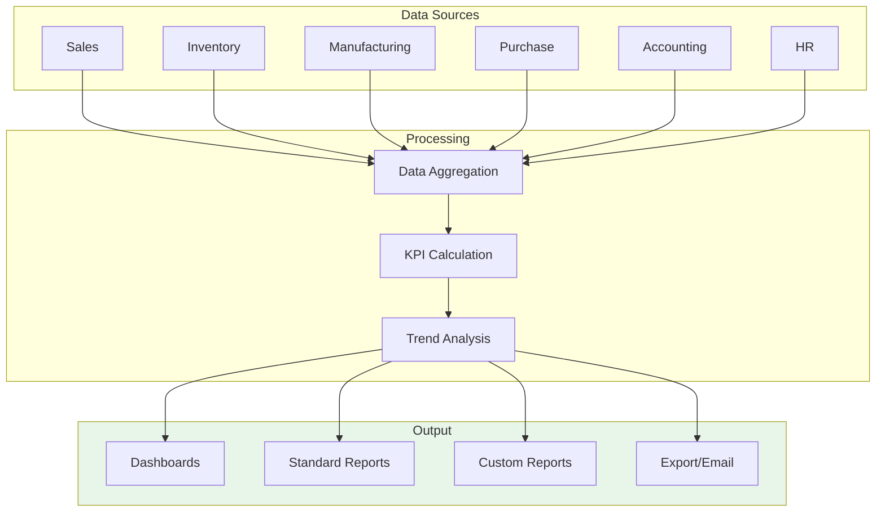

# Modul 14: Reporting & Dashboards

## Tujuan Modul

Menyediakan insight dan visibility ke seluruh operasi PT. Furnicraft Indonesia melalui dashboard dan laporan terintegrasi.

---

## Diagram Alur Data Reporting



---

## 1. Executive Dashboard

### Overview Perusahaan

```
╔═══════════════════════════════════════════════════════════════════════════╗
║                    PT. FURNICRAFT INDONESIA                                ║
║                  EXECUTIVE DASHBOARD - FEB 2024                            ║
╠═══════════════════════════════════════════════════════════════════════════╣
║                                                                           ║
║  KEY METRICS                                                               ║
║  ┌─────────────────┐ ┌─────────────────┐ ┌─────────────────┐              ║
║  │  REVENUE        │ │  ORDERS         │ │  GROSS MARGIN   │              ║
║  │                 │ │                 │ │                 │              ║
║  │  Rp 3.2 B       │ │  145            │ │  32%            │              ║
║  │  ▲ +15% MoM     │ │  ▲ +8% MoM      │ │  ▼ -2% MoM      │              ║
║  └─────────────────┘ └─────────────────┘ └─────────────────┘              ║
║                                                                           ║
║  ┌─────────────────┐ ┌─────────────────┐ ┌─────────────────┐              ║
║  │  PRODUCTION     │ │  INVENTORY      │ │  CASH FLOW      │              ║
║  │                 │ │                 │ │                 │              ║
║  │  98 units       │ │  Rp 4.5 B       │ │  Rp 1.2 B       │              ║
║  │  OEE: 85%       │ │  Turns: 4.2x    │ │  ▲ Positive     │              ║
║  └─────────────────┘ └─────────────────┘ └─────────────────┘              ║
║                                                                           ║
║  REVENUE TREND (12 Months)                                                 ║
║  ┌─────────────────────────────────────────────────────────────────────┐  ║
║  │ 4B │                                                        ▄█      │  ║
║  │    │                                               ▄█ ▄█  ▄██      │  ║
║  │ 3B │                              ▄█ ▄█ ▄█ ▄█ ▄██ ███ ███ ███      │  ║
║  │    │         ▄█ ▄█ ▄█ ▄█ ▄█ ▄██ ███ ███ ███ ███ ███ ███ ███      │  ║
║  │ 2B │    ▄█ ▄██ ███ ███ ███ ███ ███ ███ ███ ███ ███ ███ ███      │  ║
║  │    │   ███ ███ ███ ███ ███ ███ ███ ███ ███ ███ ███ ███ ███      │  ║
║  │ 1B │   ███ ███ ███ ███ ███ ███ ███ ███ ███ ███ ███ ███ ███      │  ║
║  │    └────Mar──Apr──May──Jun──Jul──Aug──Sep──Oct──Nov──Dec──Jan──Feb─┘  ║
║  └─────────────────────────────────────────────────────────────────────┘  ║
║                                                                           ║
║  SALES BY CATEGORY                    TOP PRODUCTS                        ║
║  ┌──────────────────────────┐        ┌───────────────────────────────┐   ║
║  │ Living Room  ████████ 35%│        │ 1. Sofa Minimalis   Rp 580 jt│   ║
║  │ Bedroom      ██████   25%│        │ 2. Meja Makan Set   Rp 420 jt│   ║
║  │ Dining       █████    20%│        │ 3. Lemari Pakaian   Rp 380 jt│   ║
║  │ Office       ████     15%│        │ 4. Rak TV           Rp 320 jt│   ║
║  │ Other        ██        5%│        │ 5. Tempat Tidur     Rp 290 jt│   ║
║  └──────────────────────────┘        └───────────────────────────────┘   ║
║                                                                           ║
╚═══════════════════════════════════════════════════════════════════════════╝
```

---

## 2. Sales Dashboard

### 2.1 Sales Performance

```
╔═══════════════════════════════════════════════════════════════╗
║                   SALES DASHBOARD - FEB 2024                   ║
╠═══════════════════════════════════════════════════════════════╣
║                                                                ║
║  SALES FUNNEL                                                  ║
║  ┌─────────────────────────────────────────────────────────┐  ║
║  │           Leads: 250                                    │  ║
║  │        ╔════════════════════════════════════╗           │  ║
║  │        ║   Opportunities: 85    (34%)       ║           │  ║
║  │        ╠═════════════════════════════╗      ║           │  ║
║  │        ║   Quotations: 62   (73%)   ║      ║           │  ║
║  │        ╠══════════════════════╗     ║      ║           │  ║
║  │        ║   Orders: 45 (73%)  ║     ║      ║           │  ║
║  │        ╚══════════════════════╝     ║      ║           │  ║
║  └─────────────────────────────────────────────────────────┘  ║
║                                                                ║
║  SALES BY CHANNEL                 SALES BY SALESPERSON        ║
║  ┌──────────────────────┐        ┌─────────────────────────┐  ║
║  │ Direct     ████████████  60%  │ Ahmad F.  ████████ Rp 850jt║
║  │ Online     ██████        25%  │ Siti N.   ███████  Rp 720jt║
║  │ Project    ████          15%  │ Budi S.   █████    Rp 580jt║
║  └──────────────────────┘        │ Dewi A.   ████     Rp 450jt║
║                                  │ Eko P.    ███      Rp 320jt║
║  QUOTATION STATUS                └─────────────────────────┘  ║
║  ┌──────────────────────┐                                     ║
║  │ ● Won:      45 (73%) │                                     ║
║  │ ● Pending:  12 (19%) │                                     ║
║  │ ○ Lost:      5  (8%) │                                     ║
║  └──────────────────────┘                                     ║
║                                                                ║
║  TARGET VS ACTUAL                                              ║
║  ┌─────────────────────────────────────────────────────────┐  ║
║  │ Team     │ Target      │ Actual      │ %     │ Status   │  ║
║  ├─────────────────────────────────────────────────────────┤  ║
║  │ Retail   │ Rp 500 jt   │ Rp 580 jt   │ 116%  │ ● Above  │  ║
║  │ Project  │ Rp 1.0 B    │ Rp 920 jt   │ 92%   │ ● On Track│ ║
║  │ Online   │ Rp 300 jt   │ Rp 320 jt   │ 107%  │ ● Above  │  ║
║  └─────────────────────────────────────────────────────────┘  ║
╚═══════════════════════════════════════════════════════════════╝
```

---

## 3. Inventory Dashboard

### Stock Overview

```
╔═══════════════════════════════════════════════════════════════╗
║                 INVENTORY DASHBOARD - FEB 2024                 ║
╠═══════════════════════════════════════════════════════════════╣
║                                                                ║
║  STOCK VALUE BY CATEGORY                                       ║
║  ┌─────────────────────────────────────────────────────────┐  ║
║  │ Raw Material    ████████████████████  Rp 2.1 B  (47%)   │  ║
║  │ WIP             ████████             Rp 850 jt  (19%)   │  ║
║  │ Finished Goods  ███████████████      Rp 1.5 B   (34%)   │  ║
║  └─────────────────────────────────────────────────────────┘  ║
║  Total Inventory Value: Rp 4.45 B                             ║
║                                                                ║
║  STOCK ALERTS                                                  ║
║  ┌─────────────────────────────────────────────────────────┐  ║
║  │ ⚠️ LOW STOCK (below reorder point): 12 products          │  ║
║  │ ❌ OUT OF STOCK: 3 products                              │  ║
║  │ 📦 OVERSTOCK (>90 days): 8 products                      │  ║
║  │ ⏰ EXPIRING MATERIALS: 2 items                           │  ║
║  └─────────────────────────────────────────────────────────┘  ║
║                                                                ║
║  TOP MOVING PRODUCTS (Feb)        SLOW MOVING (>60 days)      ║
║  ┌──────────────────────────┐    ┌──────────────────────────┐ ║
║  │ 1. Meja Makan Set    45  │    │ 1. Kursi Antik       120d │ ║
║  │ 2. Sofa 3-Seater     38  │    │ 2. Lemari Classic     95d │ ║
║  │ 3. Lemari 3-Pintu    32  │    │ 3. Meja Ukir          88d │ ║
║  │ 4. Tempat Tidur      28  │    │ 4. Bufet Colonial     75d │ ║
║  │ 5. Rak TV Minimalis  25  │    │ 5. Kursi Malas        62d │ ║
║  └──────────────────────────┘    └──────────────────────────┘ ║
║                                                                ║
║  INVENTORY TURNOVER                                            ║
║  ┌─────────────────────────────────────────────────────────┐  ║
║  │ Category      │ Turnover │ Days Inv │ Target │ Status   │  ║
║  ├─────────────────────────────────────────────────────────┤  ║
║  │ Raw Material  │   6.2x   │   59 d   │  8x    │ 🔴 Below │  ║
║  │ WIP           │   12.0x  │   30 d   │  12x   │ 🟢 Good  │  ║
║  │ Finished      │   4.8x   │   76 d   │  6x    │ 🟡 Watch │  ║
║  └─────────────────────────────────────────────────────────┘  ║
╚═══════════════════════════════════════════════════════════════╝
```

---

## 4. Manufacturing Dashboard

### Production Performance

```
╔═══════════════════════════════════════════════════════════════╗
║               MANUFACTURING DASHBOARD - FEB 2024               ║
╠═══════════════════════════════════════════════════════════════╣
║                                                                ║
║  OEE (Overall Equipment Effectiveness)                         ║
║  ┌─────────────────────────────────────────────────────────┐  ║
║  │                                                         │  ║
║  │                    ┌─────────┐                          │  ║
║  │                    │         │                          │  ║
║  │                    │  85%    │  OEE                     │  ║
║  │                    │         │                          │  ║
║  │                    └─────────┘                          │  ║
║  │                                                         │  ║
║  │  Availability   ████████████████████   95%              │  ║
║  │  Performance    ████████████████       90%              │  ║
║  │  Quality        ████████████████████   99%              │  ║
║  └─────────────────────────────────────────────────────────┘  ║
║                                                                ║
║  PRODUCTION OUTPUT                                             ║
║  ┌─────────────────────────────────────────────────────────┐  ║
║  │ Week  │ Planned │ Actual │ Variance │ Completion        │  ║
║  ├─────────────────────────────────────────────────────────┤  ║
║  │ W1    │   25    │   24   │   -1     │ ████████████ 96%  │  ║
║  │ W2    │   25    │   26   │   +1     │ █████████████104% │  ║
║  │ W3    │   25    │   25   │    0     │ ████████████ 100% │  ║
║  │ W4    │   25    │   23   │   -2     │ ██████████   92%  │  ║
║  └─────────────────────────────────────────────────────────┘  ║
║  Monthly Total: 98 / 100 planned (98%)                        ║
║                                                                ║
║  WORK CENTER UTILIZATION                                       ║
║  ┌─────────────────────────────────────────────────────────┐  ║
║  │ Cutting     ████████████████████  85%  │  WO: 45        │  ║
║  │ Assembly    ██████████████████    78%  │  WO: 38        │  ║
║  │ Finishing   ████████████████████  88%  │  WO: 42        │  ║
║  │ Packing     ██████████████        65%  │  WO: 28        │  ║
║  └─────────────────────────────────────────────────────────┘  ║
║                                                                ║
║  QUALITY METRICS                  PRODUCTION ISSUES            ║
║  ┌──────────────────────┐        ┌──────────────────────────┐ ║
║  │ First Pass Yield: 97%│        │ ● Machine Breakdown:   2 │ ║
║  │ Defect Rate:     2.8%│        │ ● Material Shortage:   3 │ ║
║  │ Rework Rate:     1.5%│        │ ● Quality Issue:       5 │ ║
║  │ Scrap Rate:      0.5%│        │ ● Other:               1 │ ║
║  └──────────────────────┘        └──────────────────────────┘ ║
╚═══════════════════════════════════════════════════════════════╝
```

---

## 5. Financial Dashboard

### Financial Overview

```
╔═══════════════════════════════════════════════════════════════╗
║                FINANCIAL DASHBOARD - FEB 2024                  ║
╠═══════════════════════════════════════════════════════════════╣
║                                                                ║
║  PROFIT & LOSS (YTD)                                           ║
║  ┌─────────────────────────────────────────────────────────┐  ║
║  │ Revenue                                    Rp  6.4 B    │  ║
║  │ ├── Product Sales           Rp  5.8 B                   │  ║
║  │ ├── Services                Rp  450 jt                  │  ║
║  │ └── Other Income            Rp  150 jt                  │  ║
║  │                                                         │  ║
║  │ Cost of Goods Sold                        (Rp  4.2 B)   │  ║
║  │ ├── Material Cost           Rp  2.8 B                   │  ║
║  │ ├── Labor Cost              Rp  950 jt                  │  ║
║  │ └── Overhead                Rp  450 jt                  │  ║
║  │                                                         │  ║
║  │ Gross Profit                               Rp  2.2 B    │  ║
║  │ Gross Margin                                    34%     │  ║
║  │                                                         │  ║
║  │ Operating Expenses                        (Rp  1.4 B)   │  ║
║  │ ├── Selling & Marketing     Rp  450 jt                  │  ║
║  │ ├── Admin & General         Rp  650 jt                  │  ║
║  │ └── Other                   Rp  300 jt                  │  ║
║  │                                                         │  ║
║  │ Operating Profit                           Rp  800 jt   │  ║
║  │ Operating Margin                                12.5%   │  ║
║  │                                                         │  ║
║  │ Net Profit                                 Rp  620 jt   │  ║
║  │ Net Margin                                      9.7%    │  ║
║  └─────────────────────────────────────────────────────────┘  ║
║                                                                ║
║  CASH POSITION                    RECEIVABLES AGING            ║
║  ┌──────────────────────┐        ┌──────────────────────────┐ ║
║  │ Cash in Bank:        │        │ Current:    Rp 1.2 B     │ ║
║  │   Rp 1.8 B           │        │ 1-30 days:  Rp 450 jt    │ ║
║  │                      │        │ 31-60 days: Rp 180 jt    │ ║
║  │ Cash Flow (MTD):     │        │ 61-90 days: Rp 85 jt     │ ║
║  │   + Rp 320 jt        │        │ >90 days:   Rp 45 jt  ⚠️ │ ║
║  └──────────────────────┘        └──────────────────────────┘ ║
║                                                                ║
║  PAYABLES AGING                   KEY RATIOS                   ║
║  ┌──────────────────────┐        ┌──────────────────────────┐ ║
║  │ Current:    Rp 850 jt│        │ Current Ratio:    2.1    │ ║
║  │ 1-30 days:  Rp 320 jt│        │ Quick Ratio:      1.4    │ ║
║  │ 31-60 days: Rp 120 jt│        │ DSO:             42 days │ ║
║  │ >60 days:   Rp 50 jt │        │ DPO:             38 days │ ║
║  └──────────────────────┘        │ Inventory Turns:  5.2x   │ ║
║                                  └──────────────────────────┘ ║
╚═══════════════════════════════════════════════════════════════╝
```

---

## 6. HR Dashboard

```
╔═══════════════════════════════════════════════════════════════╗
║                    HR DASHBOARD - FEB 2024                     ║
╠═══════════════════════════════════════════════════════════════╣
║                                                                ║
║  HEADCOUNT                        DEPARTMENT DISTRIBUTION      ║
║  ┌──────────────────────┐        ┌──────────────────────────┐ ║
║  │ Total: 90 employees  │        │ Production  ████████ 50% │ ║
║  │ ├── Permanent: 75    │        │ Sales       ███     12% │ ║
║  │ ├── Contract:  13    │        │ Finance     ██       8% │ ║
║  │ └── Intern:     2    │        │ Warehouse   ██       9% │ ║
║  │                      │        │ HR & Admin  ██       7% │ ║
║  │ New Hires (MTD): 3   │        │ Other       ████    14% │ ║
║  │ Turnover (MTD):  1   │        └──────────────────────────┘ ║
║  └──────────────────────┘                                     ║
║                                                                ║
║  ATTENDANCE                       LEAVE SUMMARY                ║
║  ┌──────────────────────┐        ┌──────────────────────────┐ ║
║  │ Average Rate: 95.2%  │        │ Annual Leave:   45 days  │ ║
║  │ ├── On Time:   85%   │        │ Sick Leave:     12 days  │ ║
║  │ ├── Late:      10%   │        │ Other:           5 days  │ ║
║  │ └── Absent:     5%   │        │                          │ ║
║  │                      │        │ Pending Requests: 8      │ ║
║  │ Overtime Hours: 320  │        └──────────────────────────┘ ║
║  └──────────────────────┘                                     ║
║                                                                ║
║  PAYROLL SUMMARY                                               ║
║  ┌─────────────────────────────────────────────────────────┐  ║
║  │ Gross Payroll:            Rp  1.250.000.000             │  ║
║  │ ├── Basic Salary          Rp    850.000.000             │  ║
║  │ ├── Allowances            Rp    280.000.000             │  ║
║  │ └── Overtime              Rp    120.000.000             │  ║
║  │                                                         │  ║
║  │ Deductions:               Rp    180.000.000             │  ║
║  │ Net Payroll:              Rp  1.070.000.000             │  ║
║  └─────────────────────────────────────────────────────────┘  ║
╚═══════════════════════════════════════════════════════════════╝
```

---

## 7. Standard Reports

### 7.1 Available Reports by Module

| Module | Reports |
|--------|---------|
| **Sales** | Sales Analysis, Quotation Analysis, Invoice Analysis |
| **Inventory** | Stock Valuation, Stock Moves, Inventory Aging |
| **Manufacturing** | Production Analysis, Work Order Analysis, Cost Analysis |
| **Purchase** | Purchase Analysis, Vendor Analysis |
| **Accounting** | P&L, Balance Sheet, Cash Flow, Aged Receivables, Aged Payables |
| **HR** | Employee Report, Payroll Summary, Attendance Report |
| **CRM** | Pipeline Analysis, Lead Analysis, Activity Report |

### 7.2 Accessing Reports

**[Module] → Reporting → [Report Name]**

---

## 8. Custom Reports (Spreadsheet)

### Create Custom Report

**Documents → Spreadsheet → Create**

```
Spreadsheet: Monthly Sales Report
├── Sheet 1: Summary
│   └── ODOO.PIVOT using Sales Analysis
├── Sheet 2: By Product
│   └── ODOO.PIVOT grouped by Product
├── Sheet 3: By Salesperson
│   └── ODOO.PIVOT grouped by Salesperson
└── Sheet 4: Trend
    └── ODOO.PIVOT with time comparison
```

### Pivot Formula Example

```
=ODOO.PIVOT(
    "sale.report",          // Model
    "price_total:sum",      // Measure
    "date:month",           // Row grouping
    "categ_id"              // Column grouping
)
```

---

## 9. Scheduled Reports

### Setup Email Reports

**Settings → Technical → Automation → Scheduled Actions**

```
Scheduled Report: Daily Sales Summary
├── Model: Sale Order
├── Trigger: Scheduled
├── Execute Every: 1 Day at 08:00
├── Action: Send Email
│
├── Email To: sales-team@furnicraft.co.id
├── Subject: Daily Sales Report - ${date}
└── Template: Daily Sales Summary
```

---

## 10. KPI Summary

### Key Performance Indicators

```
╔═══════════════════════════════════════════════════════════════╗
║                   KPI SCORECARD - FEB 2024                     ║
╠═══════════════════════════════════════════════════════════════╣
║                                                                ║
║  CATEGORY          │ KPI              │ Target │ Actual │ Sts ║
╠═══════════════════════════════════════════════════════════════╣
║  FINANCIAL                                                     ║
║  ─────────────────────────────────────────────────────────── ║
║                    │ Revenue          │ 3.0 B  │ 3.2 B  │ 🟢  ║
║                    │ Gross Margin     │ 35%    │ 32%    │ 🟡  ║
║                    │ Net Margin       │ 10%    │ 9.7%   │ 🟡  ║
║                    │ DSO              │ 45 d   │ 42 d   │ 🟢  ║
║                                                                ║
║  SALES                                                         ║
║  ─────────────────────────────────────────────────────────── ║
║                    │ Orders           │ 140    │ 145    │ 🟢  ║
║                    │ Conversion Rate  │ 70%    │ 73%    │ 🟢  ║
║                    │ Avg Order Value  │ 20 jt  │ 22 jt  │ 🟢  ║
║                                                                ║
║  OPERATIONS                                                    ║
║  ─────────────────────────────────────────────────────────── ║
║                    │ On-Time Delivery │ 95%    │ 92%    │ 🟡  ║
║                    │ OEE              │ 85%    │ 85%    │ 🟢  ║
║                    │ Quality Rate     │ 98%    │ 97%    │ 🟢  ║
║                    │ Inventory Turns  │ 6x     │ 5.2x   │ 🟡  ║
║                                                                ║
║  CUSTOMER                                                      ║
║  ─────────────────────────────────────────────────────────── ║
║                    │ CSAT Score       │ 4.5    │ 4.3    │ 🟡  ║
║                    │ NPS              │ 40     │ 38     │ 🟡  ║
║                    │ Repeat Customer  │ 30%    │ 32%    │ 🟢  ║
║                                                                ║
║  HR                                                            ║
║  ─────────────────────────────────────────────────────────── ║
║                    │ Attendance       │ 95%    │ 95.2%  │ 🟢  ║
║                    │ Turnover Rate    │ <5%    │ 3%     │ 🟢  ║
║                                                                ║
╚═══════════════════════════════════════════════════════════════╝

Legend: 🟢 On/Above Target  🟡 Within Tolerance  🔴 Below Target
```

---

## 11. Checklist Implementasi

- [ ] Setup dashboard views per module
- [ ] Create custom KPI spreadsheets
- [ ] Configure scheduled reports
- [ ] Setup email distributions
- [ ] Define access rights for reports
- [ ] Create executive dashboard
- [ ] Train users on report usage
- [ ] Document report definitions

---

## Penutup

Selamat! Anda telah menyelesaikan panduan implementasi Odoo 16 untuk PT. Furnicraft Indonesia.

### Dokumen dalam Seri Ini

1. [00-overview.md](./00-overview.md) - Overview & Roadmap
2. [01-persiapan-instalasi.md](./01-persiapan-instalasi.md) - Instalasi
3. [02-pengaturan-perusahaan.md](./02-pengaturan-perusahaan.md) - Setup Perusahaan
4. [03-master-data.md](./03-master-data.md) - Master Data
5. [04-inventory.md](./04-inventory.md) - Inventory
6. [05-purchase.md](./05-purchase.md) - Purchase
7. [06-manufacturing.md](./06-manufacturing.md) - Manufacturing
8. [07-sales.md](./07-sales.md) - Sales
9. [08-accounting.md](./08-accounting.md) - Accounting
10. [09-crm.md](./09-crm.md) - CRM
11. [10-hr.md](./10-hr.md) - HR
12. [11-project.md](./11-project.md) - Project
13. [12-quality.md](./12-quality.md) - Quality
14. [13-website-ecommerce.md](./13-website-ecommerce.md) - Website & E-Commerce
15. [14-reporting.md](./14-reporting.md) - Reporting (Dokumen ini)

---

**Selamat menggunakan Odoo 16! 🎉**

