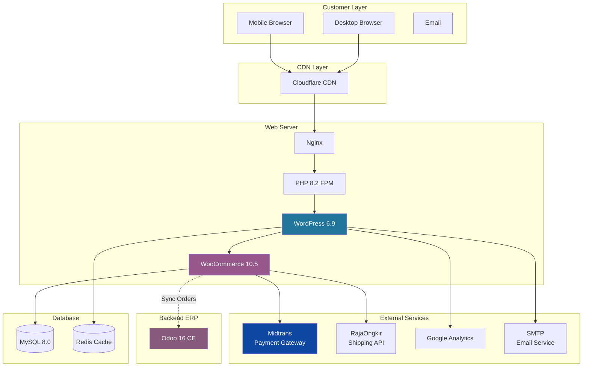
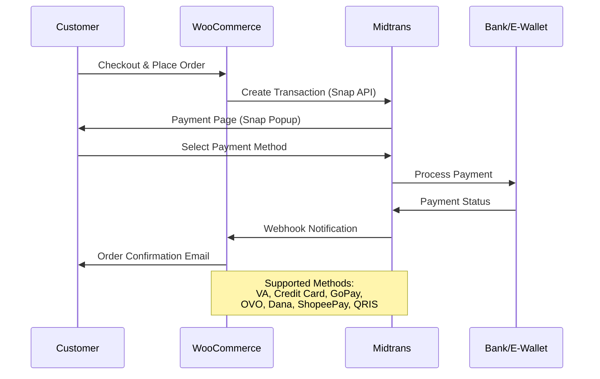
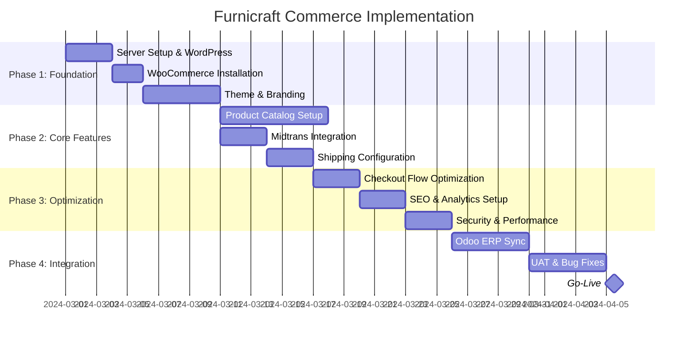

# Furnicraft Commerce - WordPress + WooCommerce Implementation Guide

> Panduan Implementasi E-Commerce untuk PT. Furnicraft Indonesia

---

## Project Overview

### Company Profile

| Field | Value |
|-------|-------|
| **Company** | PT. Furnicraft Indonesia |
| **Domain** | www.furnicraft.co.id |
| **Industry** | Furniture Manufacturing & Retail |
| **Target Market** | B2C (Consumer) + B2B (Corporate/Interior) |
| **Location** | Jakarta (HQ), Cileungsi (Factory) |

### Business Goals

1. **Online Sales Channel** - Sell furniture products directly to consumers
2. **Brand Presence** - Establish Furnicraft as premium furniture brand
3. **Lead Generation** - Capture B2B leads for custom furniture projects
4. **Customer Portal** - Self-service order tracking and reorder

---

## Tech Stack

### Core Platform

| Component | Version | Purpose |
|-----------|---------|---------|
| **WordPress** | 6.9.1 | CMS & Website Builder |
| **WooCommerce** | 10.5.0 | E-Commerce Engine |
| **PHP** | 8.2+ | Server-side Runtime |
| **MySQL** | 8.0+ | Database |
| **Nginx** | 1.24+ | Web Server |

### Payment & Shipping

| Service | Provider | Integration |
|---------|----------|-------------|
| **Payment Gateway** | Midtrans | Official WP Plugin |
| **Shipping Calculator** | RajaOngkir | API Plugin |
| **Couriers** | JNE, J&T, SiCepat | Via RajaOngkir |

### Essential Plugins

| Plugin | Purpose | Required |
|--------|---------|----------|
| WooCommerce | Core e-commerce | ✓ |
| Midtrans-WooCommerce | Payment gateway | ✓ |
| WooCommerce Shipping Indonesia | RajaOngkir integration | ✓ |
| Yoast SEO | SEO optimization | ✓ |
| WP Super Cache / LiteSpeed Cache | Caching | ✓ |
| Wordfence | Security | ✓ |
| UpdraftPlus | Backup | ✓ |
| WPForms Lite | Contact forms | ✓ |
| Tidio / Crisp | Live chat | Optional |
| Google Site Kit | Analytics | ✓ |

---

## Architecture Diagram

---

## Customer Journey Flow

```mermaid
flowchart LR
    subgraph Frontend["Customer Journey"]
        F1[Browse Website] --> F2[View Products]
        F2 --> F3[Add to Cart]
        F3 --> F4[Checkout]
        F4 --> F5[Select Payment]
        F5 --> F6[Midtrans Payment]
        F6 --> F7[Order Confirmation]
    end
    
    subgraph Backend["Backend Process"]
        B1[Order Created<br/>WooCommerce]
        B2[Payment Verified<br/>Midtrans Webhook]
        B3[Sync to Odoo]
        B4[Fulfillment]
        B5[Shipping Update]
    end
    
    F7 --> B1 --> B2 --> B3 --> B4 --> B5
    
    style Frontend fill:#e3f2fd
    style Backend fill:#e8f5e9
```

---

## Payment Flow (Midtrans)

---

## Document Structure

| No | Document | Description |
|----|----------|-------------|
| 00 | [00-overview.md](./00-overview.md) | Project overview (this file) |
| 01 | [01-server-setup.md](./01-server-setup.md) | Server requirements & WordPress installation |
| 02 | [02-woocommerce-setup.md](./02-woocommerce-setup.md) | WooCommerce installation & core config |
| 03 | [03-theme-customization.md](./03-theme-customization.md) | Theme selection & Furnicraft branding |
| 04 | [04-product-management.md](./04-product-management.md) | Product types, categories, attributes |
| 05 | [05-midtrans-integration.md](./05-midtrans-integration.md) | Payment gateway setup |
| 06 | [06-shipping-configuration.md](./06-shipping-configuration.md) | Shipping zones & courier integration |
| 07 | [07-checkout-optimization.md](./07-checkout-optimization.md) | Cart & checkout optimization |
| 08 | [08-seo-analytics.md](./08-seo-analytics.md) | SEO, Analytics, structured data |
| 09 | [09-security-performance.md](./09-security-performance.md) | Security hardening & performance |
| 10 | [10-odoo-integration.md](./10-odoo-integration.md) | Sync with Odoo ERP |

---

## Implementation Roadmap

---

## Key Requirements Summary

### From Furnicraft Business

| Requirement | Specification |
|-------------|---------------|
| **Minimum Order** | Rp 1.000.000 |
| **Free Shipping Threshold** | Rp 10.000.000 |
| **Stock Display** | Yes, show availability |
| **Backorder** | Not allowed |
| **Cart Abandonment Email** | After 1 hour |
| **Languages** | Indonesian (primary), English |
| **Currency** | IDR only |

### Shipping Zones

| Zone | Coverage | Rate |
|------|----------|------|
| **Jabodetabek** | Jakarta, Bogor, Depok, Tangerang, Bekasi | Flat Rp 150.000 (Free > Rp 10M) |
| **Java** | All Java provinces except Jabodetabek | Weight-based via RajaOngkir |
| **Outer Java** | Sumatra, Kalimantan, Sulawesi, etc. | Weight-based (higher rate) |
| **Store Pickup** | Jakarta showroom, Cileungsi factory | Free |

### Payment Methods (via Midtrans)

| Method | Fee | Settlement |
|--------|-----|------------|
| Bank Transfer (Manual) | Free | Manual verification |
| Virtual Account | Rp 4.000/tx | Instant |
| Credit Card | 2.9% + Rp 2.000 | T+2 |
| GoPay | 2% | Instant |
| OVO/Dana/ShopeePay | 2% | Instant |
| QRIS | 0.7% | Instant |

---

## Branding Guidelines

### Color Palette

| Color | Hex | Usage |
|-------|-----|-------|
| **Primary** | `#8B4513` | Headers, CTAs, buttons |
| **Secondary** | `#D2691E` | Accents, highlights |
| **Accent** | `#228B22` | Success states, badges |
| **Background** | `#FFF8DC` | Page background |
| **Text** | `#333333` | Body text |
| **Light Gray** | `#F5F5F5` | Cards, sections |

### Typography

| Element | Font | Weight |
|---------|------|--------|
| **Headings** | Playfair Display | 600-700 |
| **Body** | Open Sans | 400-600 |
| **Buttons** | Open Sans | 600 |

### Layout

- **Container Width**: 1400px
- **Mobile Breakpoint**: 768px
- **Grid**: 12-column
- **Spacing**: 8px base unit

---

## Success Metrics (KPIs)

| Metric | Target |
|--------|--------|
| **Monthly Visitors** | 50,000+ |
| **Conversion Rate** | > 2% |
| **Average Order Value** | > Rp 5.000.000 |
| **Cart Abandonment Rate** | < 70% |
| **Page Load Time** | < 3 seconds |
| **Mobile Score (PageSpeed)** | > 80 |
| **Uptime** | 99.9% |

---

**Next Document:** [01-server-setup.md](./01-server-setup.md) - Server Requirements & WordPress Installation
