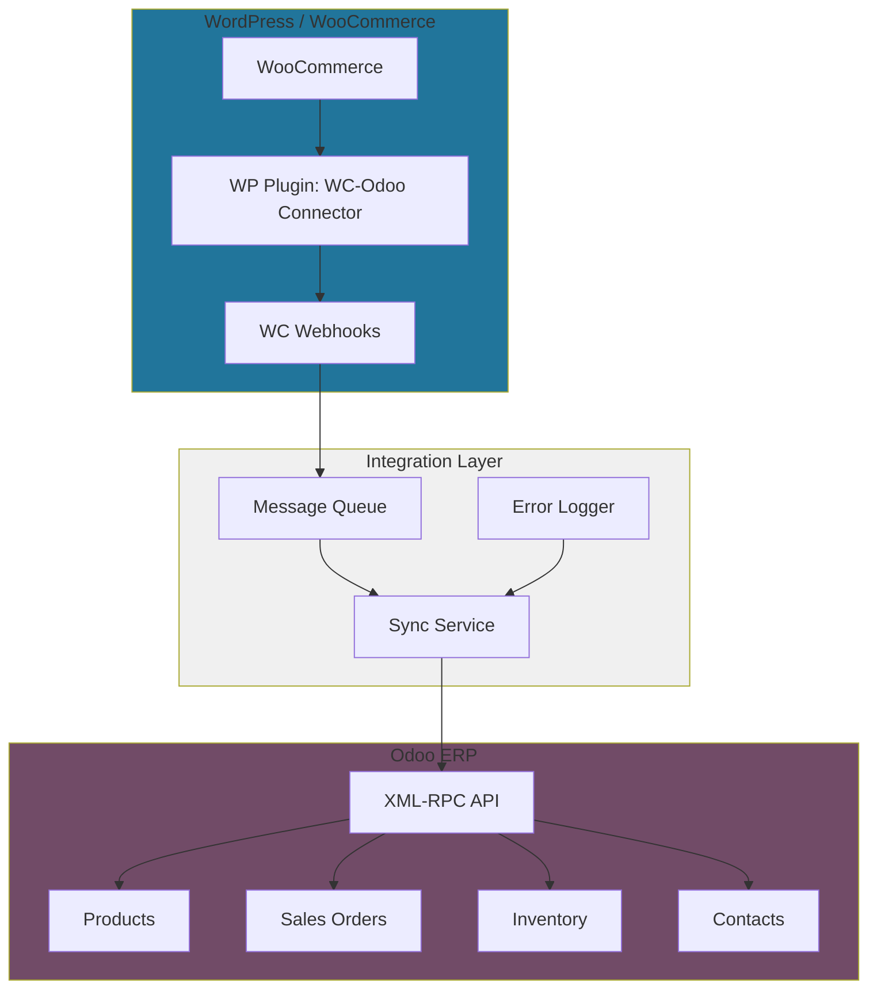

# 10. Odoo Integration

Panduan integrasi WordPress WooCommerce dengan Odoo ERP untuk PT. Furnicraft Indonesia.

---

## Daftar Isi

1. [Integration Overview](#1-integration-overview)
2. [Integration Architecture](#2-integration-architecture)
3. [Odoo XML-RPC API](#3-odoo-xml-rpc-api)
4. [Product Synchronization](#4-product-synchronization)
5. [Order Synchronization](#5-order-synchronization)
6. [Stock Synchronization](#6-stock-synchronization)
7. [Customer Synchronization](#7-customer-synchronization)
8. [Webhook Implementation](#8-webhook-implementation)
9. [Error Handling & Logging](#9-error-handling--logging)

---

## 1. Integration Overview

### 1.1 Why Integrate?

```
Integration Benefits:
├── Single source of truth for inventory
├── Automatic order creation in ERP
├── Real-time stock updates
├── Unified customer database
├── Streamlined fulfillment process
└── Accurate financial reporting
```

### 1.2 Data Flow

```
Data Synchronization:
│
├── Products: Odoo → WooCommerce
│   ├── Name, description, images
│   ├── Price (from pricelist)
│   ├── SKU
│   ├── Categories
│   └── Stock quantity
│
├── Orders: WooCommerce → Odoo
│   ├── Customer info
│   ├── Order lines
│   ├── Shipping address
│   ├── Payment status
│   └── Order notes
│
├── Stock: Odoo → WooCommerce
│   ├── Quantity available
│   └── Stock status (in stock/out of stock)
│
└── Customers: Bidirectional
    ├── WC → Odoo: New customer on first order
    └── Odoo → WC: Customer updates (optional)
```

---

## 2. Integration Architecture

### 2.1 Architecture Diagram



### 2.2 Integration Methods

```
Available Methods:
│
├── Option 1: Direct Plugin (Recommended for Small-Medium)
│   ├── Plugin: "WooCommerce Odoo Integration"
│   ├── Real-time sync via XML-RPC
│   └── No middleware required
│
├── Option 2: Middleware Service (Recommended for Large)
│   ├── Custom Node.js/Python service
│   ├── Queue-based for reliability
│   └── Better error handling
│
└── Option 3: Zapier/n8n (Quick Setup)
    ├── No-code integration
    ├── Limited customization
    └── Monthly subscription cost
```

---

## 3. Odoo XML-RPC API

### 3.1 API Endpoints

```
Odoo XML-RPC Endpoints:
├── Common: https://odoo.furnicraft.co.id/xmlrpc/2/common
│   └── authenticate, version
│
└── Object: https://odoo.furnicraft.co.id/xmlrpc/2/object
    └── execute_kw (CRUD operations)
```

### 3.2 Authentication

```php
// PHP XML-RPC connection to Odoo
class OdooConnector {
    private $url;
    private $db;
    private $username;
    private $password;
    private $uid;
    
    public function __construct() {
        $this->url = 'https://odoo.furnicraft.co.id';
        $this->db = 'furnicraft_production';
        $this->username = 'api@furnicraft.co.id';
        $this->password = get_option('odoo_api_key'); // Store securely
    }
    
    public function authenticate() {
        $common = ripcord::client($this->url . '/xmlrpc/2/common');
        $this->uid = $common->authenticate(
            $this->db,
            $this->username,
            $this->password,
            []
        );
        return $this->uid;
    }
    
    public function execute($model, $method, $args = [], $kwargs = []) {
        if (!$this->uid) {
            $this->authenticate();
        }
        
        $models = ripcord::client($this->url . '/xmlrpc/2/object');
        return $models->execute_kw(
            $this->db,
            $this->uid,
            $this->password,
            $model,
            $method,
            $args,
            $kwargs
        );
    }
}
```

### 3.3 Required Odoo User Permissions

```
API User Setup in Odoo:
├── Create dedicated API user
├── Access Rights:
│   ├── Sales: User (All Documents)
│   ├── Inventory: User
│   ├── Contacts: User
│   └── Invoicing: Billing (if needed)
│
└── Generate API Key:
    └── Settings → Users → API Keys → New API Key
```

---

## 4. Product Synchronization

### 4.1 Sync Strategy

```
Product Sync Direction: Odoo → WooCommerce

Sync Triggers:
├── Scheduled: Every 1 hour
├── Manual: Admin button in WP
└── On Odoo update: Webhook (if configured)

Fields to Sync:
├── Odoo Field → WC Field
├── name → post_title
├── description_sale → post_content (description)
├── list_price → regular_price
├── default_code (SKU) → sku
├── qty_available → stock_quantity
├── categ_id → product_cat
└── image_1920 → product_image
```

### 4.2 Product Sync Code

```php
// Sync products from Odoo to WooCommerce
class OdooProductSync {
    private $odoo;
    
    public function __construct() {
        $this->odoo = new OdooConnector();
    }
    
    public function syncAllProducts() {
        // Get products from Odoo
        $products = $this->odoo->execute(
            'product.template',
            'search_read',
            [[['sale_ok', '=', true], ['website_published', '=', true]]],
            ['fields' => [
                'name', 
                'description_sale', 
                'list_price', 
                'default_code',
                'qty_available',
                'categ_id',
                'image_1920'
            ]]
        );
        
        foreach ($products as $odoo_product) {
            $this->syncProduct($odoo_product);
        }
        
        return count($products);
    }
    
    private function syncProduct($odoo_product) {
        $sku = $odoo_product['default_code'];
        
        // Check if product exists in WooCommerce
        $wc_product_id = wc_get_product_id_by_sku($sku);
        
        if ($wc_product_id) {
            // Update existing
            $product = wc_get_product($wc_product_id);
        } else {
            // Create new
            $product = new WC_Product_Simple();
        }
        
        // Update fields
        $product->set_name($odoo_product['name']);
        $product->set_description($odoo_product['description_sale'] ?: '');
        $product->set_regular_price($odoo_product['list_price']);
        $product->set_sku($sku);
        $product->set_stock_quantity($odoo_product['qty_available']);
        $product->set_manage_stock(true);
        
        // Set stock status
        if ($odoo_product['qty_available'] > 0) {
            $product->set_stock_status('instock');
        } else {
            $product->set_stock_status('outofstock');
        }
        
        // Save product
        $product->save();
        
        // Link to Odoo ID
        update_post_meta($product->get_id(), '_odoo_product_id', $odoo_product['id']);
        
        return $product->get_id();
    }
}
```

### 4.3 Schedule Product Sync

```php
// functions.php - Schedule hourly sync
add_action('init', 'furnicraft_schedule_product_sync');
function furnicraft_schedule_product_sync() {
    if (!wp_next_scheduled('furnicraft_odoo_product_sync')) {
        wp_schedule_event(time(), 'hourly', 'furnicraft_odoo_product_sync');
    }
}

add_action('furnicraft_odoo_product_sync', 'furnicraft_run_product_sync');
function furnicraft_run_product_sync() {
    $sync = new OdooProductSync();
    $count = $sync->syncAllProducts();
    error_log("Odoo Product Sync: {$count} products synchronized");
}
```

---

## 5. Order Synchronization

### 5.1 Order Sync Strategy

```
Order Sync Direction: WooCommerce → Odoo

Sync Trigger: On WC order status change to "Processing"

Create in Odoo:
├── res.partner (if new customer)
├── sale.order (quotation)
├── sale.order.line (order items)
└── Confirm order → Creates stock.picking
```

### 5.2 Order Sync Code

```php
// Sync WooCommerce order to Odoo
class OdooOrderSync {
    private $odoo;
    
    public function __construct() {
        $this->odoo = new OdooConnector();
    }
    
    public function syncOrder($order_id) {
        $order = wc_get_order($order_id);
        
        if (!$order) {
            return false;
        }
        
        // Check if already synced
        $odoo_order_id = get_post_meta($order_id, '_odoo_order_id', true);
        if ($odoo_order_id) {
            return $odoo_order_id; // Already synced
        }
        
        // Get or create customer in Odoo
        $partner_id = $this->getOrCreatePartner($order);
        
        // Create sale order
        $order_data = [
            'partner_id' => $partner_id,
            'client_order_ref' => $order->get_order_number(),
            'note' => $order->get_customer_note(),
            'origin' => 'WooCommerce #' . $order->get_order_number(),
        ];
        
        $odoo_order_id = $this->odoo->execute(
            'sale.order',
            'create',
            [$order_data]
        );
        
        // Create order lines
        foreach ($order->get_items() as $item) {
            $product = $item->get_product();
            $odoo_product_id = $this->getOdooProductId($product->get_sku());
            
            if ($odoo_product_id) {
                $line_data = [
                    'order_id' => $odoo_order_id,
                    'product_id' => $odoo_product_id,
                    'product_uom_qty' => $item->get_quantity(),
                    'price_unit' => $item->get_subtotal() / $item->get_quantity(),
                ];
                
                $this->odoo->execute('sale.order.line', 'create', [$line_data]);
            }
        }
        
        // Confirm order in Odoo
        $this->odoo->execute('sale.order', 'action_confirm', [[$odoo_order_id]]);
        
        // Save Odoo order ID
        update_post_meta($order_id, '_odoo_order_id', $odoo_order_id);
        $order->add_order_note('Order synced to Odoo. Odoo SO ID: ' . $odoo_order_id);
        
        return $odoo_order_id;
    }
    
    private function getOrCreatePartner($order) {
        $email = $order->get_billing_email();
        
        // Search existing partner
        $partners = $this->odoo->execute(
            'res.partner',
            'search_read',
            [[['email', '=', $email]]],
            ['fields' => ['id'], 'limit' => 1]
        );
        
        if (!empty($partners)) {
            return $partners[0]['id'];
        }
        
        // Create new partner
        $partner_data = [
            'name' => $order->get_billing_first_name() . ' ' . $order->get_billing_last_name(),
            'email' => $email,
            'phone' => $order->get_billing_phone(),
            'street' => $order->get_billing_address_1(),
            'street2' => $order->get_billing_address_2(),
            'city' => $order->get_billing_city(),
            'zip' => $order->get_billing_postcode(),
            'country_id' => 100, // Indonesia ID in Odoo
        ];
        
        return $this->odoo->execute('res.partner', 'create', [$partner_data]);
    }
    
    private function getOdooProductId($sku) {
        $products = $this->odoo->execute(
            'product.product',
            'search_read',
            [[['default_code', '=', $sku]]],
            ['fields' => ['id'], 'limit' => 1]
        );
        
        return !empty($products) ? $products[0]['id'] : null;
    }
}

// Hook into WooCommerce order status change
add_action('woocommerce_order_status_processing', 'furnicraft_sync_order_to_odoo');
function furnicraft_sync_order_to_odoo($order_id) {
    $sync = new OdooOrderSync();
    $sync->syncOrder($order_id);
}
```

---

## 6. Stock Synchronization

### 6.1 Real-time Stock Updates

```php
// Sync stock from Odoo to WooCommerce
class OdooStockSync {
    private $odoo;
    
    public function __construct() {
        $this->odoo = new OdooConnector();
    }
    
    public function syncAllStock() {
        // Get all products with stock
        $stock_quants = $this->odoo->execute(
            'product.product',
            'search_read',
            [[['sale_ok', '=', true]]],
            ['fields' => ['default_code', 'qty_available']]
        );
        
        foreach ($stock_quants as $item) {
            $this->updateWCStock($item['default_code'], $item['qty_available']);
        }
        
        return count($stock_quants);
    }
    
    private function updateWCStock($sku, $quantity) {
        $product_id = wc_get_product_id_by_sku($sku);
        
        if (!$product_id) {
            return false;
        }
        
        $product = wc_get_product($product_id);
        $old_stock = $product->get_stock_quantity();
        
        // Only update if changed
        if ($old_stock != $quantity) {
            $product->set_stock_quantity($quantity);
            $product->set_stock_status($quantity > 0 ? 'instock' : 'outofstock');
            $product->save();
            
            error_log("Stock updated: {$sku} - {$old_stock} → {$quantity}");
        }
        
        return true;
    }
}

// Schedule stock sync every 15 minutes
add_action('init', 'furnicraft_schedule_stock_sync');
function furnicraft_schedule_stock_sync() {
    if (!wp_next_scheduled('furnicraft_odoo_stock_sync')) {
        wp_schedule_event(time(), 'fifteen_minutes', 'furnicraft_odoo_stock_sync');
    }
}

// Add custom cron schedule
add_filter('cron_schedules', 'furnicraft_cron_schedules');
function furnicraft_cron_schedules($schedules) {
    $schedules['fifteen_minutes'] = [
        'interval' => 900,
        'display'  => 'Every 15 Minutes'
    ];
    return $schedules;
}

add_action('furnicraft_odoo_stock_sync', 'furnicraft_run_stock_sync');
function furnicraft_run_stock_sync() {
    $sync = new OdooStockSync();
    $count = $sync->syncAllStock();
    error_log("Odoo Stock Sync: {$count} products updated");
}
```

---

## 7. Customer Synchronization

### 7.1 Customer Sync on Registration

```php
// Sync WooCommerce customer to Odoo on registration
add_action('woocommerce_created_customer', 'furnicraft_sync_customer_to_odoo', 10, 3);
function furnicraft_sync_customer_to_odoo($customer_id, $new_customer_data, $password_generated) {
    $customer = new WC_Customer($customer_id);
    
    $odoo = new OdooConnector();
    
    $partner_data = [
        'name' => $customer->get_first_name() . ' ' . $customer->get_last_name(),
        'email' => $customer->get_email(),
        'customer_rank' => 1, // Mark as customer
    ];
    
    $partner_id = $odoo->execute('res.partner', 'create', [$partner_data]);
    
    if ($partner_id) {
        update_user_meta($customer_id, '_odoo_partner_id', $partner_id);
    }
}
```

---

## 8. Webhook Implementation

### 8.1 Odoo Webhooks (Advanced)

```python
# Odoo custom module for webhooks
# models/webhook.py

from odoo import models, api
import requests

class ProductTemplate(models.Model):
    _inherit = 'product.template'
    
    @api.model
    def create(self, vals):
        record = super().create(vals)
        self._send_webhook('product_created', record)
        return record
    
    def write(self, vals):
        result = super().write(vals)
        for record in self:
            self._send_webhook('product_updated', record)
        return result
    
    def _send_webhook(self, event, record):
        webhook_url = self.env['ir.config_parameter'].sudo().get_param('wc_webhook_url')
        secret = self.env['ir.config_parameter'].sudo().get_param('wc_webhook_secret')
        
        if webhook_url:
            payload = {
                'event': event,
                'product_id': record.id,
                'sku': record.default_code,
                'name': record.name,
                'price': record.list_price,
                'stock': record.qty_available,
                'secret': secret,
            }
            
            try:
                requests.post(webhook_url, json=payload, timeout=5)
            except Exception as e:
                pass  # Log error but don't block
```

### 8.2 WordPress Webhook Receiver

```php
// Receive webhooks from Odoo
add_action('rest_api_init', 'furnicraft_register_odoo_webhook');
function furnicraft_register_odoo_webhook() {
    register_rest_route('furnicraft/v1', '/odoo-webhook', [
        'methods' => 'POST',
        'callback' => 'furnicraft_handle_odoo_webhook',
        'permission_callback' => 'furnicraft_verify_odoo_webhook',
    ]);
}

function furnicraft_verify_odoo_webhook($request) {
    $secret = $request->get_param('secret');
    $expected_secret = get_option('odoo_webhook_secret');
    return hash_equals($expected_secret, $secret);
}

function furnicraft_handle_odoo_webhook($request) {
    $event = $request->get_param('event');
    $data = $request->get_params();
    
    switch ($event) {
        case 'product_created':
        case 'product_updated':
            $sync = new OdooProductSync();
            // Sync single product by Odoo ID
            break;
            
        case 'stock_updated':
            $sync = new OdooStockSync();
            $sync->updateWCStock($data['sku'], $data['stock']);
            break;
    }
    
    return new WP_REST_Response(['status' => 'ok'], 200);
}
```

---

## 9. Error Handling & Logging

### 9.1 Sync Error Logging

```php
// Custom log file for Odoo sync
class OdooSyncLogger {
    private $log_file;
    
    public function __construct() {
        $upload_dir = wp_upload_dir();
        $this->log_file = $upload_dir['basedir'] . '/odoo-sync.log';
    }
    
    public function log($message, $level = 'INFO') {
        $timestamp = date('Y-m-d H:i:s');
        $log_entry = "[{$timestamp}] [{$level}] {$message}\n";
        file_put_contents($this->log_file, $log_entry, FILE_APPEND);
    }
    
    public function error($message) {
        $this->log($message, 'ERROR');
    }
    
    public function info($message) {
        $this->log($message, 'INFO');
    }
}

// Usage in sync classes
$logger = new OdooSyncLogger();
$logger->info("Product sync started");
$logger->error("Failed to sync product SKU: SOFA-001");
```

### 9.2 Retry Logic

```php
// Retry failed syncs
class OdooSyncRetry {
    public function retryFailedSyncs() {
        // Get failed sync records from custom table or options
        $failed_syncs = get_option('odoo_failed_syncs', []);
        
        foreach ($failed_syncs as $key => $sync) {
            $success = false;
            
            if ($sync['type'] === 'order') {
                $order_sync = new OdooOrderSync();
                $success = $order_sync->syncOrder($sync['id']);
            }
            
            if ($success) {
                unset($failed_syncs[$key]);
            } else {
                $failed_syncs[$key]['attempts']++;
                
                // Remove after 5 attempts
                if ($failed_syncs[$key]['attempts'] >= 5) {
                    // Notify admin
                    wp_mail(
                        get_option('admin_email'),
                        'Odoo Sync Failed',
                        "Failed to sync {$sync['type']} ID: {$sync['id']} after 5 attempts."
                    );
                    unset($failed_syncs[$key]);
                }
            }
        }
        
        update_option('odoo_failed_syncs', $failed_syncs);
    }
}
```

### 9.3 Admin Dashboard Widget

```php
// Add sync status widget to WP admin dashboard
add_action('wp_dashboard_setup', 'furnicraft_add_sync_widget');
function furnicraft_add_sync_widget() {
    wp_add_dashboard_widget(
        'furnicraft_odoo_sync_widget',
        'Odoo Sync Status',
        'furnicraft_sync_widget_content'
    );
}

function furnicraft_sync_widget_content() {
    $last_product_sync = get_option('odoo_last_product_sync', 'Never');
    $last_stock_sync = get_option('odoo_last_stock_sync', 'Never');
    $failed_count = count(get_option('odoo_failed_syncs', []));
    ?>
    <table class="widefat">
        <tr><th>Last Product Sync</th><td><?php echo $last_product_sync; ?></td></tr>
        <tr><th>Last Stock Sync</th><td><?php echo $last_stock_sync; ?></td></tr>
        <tr><th>Failed Syncs</th><td><?php echo $failed_count; ?></td></tr>
    </table>
    <p>
        <a href="<?php echo admin_url('admin.php?page=odoo-sync'); ?>" class="button">
            Manual Sync
        </a>
    </p>
    <?php
}
```

---

## 10. Integration Checklist

### Setup
- [ ] Create API user in Odoo with required permissions
- [ ] Generate API key in Odoo
- [ ] Configure WordPress with Odoo credentials
- [ ] Install XML-RPC library (Ripcord)
- [ ] Test connection to Odoo API

### Product Sync
- [ ] Map Odoo product fields to WooCommerce
- [ ] Configure product sync schedule (hourly)
- [ ] Verify product categories mapping
- [ ] Test image sync
- [ ] Verify SKU matching

### Order Sync
- [ ] Configure order sync trigger (on processing)
- [ ] Test customer creation in Odoo
- [ ] Verify order line items
- [ ] Test shipping address sync
- [ ] Verify order confirmation in Odoo

### Stock Sync
- [ ] Configure stock sync schedule (every 15 min)
- [ ] Test stock quantity updates
- [ ] Verify out-of-stock handling
- [ ] Test low stock notifications

### Monitoring
- [ ] Setup sync logging
- [ ] Configure error notifications
- [ ] Add admin dashboard widget
- [ ] Test retry logic for failed syncs
- [ ] Document recovery procedures

---

**End of Documentation**

Dokumentasi lengkap untuk implementasi e-commerce PT. Furnicraft Indonesia menggunakan WordPress + WooCommerce + Midtrans dengan integrasi Odoo ERP.
